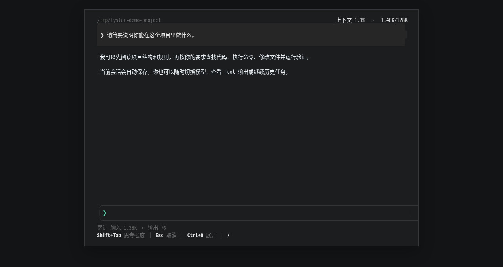

# LYStar Code

LYStar Code 是基于 [Pi](https://github.com/earendil-works/pi) 的中文终端编码 Agent，提供中文全屏 TUI，并兼容 Pi 的 Session、Skill、Extension、Package、Theme、Prompt Template、`.pi` 数据和 `PI_*` 环境变量。

支持 macOS、Linux 和 Windows x64。安装独立发行包无需 Node.js。

<p align="center">
  
</p>

## 安装

### macOS / Linux

```bash
curl -fsSL https://github.com/octyean/lystar-agent/releases/latest/download/install.sh | bash
```

安装器会识别系统和架构、校验 SHA-256，并安装到 `~/.local/share/lystar-agent/`。没有 Node.js 也可以运行。

### Windows 10 / 11

在 Windows PowerShell 5.1 或更高版本中执行：

```powershell
$cmd="$env:TEMP\lystar-install.cmd"; iwr -UseBasicParsing https://github.com/octyean/lystar-agent/releases/latest/download/install.cmd -OutFile $cmd; & $cmd
```

不需要管理员权限，也不用预装 Git 或 Bash。安装器只下载并校验 LYStar Code 发行包、维护版本指针并自动写入用户 PATH；新开的终端可直接运行 `lc` 或 `lystar`，两个命令完全等价。只有实际使用内建 `bash` Tool 时才需要 Git Bash、WSL、MSYS2、Cygwin 或其他兼容 Bash。

公司网络、GitHub 访问缓慢、手动校验和系统限制见[完整安装说明](docs/getting-started/installation.md)与[中国大陆网络配置](docs/getting-started/mainland-china.md)。

## 快速开始

1. 进入准备处理的项目目录，运行 `lc`。
2. 在界面中执行 `/login`，选择 Provider 并登录或填写 API Key。
3. 输入任务，例如：`阅读这个项目，告诉我如何启动和运行测试。`

```bash
cd /path/to/project
lc
```

也可以运行完整别名 `lystar`。

LYStar 可以读取、创建和编辑文件，也可以执行 Shell 命令。首次在陌生项目中使用前，请确认项目来源并保留 Git 提交或其他可回退点。

## 核心能力

- 中文全屏终端工作区，输入区固定，支持键盘和鼠标滚动。
- 内置文件读取、写入、精确编辑和 Bash 工具。
- 自动保存、继续、浏览、分支和压缩 Session。
- 支持多 Provider、多模型、思考强度和模型切换。
- 兼容 Pi Skill、Extension、Package、Theme 和 Prompt Template；输入 `$` 或 `@` 可同时引用多个 Skill。
- 内置 subagent 工具和三个通用角色，用户或项目同名 Agent 可直接覆盖。
- MCP 等能力通过 Pi Extension 接入。
- 支持独立更新、回退和卸载，程序操作不会删除 `~/.pi/agent` 用户数据。

## 文档

- [文档首页](docs/README.md)
- [完整安装说明](docs/getting-started/installation.md)
- [5 分钟快速开始](docs/getting-started/quick-start.md)
- [Provider 与 API Key](docs/getting-started/providers.md)
- [中国大陆网络配置](docs/getting-started/mainland-china.md)
- [交互界面与快捷键](docs/usage/interactive-tui.md)
- [安装 Skill、Extension 和 Package](docs/ecosystem/overview.md)
- [故障排查](docs/troubleshooting/installation.md)
- [参与开发](docs/development/setup.md)

## 更新、回退与卸载

```bash
lc update
lc update --rollback
```

卸载命令、版本目录和数据保留规则见[更新、回退与卸载](docs/usage/update-rollback-uninstall.md)。

## 兼容性与限制

LYStar Code 当前基于 Pi `v0.84.1`，继续读取 `~/.pi/agent/`、项目 `.pi/`、Pi Session 和生态资源。Pi 与 LYStar 可以共用数据，但不要同时写同一个 Session 文件。

当前 macOS 发行包尚未完成 Developer ID/notarization，Windows 发行包尚未完成 Authenticode。安装器和 Release 提供 SHA-256 与 GitHub artifact attestation；系统仍可能显示 Gatekeeper 或 SmartScreen 提示。

## 开发与贡献

源码开发需要 Node.js 22、npm、Bun 1.3.9 和 Bash。环境准备、检查命令、发行流程与上游同步见[开发文档](docs/development/setup.md)。

## 来源与许可证

LYStar Code 基于 `earendil-works/pi`，按 [MIT License](LICENSE) 发行。第三方依赖说明见 [THIRD_PARTY_LICENSES.md](THIRD_PARTY_LICENSES.md)。Grok Build 仅作为全屏 TUI 交互参考，没有复制其源码或资产。
