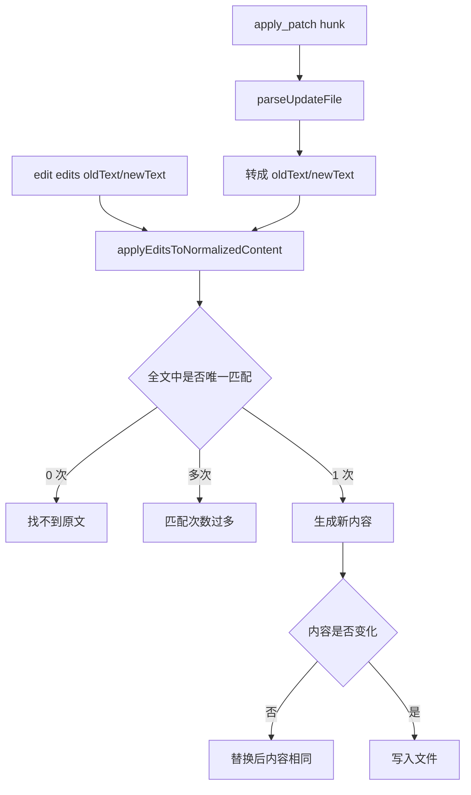
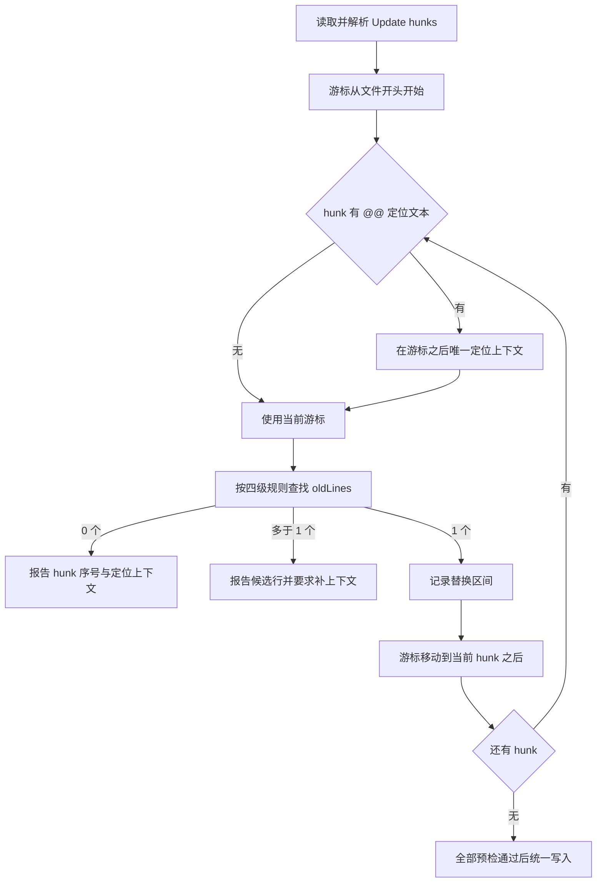
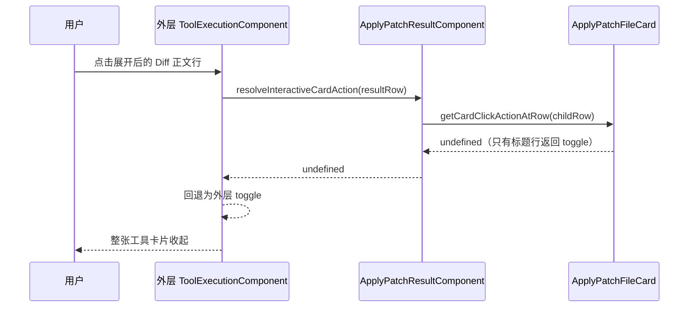
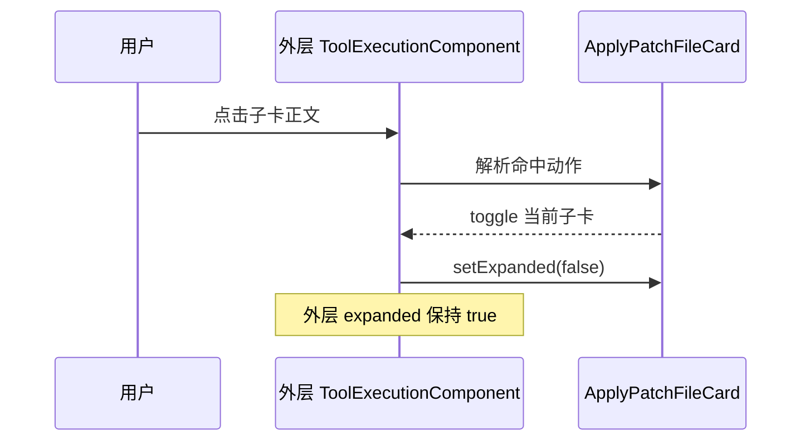

# 文件修改、Thinking 渲染与嵌套卡片交互问题分析及处理方案

## 1. 文档目的

本文只做问题分析和实施方案设计，不修改功能代码。

要处理的现象有三类：

1. 文件修改时频繁出现“找不到原文”“匹配次数过多”“替换后内容相同”等失败。
2. Thinking 展示区域直接显示 `**`、反引号等 Markdown 源字符。
3. 展开嵌套 TUI 卡片后，点击其正文想收起子卡片时，外层工具卡片也被收起。

本文给出已核实的根因、建议修改位置、明确不做的事情，以及实施后的验证依据。

## 2. 调查范围与事实基线

### 2.1 LYStar 源码范围

本次主要检查了以下链路：

| 问题 | 核心源码 |
|---|---|
| `edit` 精确替换 | `packages/coding-agent/src/core/tools/edit.ts`、`packages/coding-agent/src/core/tools/edit-diff.ts` |
| Agent Harness 中的 `edit` | `packages/agent/src/harness/tools/edit.ts`、`packages/agent/src/harness/tools/edit-diff.ts` |
| `apply_patch` | `packages/coding-agent/src/extensions/apply-patch/index.ts` |
| 对话区 Thinking | `packages/coding-agent/src/modes/interactive/components/assistant-message.ts` |
| 实时 Thinking 活动栏 | `packages/coding-agent/src/modes/interactive/components/workspace-activity-bar.ts`、`packages/coding-agent/src/modes/interactive/interactive-mode.ts` |
| 卡片点击分发 | `interactive-card.ts`、`tool-execution.ts`、`tool-execution-stack.ts`、`tool-execution-group.ts` |
| Subagent 独立会话 | `subagent-session-view.ts` |

CodeGraph 调用关系和源码阅读得到的结论一致。`InteractiveCard` 是共享契约，直接改变它会影响主会话、工具组、Subagent 会话和多种自定义卡片，因此卡片问题应优先采用局部修复。

### 2.2 Codex CLI 对照基线

文件补丁部分参考 OpenAI Codex 仓库 `main` 分支在本次调查时的提交：

```text
2230d64464488d8847197722fdca09d90095c705
提交时间：2026-08-12T03:00:47Z
```

核对文件：

- [`parser.rs`](https://github.com/openai/codex/blob/2230d64464488d8847197722fdca09d90095c705/codex-rs/apply-patch/src/parser.rs)
- [`seek_sequence.rs`](https://github.com/openai/codex/blob/2230d64464488d8847197722fdca09d90095c705/codex-rs/apply-patch/src/seek_sequence.rs)
- [`file_update.rs`](https://github.com/openai/codex/blob/2230d64464488d8847197722fdca09d90095c705/codex-rs/apply-patch/src/file_update.rs)
- [`prompt_with_apply_patch_instructions.md`](https://github.com/openai/codex/blob/2230d64464488d8847197722fdca09d90095c705/codex-rs/core/prompt_with_apply_patch_instructions.md)

该提交只作为实现对照点。后续 Codex 继续变化时，应重新核对源码，不能把本文记录当成 Codex 的永久契约。

## 3. 总结论

三个问题来自三条独立链路，应分别修复：

| 问题 | 已确认根因 | 处理原则 |
|---|---|---|
| 文件修改失败频繁 | `edit` 和 `apply_patch` 最终共用同一个全文字符串替换器，`apply_patch` 的 hunk 上下文和顺序语义在解析后丢失 | `edit` 保持唯一精确替换；`apply_patch` 改为按行、按 hunk、按顺序定位 |
| Thinking 显示 Markdown 源字符 | 对话区 Thinking 已用 Markdown；左下角实时活动栏仍用普通 `Text` 思路输出最后一行原文 | 只给实时单行状态补内联 Markdown 渲染，不改完整 Markdown 组件的块级行为 |
| 收子卡时外层也收起 | 子卡正文返回“无动作”，外层把它解释为“由外层处理”，于是执行外层 toggle | 让已命中的子卡拥有自己的全部渲染行，正文点击继续作用于子卡 |

共同原则是修责任点，不新增第二套补丁语言、Markdown 渲染器或鼠标事件系统。

---

## 4. 问题一：文件修改工具频繁失败

### 4.1 先纠正错误信息的归属

用户看到的三类文本来自 `edit-diff.ts`：

- `Could not find ...`：原文没有定位成功。
- `Found N occurrences ...`：原文出现多次，无法唯一定位。
- `No changes made ... identical content`：替换后的文件内容与替换前相同。

这三类文本直接来自 `edit-diff.ts`。当前 `apply_patch` 在解析 `@@` hunk 后，也把每个 hunk 转成 `{ oldText, newText }`，再调用同一个 `applyEditsToNormalizedContent()`，因此通过 `apply_patch` 也可能看到相同错误。

所以问题可以表述为：

> `edit` 的严格替换契约本身有必要保留；`apply_patch` 不应该继续把结构化 hunk 降级成普通全文字符串替换。

### 4.2 当前执行链路



这条链路对 `edit` 合理，对 `apply_patch` 过于粗糙。

### 4.3 已确认的具体原因

#### 4.3.1 `edit` 本来就是严格的文本替换工具

`edit` 的工具说明明确要求：

- 每个 `oldText` 必须在原文件中唯一出现。
- 同一次调用的全部 edits 都基于同一份原文件匹配。
- 多个替换区间不能重叠。
- 任一 edit 失败时不写文件。

这些限制防止工具在重复代码中猜位置，也防止前一个替换改变后一个替换的定位依据。频繁报错说明调用参数不够稳定，不代表应该自动选第一个候选。

#### 4.3.2 当前模糊匹配按整次调用切换

现有流程先检查所有 edits。只要其中任意一个需要模糊匹配，整次调用就进入归一化后的内容空间，随后所有 edits 都在这个空间重新查找。

归一化包括：

- 去掉每行尾部空白。
- Unicode 兼容归一化。
- 将弯引号、不同破折号和特殊空格转换为普通字符。

这能处理复制文本时的细微字符差异，但也可能让原本不同的文本变得相同，从而增加重复候选。影响范围本应只落在一个 edit 上，却扩展到同批次的其他 edits。

#### 4.3.3 `apply_patch` 丢掉了 hunk 的定位信息

`parseUpdateFile()` 当前只保留两段拼接文本：

```text
oldText = 上下文行 + 删除行
newText = 上下文行 + 新增行
```

以下信息没有进入应用阶段：

- `@@` 后面的函数名、类名或其他定位文本。
- hunk 在文件中的先后顺序。
- 上一个 hunk 已经定位到哪里。
- `*** End of File` 的文件尾语义。
- 哪些行只是上下文，写回时不应被归一化覆盖。

结果是每个 hunk 都回到整个文件中查找一段长字符串。代码稍有变化会“找不到”；存在重复代码会“匹配次数过多”；只有新增行而没有旧行的 hunk 也无法表达。

#### 4.3.4 “替换后内容相同”目前提示不够准确

无变化检查本身是对的。静默返回成功会让调用方误以为文件已修改。

当前单 edit 错误把原因引向“特殊字符或文本不存在”，但实际还可能是：

- `newText` 与文件当前内容相同。
- 模糊归一化后，目标状态已经存在。
- 调用方重试了一个已经成功应用过的修改。

错误信息应直接说明“请求不会改变文件”，并提示重新读取目标区域；不需要继续猜测特殊字符。

### 4.4 Codex CLI 当前实现中值得借鉴的部分

Codex 当前的补丁应用逻辑保留了 hunk 结构，没有先降级成全文字符串替换。

| Codex 行为 | 作用 | LYStar 建议 |
|---|---|---|
| 按行保存 `old_lines`、`new_lines` 和上下文行索引 | 能区分真正修改的行和定位用上下文 | 采用 |
| 保存可选的 `@@` 定位文本 | 先进入函数、类或稳定上下文，再找修改块 | 采用 |
| 使用 `line_index` 顺序处理 hunk | 后续 hunk 从前一处之后继续找 | 采用 |
| 允许 `old_lines` 为空 | 可在已定位的上下文后或文件尾执行纯新增 | 采用，并要求插入点唯一 |
| 依次尝试精确、忽略行尾空白、忽略首尾空白 | 处理常见格式差异，规则容易解释 | 采用 |
| 最后归一化常见 Unicode 标点和特殊空格 | 兼容复制产生的弯引号、破折号等差异 | 保留 LYStar 现有等价能力，但缩小到单个 hunk |
| 支持 `*** End of File` | 明确文件尾修改的位置 | 采用 |
| 默认要求修改前后各提供 3 行上下文 | 提高 hunk 定位稳定性 | 写入工具说明 |
| 上下文仍重复时用 `@@` 指明函数或类 | 避免扩大整段原文 | 写入工具说明 |

### 4.5 不直接照搬 Codex 的部分

Codex 的 `seek_sequence()` 找到第一个符合条件的位置后就返回。LYStar 当前已经把“重复候选不自动猜测”作为安全保护，本次不应为了减少报错而删除它。

建议保留以下差异：

1. 每个 hunk 在当前搜索范围内仍需唯一定位。
2. 出现多个候选时返回候选行号，要求补充上下文或 `@@` 定位。
3. 不引入相似度评分，也不自动选择“最像”的候选。
4. 不把失败当成功，不静默跳过 no-op hunk。

这样能借到 Codex 的结构化定位能力，同时继续避免在重复代码里改错位置。

### 4.6 建议处理方案

#### 4.6.1 `edit`：保留契约，只收紧匹配作用域和诊断

`edit` 继续用于单文件、明确原文、少量不相邻区域的精确替换。

建议改动：

1. 每个 edit 独立选择匹配等级。
   - 先在原文中做精确匹配。
   - 精确匹配为 0 次时，才对当前 edit 依次尝试宽松规则。
   - 不能因为一个 edit 需要归一化，就让同批其他 edits 一起进入归一化空间。
2. 每一级匹配都坚持唯一性。
   - 1 个候选：接受。
   - 多个候选：立即报告该级别的候选行号。
   - 0 个候选：再进入下一级。
3. 继续让全部 edits 基于同一份原文件定位，并继续拒绝重叠区间。
4. 继续只改实际命中的行块，未修改行保留原始内容。
5. 改善错误信息，使其描述真实尝试过程。

建议错误信息包含：

```text
无法定位 edits[1] 在 src/a.ts 中的原文。
已尝试：精确匹配、忽略行尾空白、忽略首尾空白、Unicode 标点归一化。
文件未修改。请重新读取目标区域，并提供更短且唯一的 oldText。
```

重复候选继续包含数量和前几个行号：

```text
edits[0] 在 src/a.ts 中有 3 个候选，位于第 12、48、96 行。
请加入目标块前后的一行稳定上下文。文件未修改。
```

no-op 信息改为：

```text
请求不会改变 src/a.ts；替换结果与当前文件相同。
请重新读取目标区域，确认修改是否已经存在。文件未修改。
```

`packages/coding-agent` 和 `packages/agent` 各有一份近似 `edit-diff.ts`。本次只同步必要行为和测试，不借机建立新共享包或大规模搬迁代码。

#### 4.6.2 `apply_patch`：保留 hunk，按顺序定位

`apply_patch` 的 Update 操作应改为保存结构化 hunk，例如概念上保留：

```text
contextHeader   可选的 @@ 后定位文本
oldLines        上下文行与删除行组成的查找序列
newLines        上下文行与新增行组成的结果序列
contextIndices  哪些行仅用于上下文
endOfFile       是否要求命中文件尾
```

应用流程建议如下：



关键约束：

- 匹配按 hunk 独立进行，不能再调用面向 `edit` 的整批全文匹配流程。
- `@@` 只负责缩小搜索范围，不直接作为要替换的正文。
- 只有新增行的 hunk 允许 `oldLines` 为空；插入点由已命中的 `@@` / 上下文之后的位置或明确的文件尾决定，不能在无定位信息时猜测。
- `*** End of File` 要求匹配块落在文件尾，避免普通重复块抢先命中。
- 上下文行只参与定位，不能因为宽松匹配而改写其空白或 Unicode 字符。
- 多文件仍先完成全部读取、解析和预检，再开始写入。
- 写入中途失败仍按现有逻辑回滚已经触碰的文件。
- 继续保留文件变更队列，避免并发工具同时写同一路径。
- 继续保留 BOM 和当前主行尾风格。

工具说明同步增加以下规则：

- 默认给每处修改提供前后各 3 行上下文。
- 重复代码中使用 `@@` 指明函数、类或稳定标题。
- 相距较远的修改使用多个 hunk，不拼接大段无关原文。
- 失败后先重新读取目标区域，再生成新 patch。
- `edit` 用于精确的 `oldText/newText` 替换；`apply_patch` 用于结构化的多行或多文件变更。

### 4.7 明确不做

本次文件修改问题不包含：

- 不增加 AST、Tree-sitter 或语言服务器定位。
- 不增加编辑距离、相似度打分或候选排序系统。
- 不自动选择第一个重复候选。
- 不增加“强制应用”“忽略冲突”开关。
- 不把 no-op 当作成功。
- 不改变 `edit` 的参数结构和公共 Tool 名。
- 不修改 Session、Extension API 或工具结果基本结构。
- 不顺带支持 rename / move；当前明确拒绝即可，确有需求时单独设计。
- 不为两份 `edit-diff.ts` 新建共享包；只保证行为和测试一致。
- 不在本次解决混合 CRLF/LF 文件的逐行行尾保真，继续沿用现有主行尾恢复策略。

### 4.8 验证依据

#### 现有测试必须继续通过

```text
packages/coding-agent/test/tools.test.ts
packages/agent/test/harness/tools.test.ts
packages/coding-agent/test/apply-patch-extension.test.ts
```

重点保留：

- BOM 文件可编辑。
- CRLF 文件写回后保持 CRLF。
- 精确匹配优先于模糊匹配。
- 多 edit 基于原文件并拒绝重叠。
- 重复候选不写文件。
- 多文件 patch 预检失败时零写入。
- 后续写入失败时回滚前面文件。

#### 需要新增的最小测试

1. 一个 edit 需要宽松匹配，另一个 edit 精确匹配且在归一化后会重复；两者应各自按自己的匹配等级定位。
2. `apply_patch` 两个相同代码块，通过 `@@ functionName` 唯一定位目标块。
3. 多个 hunk 按文件顺序定位，后一个 hunk 不回到前一个 hunk 之前。
4. 只有 `+` 行的 hunk 能在唯一上下文后插入；缺少可靠插入点时明确失败。
5. 上下文行只有尾部空白差异时可定位，未修改上下文的原始字符保持不变。
6. `*** End of File` 只命中文件尾。
7. 找不到 hunk、hunk 重复、no-op 时均不写任何文件。
8. 错误信息包含文件、hunk 或 edit 序号、尝试的匹配等级和“文件未修改”。

---

## 5. 问题二：Thinking 区域未渲染 Markdown

### 5.1 已确认现状

Thinking 有两种展示路径：

| 展示位置 | 当前组件 | 当前行为 |
|---|---|---|
| 对话记录中的 Thinking | `AssistantMessageComponent` 内的 `Markdown` | 已渲染 Markdown，并使用 Thinking 配色 |
| 左下角实时 Thinking | `WorkspaceActivityBar` | 只取最后一个非空行，作为普通字符串着色和裁切 |

`getLatestThinkingActivityText()` 从流式消息中提取最后一行；`WorkspaceActivityBar.phaseLabel()` 原样返回这一行；`render()` 只调用 `theme.fg()`。因此 `**分析**`、`` `symbol` `` 等标记会直接显示。

问题只存在于实时单行活动栏，不需要重写对话区 Thinking。

### 5.2 根因

活动栏把 Thinking 当成普通状态文案处理，但模型输出的 Thinking 仍是 Markdown 文本。数据源和渲染器的文本语义不一致。

直接把完整 `Markdown` 块组件塞进活动栏也不合适：

- 活动栏固定为一行，块级标题、列表、引用和代码块没有可用空间。
- 当前 Thinking 会从左侧裁掉旧内容，保留最新尾部；普通 Markdown 块组件可能先换行，再改变保留哪一段。
- 流式文本常暂时缺少闭合标记，活动栏必须保持稳定，不能闪烁或消失。

### 5.3 建议处理方案

在现有 Markdown 实现中提取一个轻量的“单行内联渲染”入口，继续复用同一个 `marked` tokenizer 和主题函数。

建议只处理 Markdown 内联语义：

- 粗体。
- 斜体。
- 行内代码。
- 删除线。
- 链接文本和现有终端链接样式。
- 反斜杠转义。

块级标题、列表、引用、表格和代码块不进入活动栏语义。活动栏收到的仍是最后一个非空源文本行。

渲染顺序：

1. 提取最后一个非空 Thinking 行。
2. 使用现有 Markdown tokenizer 做内联解析和 ANSI 样式转换。
3. 使用现有 `visibleWidth`、`sliceByColumn` 和 `truncateToWidth` 做终端列宽裁切。
4. Thinking 仍从左侧裁切，保留最新尾部。
5. 进度、队列和耗时后缀继续按当前宽度规则显示。

建议把内联入口放在 `packages/tui/src/components/markdown.ts` 的现有实现附近，避免在 `workspace-activity-bar.ts` 用正则手写另一套 Markdown 规则。若现有 `Markdown` 内部方法只需很小调整即可复用，就只暴露最小函数，不新增组件层级。

### 5.4 实施边界

- 只修改 `thinking` phase；工具名、路径、错误等活动栏文本仍按纯文本显示。
- 不在活动栏支持多行 Markdown。
- 不显示完整 Thinking，只继续显示最后一行。
- 不改变 `thinkingDisplayMode` 的 `activity` / `transcript` 设置含义。
- 不改对话记录中的 Markdown 渲染、代码块折叠和 Extension Markdown transformer。
- 不为活动栏增加新的 Markdown 依赖。
- 不用正则删除 `**`、反引号等符号；这种做法会丢失样式，也处理不好转义和流式未闭合标记。
- 不改变活动栏高度和固定底部布局。

### 5.5 验证依据

主要测试文件：

```text
packages/coding-agent/test/task-workbench-components.test.ts
packages/coding-agent/test/assistant-message.test.ts
packages/coding-agent/test/interactive-tui.test.ts
packages/tui/test/markdown.test.ts
```

新增用例至少覆盖：

1. `正在检查 **类型定义**` 不再显示 `**`，类型定义使用粗体样式。
2. ``检查 `apply_patch` 结果`` 不显示反引号，代码文字使用现有 code 样式。
3. 未闭合的 `**正在分析` 在流式过程中仍可读，不丢字、不抛错。
4. 中文宽字符和 ANSI 样式参与裁切后，`visibleWidth(line) <= width`。
5. 24 列窄宽度下仍保留 Thinking 尾部和耗时，不挤出活动栏边界。
6. `transcript` 模式仍把 Thinking 交给对话区 Markdown，不重复出现在活动栏。
7. 工具执行阶段包含星号或反引号的路径仍按原文显示，不被误当 Markdown。

可见 TUI 修改完成后还需做真实 PTY 检查：`80x24`、`80x8`、`120x36`，观察流式未闭合标记和完整标记到达时是否抖动。

---

## 6. 问题三：收起嵌套卡片时外层卡片也被收起

### 6.1 当前点击分发链路

以 `apply_patch` 的文件 Diff 子卡片为例：



状态没有丢失，鼠标行号也没有整体算错。问题在于点击所有权：

- 子卡片确实渲染了标题、空行和 Diff 正文。
- 子卡片只声明标题行可点击。
- 外层把子卡片返回的 `undefined` 当成“子卡未处理，可以切换外层”。

所以点击子卡正文时，动作冒泡到了外层。

### 6.2 建议处理方案

对会展开正文的嵌套卡片，卡片拥有自己渲染出来的全部行：

```text
0 <= row < lastRenderedLineCount
```

命中这些行时都返回该子卡片的 toggle。以 `ApplyPatchFileCard` 为例，标题、标题后的空行和 Diff 正文都应切换当前文件卡片。

这样点击行为变成：



### 6.3 为什么优先局部修复

`InteractiveCardAction` 目前只有 `toggle` 和 `openSubagent`。可以新增 `handled` / `consume` 一类动作来阻止父级回退，但这会改变所有交互卡片的公共契约，并要求逐个检查现有实现。

当前已确认问题来自展开型子卡只拥有标题行。把这类子卡的点击范围改成整个自身范围即可解决，改动更小，也符合“点击卡片任意可见区域切换该卡片”的现有交互预期。

只有后续出现“子卡正文必须不可操作，但也绝不能冒泡”的真实组件时，才需要扩展公共 action 契约。

### 6.4 专用动作优先级

局部修复不能覆盖已有专用交互：

1. 终端链接仍先由链接命中逻辑处理。
2. Subagent 运行项仍返回 `openSubagent`，不能被普通 toggle 覆盖。
3. 工具组之间的 divider 和布局空行继续不可点击。
4. 点击外层工具标题仍切换外层卡片。
5. 点击某个文件子卡只切换该文件，不影响兄弟文件子卡。

主会话和 Subagent 独立会话都通过 `resolveInteractiveCardAction()` / `activateInteractiveCard()` 执行动作，因此两条入口都要验证。

### 6.5 实施边界

- 不修改鼠标协议解析。
- 不新增事件冒泡框架。
- 不重写 `InteractiveCard` 层级结构。
- 不让 divider、卡片间空白或 transcript 空白区变成可点击区域。
- 不改变 `Ctrl+O` 的全局展开/收起语义。
- 不改变卡片状态恢复 key。
- 不把专用 `openSubagent` 动作降级成 toggle。

### 6.6 验证依据

主要测试文件：

```text
packages/coding-agent/test/tool-execution-component.test.ts
packages/coding-agent/test/tool-execution-group.test.ts
packages/coding-agent/test/subagent-session-view.test.ts
packages/coding-agent/test/task-workbench-components.test.ts
```

新增用例至少覆盖：

1. 外层 `apply_patch` 工具卡展开后，点击文件标题展开文件 Diff。
2. 文件 Diff 展开后，点击 Diff 正文返回该文件子卡的 toggle。
3. 执行动作后文件子卡收起，外层工具卡仍保持展开。
4. 点击另一个兄弟文件只改变该文件状态。
5. 点击外层标题仍收起外层。
6. 点击工具组 divider 或空白行不产生动作。
7. 主会话鼠标按下/释放完整链路只切换子卡。
8. Subagent Session View 中执行相同点击，结果与主会话一致。
9. `openSubagent` 和终端链接仍优先执行原动作。

真实 PTY 还应检查滚动后的卡片、窄终端换行后的卡片，以及展开 Diff 后鼠标行号是否仍正确。

---

## 7. 建议实施顺序

这三个修复没有功能依赖，可以分别提交和回滚。建议按风险从底层到界面处理：

1. 先调整 `edit` 的逐 edit 匹配和错误信息，保持 Coding Agent 与 Agent Harness 行为一致。
2. 再让 `apply_patch` 保存并应用结构化 hunk，复用现有文件队列、预检和回滚能力。
3. 补实时 Thinking 的单行内联 Markdown 渲染。
4. 修正展开型嵌套卡片的点击所有权。
5. 最后运行共享检查、构建和真实 PTY 验证。

建议拆成独立提交，避免文件修改语义和 TUI 交互混在一个回滚单元中：

```text
fix(agent): 稳定文件修改定位与诊断
fix(tui): 渲染实时 Thinking 内联样式
fix(tui): 保持嵌套卡片点击归属
```

## 8. 整体验收标准

### 8.1 自动验证

实施后至少运行：

```bash
cd packages/coding-agent
npx vitest --run test/tools.test.ts test/apply-patch-extension.test.ts test/task-workbench-components.test.ts test/assistant-message.test.ts test/tool-execution-component.test.ts test/tool-execution-group.test.ts test/subagent-session-view.test.ts

cd ../agent
npx vitest --run test/harness/tools.test.ts

cd ../..
npm run check
npm run build:offline
git diff --check
```

若 `packages/tui` 新增了内联 Markdown 测试，还要单独运行对应测试文件。

### 8.2 真实 TUI 验证

使用独立 tmux socket，至少覆盖：

- `80x24` 常规终端。
- `80x8` 极小高度。
- `120x36` 宽终端。
- Thinking 流式输出中和结束后。
- 一个含粗体、行内代码、中文宽字符的 Thinking 行。
- 一个包含多个文件、每个文件都有 Diff 的 `apply_patch` 结果。
- 主会话与 Subagent Session View 中展开、收起子卡片。
- resize、滚动后点击、退出终端恢复。

### 8.3 通过条件

全部满足才算完成：

1. `edit` 仍不会在重复原文中猜位置。
2. `apply_patch` 能用 hunk 顺序和 `@@` 上下文稳定定位，不再依赖整段全文唯一替换。
3. 任一 patch 预检失败时不写文件，写入中途失败时能回滚。
4. no-op 明确报错，不伪装成成功。
5. 实时 Thinking 的常用内联 Markdown 有样式，源标记不直接暴露。
6. 活动栏保持单行、固定高度和正确终端列宽。
7. 点击展开子卡的正文只收起该子卡，外层状态不变。
8. 链接、Subagent 打开、divider 和空白区域行为没有回归。

## 9. 最终判断

文件修改问题的核心是让两种工具各自遵守适合自己的定位模型：`edit` 负责唯一文本替换，`apply_patch` 负责结构化 hunk。继续扩大模糊匹配只会增加误改风险。Codex 当前实现提供了足够直接的参考，LYStar 只需借用按行、上下文和顺序定位，不需要引入 AST 或相似度系统。

Thinking 问题只缺一个单行内联渲染入口；嵌套卡片问题只缺正确的点击所有权。两项都能在现有 TUI 体系内解决，不需要新增并行实现。