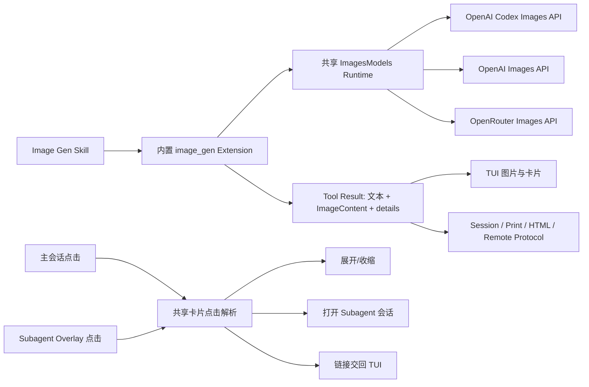

# LYStar Code Image Gen 与 TUI 卡片交互修复方案

> 状态：待 Yean 确认
>
> 日期：2026-08-09
>
> 本文只定义实施方案，不包含功能代码修改。

## 1. 目标

本次一起处理两类问题：

1. 在 LYStar Code 中接入 Codex 的 Image Generation Skill，并提供真正由 Agent 调用的原生 `image_gen` Tool。
2. 清理最近新增 TUI 卡片的点击展开/收缩问题：
   - 部分卡片只能点击第一行。
   - Subagent 独立会话里的 Tool、Diff、长内容等卡片无法点击展开/收缩。
   - 保持网页来源链接、Subagent 会话打开等已有点击行为不被展开逻辑截走。

完成后的体验应满足：

- 用户提出生图或改图需求时，模型能自动发现 Image Gen Skill，并调用 `image_gen`。
- 图片生成后立即在 TUI 中显示，并保存到稳定路径。
- 用户可以继续要求基于刚生成的图片修改。
- 主会话和 Subagent 会话中的同类卡片使用一致的点击规则。
- `Ctrl+O` 继续作为全局展开/收缩入口。
- 不增加第二套 Session、Tool、图片渲染或鼠标系统。

## 2. 已确认的现状

### 2.1 Codex 当前实现

以 OpenAI Codex `main` 在 2026-08-09 的源码为基线：

- Image Gen Skill 默认要求使用内置 `image_gen`，CLI 脚本只作为用户明确选择后的后备路径。
- 当前 Codex 的内置生图能力由 Image Generation Extension 提供，模型侧工具为 `image_gen.imagegen`。
- Tool 参数只有三个核心字段：
  - `prompt`
  - `referenced_image_paths`
  - `num_last_images_to_include`
- 默认图片模型为 `gpt-image-2`。
- 新图调用 Images Generation API，改图调用 Images Edit API。
- 生成结果会保存到 `generated_images/<thread>/<call>.png`，同时作为图片内容返回给模型，支持后续继续编辑。
- Codex 使用独立的 Image Generation Item 表达运行状态、结果和保存路径。

参考源码：

- `codex-rs/skills/src/assets/samples/imagegen/SKILL.md`
- `codex-rs/ext/image-generation/src/tool.rs`
- `codex-rs/ext/image-generation/src/backend.rs`
- `codex-rs/ext/image-generation/src/artifact.rs`
- `codex-rs/ext/items/src/image_generation.rs`

### 2.2 LYStar 已有图片能力

LYStar/Pi 当前并非从零开始：

- `packages/ai` 已有完整的 `ImagesModels`、`ImagesProvider`、`generateImages()` 和图片模型类型。
- 当前内置图片 Provider 只有 OpenRouter。
- OpenRouter 图片目录已包含 `openai/gpt-image-2`、`openai/gpt-image-1` 等模型。
- Tool Result 已支持 `ImageContent`。
- TUI 的 `ToolExecutionComponent` 已能使用 Kitty 图片协议显示 Tool 返回图片，并提供文本回退。
- HTML 导出、远程 Protocol、Session JSONL 已支持 Tool Result 中的图片内容。
- `read`、文件附件、剪贴板图片已有图片 MIME 检测、转换和尺寸处理能力。

因此不需要新建图片消息系统或独立渲染器。原生生图 Tool 应直接复用现有图片 Provider、Tool Result 和 TUI 图片组件。

### 2.3 Skill 注入能力

内置 Extension 已可以监听 `resources_discover`，返回 `skillPaths`。因此 Image Gen Skill 可以跟随内置 Extension 装载，无需启动时复制到用户的 `~/.pi/agent/skills`，也不会覆盖用户同名文件。

### 2.4 卡片点击问题根因

当前点击链路为：

```text
LystarTUI.handleViewportInput
  -> InteractiveMode.handleWorkspaceInput
  -> LystarWorkspace.getComponentHitAtScreenRow
  -> 组件自己的 isExpansionToggleRow
  -> setExpanded
```

问题不是单一组件样式，而是交互责任分散：

| 组件 | 当前命中规则 | 结果 |
|---|---|---|
| `ToolExecutionComponent` | `row >= 0` | 单个 Tool 卡片任意行可切换 |
| `ToolExecutionGroupComponent` | 组摘要只认 `row === 0` | 多 Tool 组只能点第一行收起 |
| `TurnSummaryComponent` | 只认 `row === 0` | 完成摘要展开后只能点第一行收起 |
| `AssistantMessageComponent` Web Search | 只记录搜索摘要行 | 为保护来源链接，只能点摘要行 |
| Subagent Session Overlay | 没有组件行命中和展开处理 | 所有内部卡片都点不开 |

Subagent Overlay 使用自己的 `SubagentSessionViewComponent.handleInput()`。它目前只处理返回、滚动、取消和编辑器输入，没有调用主会话的组件点击逻辑，这是“Subagent 内卡片全部无法点击”的直接根因。

## 3. 方案总览



实施分成两个独立责任面：

1. Image Gen：图片 Provider 能力、内置 Tool、Skill、结果保存和显示。
2. 卡片交互：统一命中语义，并让主会话与 Subagent Overlay 共用。

两部分可以在同一版本交付，但代码和测试保持分组，方便以后合并 Pi 上游时判断冲突归属。

## 4. Image Gen 设计

### 4.1 内置 Skill

新增内置 Image Gen Skill，内容以 Codex 官方 Skill 为基线做 LYStar 适配：

- Skill 名保持 `imagegen`。
- 默认调用 LYStar 内置 `image_gen` Tool。
- 保留新图、参考图、改图、批量、多轮迭代、透明背景和提示词结构指导。
- 将 `$CODEX_HOME` 改为 LYStar 的配置目录和生成图片路径语义。
- CLI/API 后备路径不在本次首版实现中承诺可用；Skill 不应引用一个 LYStar 没有随包提供的脚本。
- 保留 OpenAI 官方 Skill 的许可证文件和来源说明。
- 中文化用户可见说明，但 Tool 名、参数名、模型名和路径变量保持技术原值。

Skill 由 Image Gen Extension 在 `resources_discover` 中返回自身路径。这样：

- `--no-skills` 仍能关闭它，符合 Pi 现有契约。
- 用户或项目同名 Skill 的冲突继续由现有 Skill 加载规则处理。
- Node 开发运行、npm 包和 Bun 二进制都读取同一份随包资产。

### 4.2 原生 Tool

新增隐藏的内置 Extension `image-gen`，注册平铺 Tool 名 `image_gen`。

不在 LYStar 中实现 Codex 的 namespace 工具层。Pi 当前 Tool 契约是平铺名称，使用 `image_gen` 可以直接匹配 Skill 心智，也避免为一个 Tool 引入 namespace 机制。

Tool 参数：

```ts
{
  prompt: string;
  referenced_image_paths?: string[];
  num_last_images_to_include?: number;
}
```

约束：

- `prompt` 必填且去除纯空白。
- 两种图片来源只能二选一。
- 最多 5 张参考图。
- 路径按 Tool 执行时的 `cwd` 解析。
- 文件读取、MIME 检测和图片规范化复用现有 `read`/图片处理能力。
- 文件不存在、格式不支持、图片处理失败时返回明确 Tool Error。
- 新图不传参考图；有参考图时走 edit。
- 不增加 `output_path`、`model`、`quality`、`size` 等首版参数。Codex 的原生 Tool 同样把这些作为内部策略，Skill 负责工作流，避免模型每次猜配置。

### 4.3 图片 Provider

扩展 `packages/ai` 的现有 Images Provider 体系，不在 Coding Agent Extension 中手写 HTTP 请求。

新增：

- `openai-images` API 实现。
- `openai` Images Provider。
- `openai-codex` Images Provider。

复用现有：

- `openrouter-images` Provider。
- `ImagesModels` 的认证、请求选项、错误结果和取消信号。
- Coding Agent 的 `AuthStorage`/`RuntimeCredentials`。

Provider 路径：

| 图片 Provider | 认证 | Endpoint | 默认模型 |
|---|---|---|---|
| `openai-codex` | 现有 ChatGPT OAuth | `<baseUrl>/codex/images/generations`、`edits` | `gpt-image-2` |
| `openai` | 现有 OpenAI API Key | `<baseUrl>/images/generations`、`edits` | `gpt-image-2` |
| `openrouter` | 现有 OpenRouter Key/OAuth | 现有 Chat Completions 图片能力 | `openai/gpt-image-2` |

`openai-codex` 请求需要复用现有 Codex OAuth Header 规则：

- `Authorization: Bearer ...`
- `chatgpt-account-id`
- `originator`

相关 JWT account id 解析和 Header 构造应从 `openai-codex-responses.ts` 提取到共享模块，不能再复制一套。

### 4.4 图片 Provider 选择

Tool 执行时按确定顺序选择：

1. 当前对话模型属于 `openai-codex`、`openai` 或 `openrouter`，且对应图片认证可用时，使用同 Provider。
2. 当前 Provider 不支持生图时，从已配置图片 Provider 中按 `openai-codex -> openai -> openrouter` 选择第一个可用项。
3. 没有任何可用图片 Provider时，Tool 返回可操作错误，说明可以登录 OpenAI Codex、配置 `OPENAI_API_KEY` 或配置 OpenRouter。

不增加新的默认 Provider 设置。只有实际出现“用户同时配置多个图片 Provider，并明确需要固定选择”的需求时，再考虑设置项。

### 4.5 ModelRuntime 接入

`ModelRuntime` 当前只持有聊天 `Models`。本次让它同时持有共享凭据的 `ImagesModels`：

```text
RuntimeCredentials
  ├─ Models
  └─ ImagesModels
```

通过 `ModelRegistry` 向内置 Extension 提供最小图片接口：

- 查询图片 Provider/模型。
- 查询认证状态。
- 调用 `generateImages()`。

不把底层 Credential Store 暴露给 Extension，也不让 Extension 直接读取 `auth.json`。

### 4.6 结果与保存路径

Tool 成功结果：

- `content` 包含：
  - 一条简短文本，说明生成完成和保存路径。
  - 一条 `ImageContent`，用于模型后续上下文、TUI、HTML 和远程客户端。
- `details` 包含：
  - `provider`
  - `model`
  - `savedPath`
  - `prompt`
  - `mode: "generate" | "edit"`
  - 可选 `usage`

默认保存位置：

```text
~/.pi/agent/generated_images/<session-id>/<tool-call-id>.png
```

规则：

- 使用现有 `getAgentDir()`，不引入新的环境变量。
- 文件名只允许字母、数字、`-`、`_`，其余字符替换。
- 先创建目录，再原子写入临时文件并 rename，避免中途退出留下半张图片。
- 默认不覆盖已有文件；极小概率冲突时增加短后缀。
- Tool Result 中只在 `ImageContent` 保存一次 base64，不在 `details` 或文本中重复保存。
- Skill 要求项目资产最终复制进工作区；默认生成文件仍保留，除非用户明确要求删除。

首版继续使用现有 Tool Result 图片 Session 契约，不新增 `imageGenerationCall` Assistant 内容类型。理由：

- Session、Protocol、Print、HTML 和 TUI 已完整支持 Tool Result 图片。
- 新增一等消息类型会同时修改 `packages/ai`、Agent 事件、Session、Protocol v2、Server、Client、导出和兼容 fixture，当前没有额外用户价值。
- 后续只有在需要独立于 Tool 的流式图片状态、跨端图片资产索引或避免 Session 内 base64 时，再升级为一等 Image Generation Item。

### 4.7 TUI 表现

`image_gen` 使用自定义 Tool renderer：

折叠态：

```text
▸ 生成图片  海边悬崖上的白色灯塔  ·  运行中
```

完成态：

```text
▸ 已生成图片  海边悬崖上的白色灯塔
  ~/.pi/agent/generated_images/<session>/<call>.png
```

展开态增加 Provider、模型、完整 prompt 和保存路径。实际图片继续由 `ToolExecutionComponent` 的通用图片渲染负责，不在 Extension renderer 中重复创建 `Image` 组件。

失败态直接显示 Provider 返回的错误摘要，不能只显示“执行失败”。

图片生成通常耗时较长：

- Tool 正常响应 `AbortSignal`。
- `Ctrl+C` 走现有 Tool 取消链路。
- 不新增轮询线程；OpenAI/OpenRouter 请求本身等待完成即可。
- 不使用超长测试 timeout 掩盖问题，网络实测单独记录。

## 5. 卡片点击统一方案

### 5.1 交互语义

卡片点击按下面优先级处理：

1. 点击 OSC 8 链接：交给 TUI 打开链接。
2. 点击 Subagent Agent 行：打开对应子会话。
3. 点击可展开卡片的其他正文行：展开/收缩该卡片。
4. 没有命中交互：交回文本选择和现有鼠标链路。

这能解决“任意正文行可收起”，又不会让来源链接或 Agent 行变成展开按钮。

### 5.2 共享点击解析

从 `InteractiveMode.handleWorkspaceInput()` 中提取一个小的纯交互解析函数，统一处理：

- `ToolExecutionGroupComponent` 的组/子 Tool 映射。
- `ToolExecutionComponent` 的 Subagent 行映射。
- 可展开组件的当前状态和切换。
- 链接优先判断。

主会话和 Subagent Overlay 都调用这一个入口。

不引入通用事件总线、组件基类或新的 TUI 框架。只抽取当前已经重复需要的命中逻辑。

建议内部返回值：

```ts
type CardClickAction =
  | { type: "toggle"; component: ExpandableComponent }
  | { type: "openSubagent"; target: SubagentRunTarget }
  | undefined;
```

### 5.3 主会话卡片

调整组件命中规则：

- `TurnSummaryComponent`：从 `row === 0` 改为全部有效行。
- 单 Tool 卡片：保持全部有效行。
- 多 Tool 组：
  - 组摘要行切换整组。
  - 展开后点击子 Tool 任意正文行切换该 Tool。
  - 组内空分隔行不吞鼠标。
- `apply_patch`：文件统计行和 Diff 正文都可以切换整张 Tool 卡片。
- Web Search：
  - 搜索摘要行可切换。
  - 来源链接点击继续打开网页。
  - 非链接的来源标题空白区域可切换；链接字符区域不拦截。
- 长 Markdown/代码：
  - 没有链接命中的正文行可切换。
  - 链接区域继续打开链接。

为实现列级链接保护，使用 `getOsc8LinkAtColumn()` 检查当前渲染行和鼠标列，不再依赖“整行禁止展开”这种粗粒度规避。

### 5.4 Subagent Session Overlay

`SubagentSessionViewComponent` 当前只保存扁平 `Container`，无法从可见行反查子组件。本次增加最小的 transcript 渲染范围索引：

```text
component A -> start/end
component B -> start/end
component C -> start/end
```

渲染时记录每个 transcript child 的行范围；点击时把屏幕行转换为：

```text
Overlay 局部行
  -> transcript 可见行
  -> 加 scrollTop
  -> 组件 + 组件内行
  -> 共享卡片点击解析
```

Subagent Overlay 由创建者注入：

- 共享展开状态 Map。
- `openSubagentSession` 回调，用于子 Agent 再打开下一层 Subagent 会话。
- 请求重绘回调。

这样主会话、第一层 Subagent 和更深层 Subagent 使用同一套卡片行为。

### 5.5 展开状态

当前主会话使用 `WeakMap<Component, boolean>` 保存局部展开状态，Subagent 每次 `setMessages()` 会重建组件，状态可能丢失。

本次不建立全局持久化系统。采用以下最小规则：

- 同一 Overlay 生命周期内，对当前组件实例保持展开状态。
- 实时消息刷新若复用了组件实例，状态继续保留。
- 重新打开 Subagent 会话后，按当前全局 `toolOutputExpanded` 默认值初始化。
- `Ctrl+O` 仍统一影响当前已渲染组件。

如果实际实现确认 `renderMessages()` 每次都重建全部组件，则在消息渲染层沿用已有 Tool Call ID 复用机制；不以文本内容作为状态 key。

## 6. 预计改动范围

最终文件以实施时源码为准，预计集中在以下位置。

### `packages/ai`

- `src/types.ts`
- `src/images-models.ts`
- `src/providers/all.ts`
- 新增 OpenAI Images API/provider 文件
- 抽取 OpenAI Codex 认证 Header 共享 helper
- 对应图片 Provider/API 测试

### `packages/coding-agent`

- `src/core/model-runtime.ts`
- `src/core/model-registry.ts`
- `src/extensions/index.ts`
- 新增 `src/extensions/image-gen/`
- `src/config.ts`：随包 Skill 资产路径
- `package.json`、`scripts/build-binaries.sh`：复制 Skill 资产
- `src/modes/interactive/components/tool-execution*.ts`
- `src/modes/interactive/components/assistant-message.ts`
- `src/modes/interactive/components/turn-summary.ts`
- `src/modes/interactive/components/subagent-session-view.ts`
- `src/modes/interactive/interactive-mode.ts`
- 对应 Tool、Skill、TUI、Subagent、打包测试

### 明确不改

- 不改变现有 Session JSONL 版本。
- 不新增 `LA_*` 环境变量。
- 不新增第二套图片渲染器。
- 不改变 Extension API 的现有 Tool Result 图片契约。
- 不添加新 npm 依赖。
- 不在首版增加图片 Provider 设置页。
- 不复制 Codex 的 Rust Extension 框架或 namespace Tool 系统。

## 7. 测试方案

### 7.1 Image Provider 单测

覆盖：

- OpenAI generation 请求 URL、Header、payload 和返回解析。
- OpenAI edit 多图请求。
- OpenAI Codex generation/edit URL。
- ChatGPT OAuth account id Header。
- 缺认证、401、429、空图片、非法 base64、取消信号。
- OpenRouter 现有图片测试继续通过。
- `gpt-image-2` 模型元数据和 Provider 选择顺序。

网络请求全部 mock，不消费真实额度。

### 7.2 Image Gen Extension 测试

覆盖：

- Skill 路径通过 `resources_discover` 注入。
- `--no-skills` 时不加载。
- 新图参数转换。
- `referenced_image_paths` 最多 5 张。
- 两种图片来源互斥。
- 路径越界、文件不存在、非图片文件和图片转换失败。
- 最近会话图片按时间倒序选取，并恢复为正序传给 Provider。
- Provider 选择顺序。
- 成功时原子保存 PNG。
- Tool Result 只包含一份图片数据，`details` 不重复 base64。
- 失败不留下半成品文件。
- 取消请求不写最终文件。

### 7.3 卡片组件单测

覆盖：

- Turn Summary 任意正文行切换。
- Tool Group 摘要、子 Tool、分隔行命中。
- `apply_patch` 文件行和 Diff 行切换。
- Web Search 来源链接列不切换，非链接列可切换。
- 长 Markdown 链接列不切换。
- Subagent Agent 行优先打开会话，不触发 Tool 展开。

### 7.4 Subagent Overlay 测试

覆盖：

- 点击内部 Tool 第一行、正文行、最后一行都能展开/收缩。
- 滚动后点击仍命中正确组件。
- PageUp/PageDown 后命中正确。
- 点击顶栏返回主会话。
- 点击链接打开 URL。
- 子会话中的 Subagent 行可以继续打开下一层会话。
- 编辑器区域点击不触发 transcript 卡片。

### 7.5 真实 PTY 验证

按项目规则使用独立 tmux socket，至少覆盖：

- `80x24`：生成图片、折叠/展开、点击保存路径附近正文。
- `80x8`：图片卡片不挤掉 Composer 和快捷栏。
- `120x36`：Kitty/文本回退布局。
- 主会话 `apply_patch`、Turn Summary、Web Search、Subagent 卡片。
- Subagent 会话内部 Tool、Diff、长 Markdown 卡片。
- 滚轮后点击、resize 后点击。
- 来源链接继续打开。
- `Ctrl+O` 与鼠标状态一致。

真实生图只做一次最终 smoke，优先使用当前已登录的 OpenAI Codex Provider；记录模型、保存路径、文件类型、尺寸和实际 TUI 结果。没有可用额度或 Provider 不支持时，明确记录未验证项，不用 mock 结果冒充真实生图。

### 7.6 项目 gate

实施完成后运行：

```bash
npm run check
npm run build:offline
npm --workspace @earendil-works/pi-ai test
npm --workspace @earendil-works/pi-coding-agent test -- --maxWorkers=4
npm --workspace @earendil-works/pi-tui test
```

另外执行：

- `git diff --check`
- Skill 资产在 Node dist、Linux 候选包中的存在性检查。
- Linux x64 候选包 `lc --version`、`--help`、`PI_OFFLINE=1 --list-models`。
- `PI_OFFLINE=1` 启动时不得因 Image Gen 主动联网。

## 8. 验收标准

全部满足才算完成：

1. `/skill:imagegen` 可用，模型自动提示中包含该 Skill。
2. 模型可以调用 `image_gen`，无需 Bash 或临时 Python 脚本。
3. OpenAI Codex 登录态可以直接用于原生生图；OpenAI/OpenRouter 已配置时也可用。
4. 图片显示在 TUI Tool 卡片中，并保存到稳定路径。
5. 后续一轮可以引用最近生成图片进行编辑。
6. Session 恢复后图片 Tool Result、保存路径和 TUI 展示仍可读取。
7. 主会话新卡片不再局限于点击第一行。
8. Subagent 会话内同类卡片可以点击展开/收缩。
9. 网页来源链接和 Subagent 打开行为不被展开逻辑截走。
10. `Ctrl+O`、鼠标、滚轮、PageUp/PageDown 和 resize 共存。
11. Session、Protocol、Extension API 和 Pi 兼容契约没有无关变化。
12. 聚焦测试、全量 gate 和真实 PTY 验证结果写入 `AGENT_VERIFICATION.md`。

## 9. 实施顺序

确认后按依赖顺序连续完成：

1. 先补 `packages/ai` OpenAI/OpenAI Codex 图片 Provider，并用 mock 测试锁定认证和请求契约。
2. 接入共享 `ImagesModels` Runtime。
3. 实现内置 `image_gen` Extension、结果保存和 Tool renderer。
4. 接入随包 Image Gen Skill 和构建资产。
5. 提取共享卡片点击解析。
6. 修主会话卡片命中范围。
7. 为 Subagent Overlay 增加组件范围索引和同一点击入口。
8. 跑聚焦测试、全量 gate、候选包和真实 PTY。
9. 最后做一次真实生图 smoke，并更新验证记录。

不拆成长期双轨，也不先发布只有 Skill、没有 Tool 的半成品版本。

## 10. 需要 Yean 确认的取舍

本方案默认采用以下决定：

- Tool 名使用 Pi 风格的平铺 `image_gen`，不引入 Codex namespace Tool 系统。
- 首版复用现有 Tool Result 图片契约，不新增 `imageGenerationCall` Session 类型。
- 默认模型由 Provider 内部固定为 `gpt-image-2`，不增加设置项和 Tool 参数。
- 图片 Provider 自动优先使用当前对话 Provider，再按 `openai-codex -> openai -> openrouter` 回退。
- Skill 首版只承诺内置 Tool 工作流，不随包提供 Codex 的 Python CLI 后备链路。

Yean 确认本文后，再开始修改代码。
