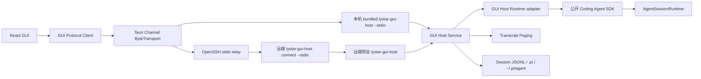

# LYStar Code GUI 开发方案

> 状态：Core、GUI Protocol、GUI Host、React 工作台和 Linux 本机 Tauri 已形成公开 Beta；`gui-v0.84.1-lystar-gui.5` 已发布五平台安装包、严格 SHA/manifest 和 provenance。当前源码候选为 `0.84.2-lystar-gui.1`，运行时 bundle 已升级到 Pi `v0.84.2`；候选继续包含设置 Host 连接泄漏、项目打开 deadline、AGENTS 加载、窗口拖动层级和 SSH 子进程退出回收修复，并完成本机浏览器与 Linux Tauri 验证。macOS App 与 Darwin Host 使用 ad-hoc code signature；干净 Mac Gatekeeper、Developer ID/notarization、真实 SSH Remote Host 和三平台完整实机运行仍未放行
>
> 日期：2026-08-15
>
> 基线：LYStar Code `0.84.2-lystar.1`，Pi `v0.84.2`
>
> 设计参考：`/tmp/cmux-drop-53c821d5-d6b0-4b10-98ec-abe86d3b0f54.png`

## 1. 方案结论

LYStar Code GUI 定位为跨平台编码 Agent 工作台，沿用 Codex GUI 的信息结构：左侧管理项目和连接，中间处理会话，底部固定输入，Tool 和 Diff 按需展开。

技术路线如下：

| 项目 | 决策 |
|---|---|
| 桌面壳 | Tauri 2 |
| 前端 | React + TypeScript + Vite |
| 长列表 | TanStack Virtual |
| Markdown | 复用 `marked` 解析，渲染为 React 组件 |
| 代码高亮 | 复用 `highlight.js` |
| 图标 | Lucide |
| 后台 | 独立 GUI Host 通过 Coding Agent 公开 SDK 组合 `AgentSessionRuntime` |
| 本地连接 | GUI 启动应用包内的 bundled `lystar-gui-host --stdio` |
| SSH 连接 | OpenSSH 连接远端按需常驻 `lystar-gui-host` |
| 会话协议 | 独立 LYStar GUI Protocol v1，复用 Pi CBOR/framing 原语 |
| 数据 | 保持 `~/.pi/agent`、项目 `.pi` 和 Session JSONL |
| 自动更新 | GUI 版本标明 bundled Runtime 基线，GUI/TUI 由 stable 兼容组合对应并自动升级 |

开发顺序固定为：

```text
共享 Session writer lock
  -> 通用 ./core export 与 GUI Host Runtime adapter
  -> GUI Protocol v1 分页
  -> Tauri 字节桥、远端 Host 与幂等任务
  -> signed stable manifest 防回放
  -> GUI 主界面
  -> 本地完整工作流
  -> SSH 远程连接
  -> 三平台发行
```

截至 2026-08-15，共享 Session writer lock、通用 `./core` export、独立 GUI Protocol/Host、Runtime contract、React 工作台和既有浏览器视觉闸门已形成开发基线。本轮继续完成 Tauri 本机/SSH 双传输、远端系统探测、五平台 Host 资源构建、完整运行资源上传、三平台托管代码、断线 lease 释放与 operation 接管、原子桌面项目注册表、SSH 项目和最近 Session 缓存，以及真实 `git-inspector`。新增 GUI 能力已经接入同一真实链路：外部 TUI writer 的 500ms 只读观察与释放后接管、Session 运行结果与 TUI 占用状态、输入/历史/Tool 图片、项目 `AGENTS.md` 原子编辑和哈希冲突检测、`@`/`$`/`/` Runtime 补全、受控外链/文件/图片/行号跳转，以及 Inspector 宽度和分区比例持久化。Linux 本机原生 Tauri 已完成 Channel、项目恢复、Project Trust、Git Inspector、Bash JSONL 落盘与重启恢复、图片查看器、项目指令动态重载和正常退出验证。`gui-v0.84.1-lystar-gui.5` 已通过预检 run `31856665307` 和正式发布 run `31859444631` 完成五平台构建；macOS ARM64/x64 的最终 DMG 已挂载并校验 App、local Host 与两种 Darwin Remote Host 的 ad-hoc 签名和架构，正式 Release 已公开 7 个资产。公开 Linux x64 AppImage 已完成 SHA 校验、真实启动、Host 资源还原和正常退出回归，CLI Latest Release 仍保持 `v0.84.1-lystar.13`。Completion、普通模型对话、认证和 Extension UI 的本轮原生键盘链仍待补齐，SSH Remote Host、干净 Mac Gatekeeper 和 macOS/Windows 平台托管仍无实机证据。当前准确结论是“`gui.5` 公开 Beta 已发布并完成 runner 级签名验证，干净 Mac 与其余跨平台实机链路未放行”，具体完成状态以第 14 节和 `AGENT_VERIFICATION.md` 为准。

现有 Pi Protocol v2 会在状态更新时携带完整 transcript，长会话和 SSH 场景无法直接使用。GUI 不修改该上游协议，改由独立 GUI Protocol 解决。

## 2. 需求范围

### 2.1 首版完整工作流

```text
启动 GUI
  -> 直接显示已保存的本机和 SSH 项目
  -> 选择项目，按需连接或重连
  -> 新建或恢复 Session
  -> 选择模型和思考强度
  -> 输入任务
  -> 查看流式回复、Tool、命令和 Diff
  -> 追加指令、停止或审阅变更
  -> SSH 断线或关闭 GUI 后远端任务继续
  -> 重开 GUI 后恢复项目、Session 和任务状态
```

### 2.2 首版功能

| 模块 | 功能 |
|---|---|
| 连接 | 本机、SSH、连接测试、远端 Host、断线重连、版本检查 |
| 项目 | 添加项目、持久项目列表、最近项目、连接归属、离线状态 |
| Session | 新建、搜索、恢复、重命名、删除确认 |
| 对话 | 用户消息、Assistant、Thinking、Tool、Web Search、错误、重试、压缩 |
| 输入 | 多行输入、中文 IME、图片粘贴/拖放、发送、引导、后续、停止 |
| Tool | 运行状态、摘要、展开详情、长输出按需读取 |
| Diff | 本轮文件、工作区变更、单文件 Diff、增删统计 |
| 模型 | Provider、模型、思考强度、认证状态、登录/退出 |
| Skill | 按用户/项目作用域搜索、查看、启停和诊断已发现 Skill |
| Extension | 选择、确认、输入、编辑器、通知、状态和文字 Widget |
| 设置 | 个性化、外观、连接、模型与认证、Skill、自动更新、诊断、关于 |

### 2.3 首版不做

- Monaco 或内置代码编辑器。
- 终端模拟器。
- SFTP 文件管理和目录同步。
- 云账号、团队空间和云端 Session 同步。
- 拉取请求中心、定时任务中心。
- Extension 任意自定义 TUI 组件的像素级复刻。
- 多窗口和无限会话标签页。

代码修改继续由 Agent Tool 完成，GUI 负责输入、监督、审阅和恢复。

## 3. 当前基础与关键缺口

### 3.1 可直接复用

当前仓库已经具备：

- `packages/protocol`：可复用的 CBOR 和 framing 原语；现有 schema 保持上游原样。
- `AgentSessionRuntime`、`createAgentSessionServices`、`createAgentSessionFromServices`：公开的 Runtime 组合能力。
- `SessionManager`、`SettingsManager`、`ProjectTrustStore`、`hasTrustRequiringProjectResources` 和 `ExtensionUIContext`：Host 所需的 Session、设置、信任和可序列化 UI 契约。
- `lc --mode rpc` 与公开 `rpc-entry`：用于行为差分验证，不作为 GUI 对外协议。
- 现有 `RemoteSession`、RPC 和 Server：作为状态、生命周期和测试语义参考，GUI 不直接依赖其 schema。
- `SessionTranscriptSource`：反向 JSONL 分页、分支过滤、cursor 失效和坏行处理的事实参考；GUI 不从 TUI 目录导入。
- TUI 长会话能力：渐进打开、有界渲染窗口、Tool/Diff 折叠和性能基准。

### 3.2 当前剩余缺口

1. 活动 Runtime 仍会全量物化大 Session；只读 transcript 已完成分页和跨页有界窗口，但 256 MiB 活动 Runtime 的完整 GUI/WebView 进程树基准尚未完成。
2. Tauri raw IPC、本机 Host、SSH bridge 和远端安装代码已接线；当前 Linux 主机已安装 Rust stable、Cargo、WebKitGTK 4.1、GTK 3、Ayatana AppIndicator、librsvg、OpenSSL 开发包和 `patchelf`。Linux x64 AppImage 已完成真实打包、Host 资源还原、raw Channel、原生 WebKitGTK 窗口、原子桌面状态和正常退出验证；真实 SSH 子进程桥、Linux ARM64、macOS 和 Windows 实机仍待验证。
3. Linux `systemd --user` + lingering 检查、macOS 带 `UserName` 的 LaunchDaemon、Windows 当前用户 Scheduled Task、完整运行资源 staging/切换/回退和 SSH relay 已实现；三系统 OpenSSH、named pipe、管理员批准、断线继续和重连接管仍无实机证据。
4. GUI updater 正式公钥、signed `stable-release-set.json`、防回放和联合升级路径尚未实现；无公钥时 updater 按闸门保持完全关闭。独立 Beta Release workflow 已通过 `gui-v0.84.1-lystar-gui.5` 实际发布五平台资产，严格 manifest、provenance、`prerelease=true` 和 CLI Latest 未改变均已确认；macOS ad-hoc code signature 只解决社区 Beta 的代码封装完整性和标准 Gatekeeper 手动放行，不替代 Developer ID、notarization 或 updater signature。
5. 原子桌面项目注册表、最后项目恢复、连接归属和最近 Session 缓存已在 Linux 原生 Tauri 验证；项目切换已改为候选 Host、Session、lease、transcript 和持久化全部成功后才提交的两阶段事务，候选连接或持久化失败不会破坏旧工作区。SSH 项目离线状态、Windows 原子替换和真实远端断线恢复仍未运行。
6. `git-inspector`、模型 OAuth/API key 写契约、图片附件、项目指令、Session 状态和 Completion 代码已接通；Git Inspector、图片查看器、项目指令动态重载和 sidecar 正常退出已在 Linux 原生 Tauri 验证，其余新增能力已通过真实浏览器与真实 Host，普通模型对话、认证、Extension UI 和原生 Completion 键盘链仍需补齐。
7. GUI/Host 五平台 Beta 安装包已由 `gui-v0.84.1-lystar-gui.5` 在原生 runner 构建并公开；macOS App 和 Darwin Host 使用 ad-hoc code signature，双架构 Host 汇总及最终 DMG 验签已通过 macOS runner，干净 Mac Gatekeeper 仍未验证。Developer ID/notarization、Windows Authenticode、正式 updater bundle、系统 WebView 实机和当前及上一支持版本的双向兼容 fixture 尚未完成。
8. `SessionManager.list()` 继续以 JSONL 为唯一事实源，大量 Session 的全文 metadata 构建仍是后续性能专项；本轮不引入第二份持久索引。
9. Rust TUI 已按 TypeScript TUI 语义接入 `/fork`、`/session`、`/model`、`/thinking`、Provider `/login` 和 `/logout`：`/fork` 候选来自 Core `getUserMessagesForForking()`，写入复用 Host `fork_session`、lease、journal 和 Session 全窗口锁，成功后恢复 Host 返回的完整原文；`/clone` 继续保持当前分支复制语义。`/session` 复用 Core `getSessionInfo()` 的全量 Session entries 统计，通过受 lease 保护的只读 `get_session_info` 展示名称、文件、消息、Token、费用、Provider/Model 和 Cache 信息；Rust 不读取 JSONL 或按本地 transcript 重算。`/model` 复用既有 `list_models` 与 journaled `set_session_model`，支持当前项定位、Provider/ID/名称筛选和 `/model <provider/model>` 初始筛选。`/thinking` 复用同一模型目录和 journaled `set_session_thinking`，只展示当前模型声明支持的等级；模型与思考写入期间会延迟应用 Host 提前广播的同 Session snapshot，只在严格 response 的 Session path、模型引用及所选值一致后提交。动态应用键位已复用 Host `KeybindingsManager.create(agentDir)` 和用户 `keybindings.json`，Rust 只把 Crossterm `Ctrl`、`Shift`、`Alt`、`Super` 组合编码为 Pi TUI `matchesKey()` 支持的原始序列。模型前后循环分别通过 journaled `cycle_session_model` 调用 Core `AgentSession.cycleModel()`，思考强度循环通过 `cycle_session_thinking` 调用 Core `cycleThinkingLevel()`；运行中、无 lease、并行 Session flow 或已有写入时拒绝，提前广播 snapshot 继续延迟到严格 response 后提交。`app.thinking.toggle` 只折叠或展开 Rust 的历史与流式思考过程，不修改 Session thinking level。认证继续复用 Host/Core 的 Provider 目录、凭据存储、`ui_request` 和 journal；Rust 不读取 `auth.json`、不保存凭据，API Key 使用密码输入，OAuth 只投影 URL、设备码与等待状态。登录/退出返回的模型目录先作为候选状态，再用 `list_model_providers` 核对目标 Provider、认证方式、`authSource`、模型数量和认证状态，通过后才提交缓存；`/logout` 只删除 `authSource=stored` 的凭据，环境变量和 `models.json` 不受影响。取消、运行中、并行 Session flow、并发写、Host 失败和非法或语义不一致响应均不会伪造提交。设置与主题继续复用 Host `list_settings` / `set_setting`、Core `SettingsManager`、Session lease、operation journal 和全窗口写锁；Host 只投影 `getLystarSettingsForUi()`，枚举显示名由 Core descriptor `format()` 提供，Rust 提交原始值。主题候选由内置主题和当前 Session `resourceLoader.getThemes()` 合并，支持固定主题及现有 `light/dark` 自动组合格式；Rust 当前没有动态配色预览引擎，本项不增加主题预览。Project Trust 的首次进入流程继续复用 Core `resolveProjectTrusted()` 和通用 `ui_request`；会话内 `/trust` 通过受当前 Session lease 保护的 `get_project_trust` / `set_project_trust` 管理当前 Runtime cwd，信任写入与同项目 Runtime 资源重载处于 Session 全窗口锁中。Host 区分当前项目直接决定与父目录继承决定，资源重载失败时恢复写前决定；Rust 只提交 cwd 与目标状态完全一致的 response。取消、运行中、无 lease、并行 Session flow、并发写、Host 失败和非法响应均保留原状态、Overlay 和 Composer 草稿。正式 `lc` 仍默认启动 TypeScript `InteractiveMode`；剩余 Skill/Package/项目指令完善、Shell/Extension parity、真实 Provider、真实 Host-Rust 进程 E2E、PTY、完整性能矩阵、三平台 transport 和发行接管尚未完成，纯 OAuth 等待阶段仍缺客户端中止契约。

这些缺口分别属于平台托管、原生壳、发行安全、剩余业务 capability 和性能演进，不能由 React 展示层或静态 fixture 代替。

## 4. 总体架构



### 4.1 Tauri 字节桥

WebView 不直接操作子进程 stdin/stdout。Tauri 后端提供一个 `ByteTransport` adapter：

- Rust 到前端使用 Tauri Channel 推送有序二进制 chunk。
- 前端到 Rust 使用 command 发送 `Uint8Array`，command 在子进程完成 write/drain 后返回。
- 每个入站 chunk 带连接内单调 `sequence`；前端累计确认，Rust 按未确认字节数暂停和恢复读取子进程 stdout。
- bridge 只转发字节，不解析 Agent 协议。
- 本机 sidecar 和 SSH 子进程复用同一 adapter。
- 每个连接设置待发送字节上限，关闭时同时释放 Channel、stdin 和子进程句柄。

这样 GUI Protocol Client、Host 和 React 状态模型都留在 GUI 自有目录，Rust 层只做 transport，不解析协议，也不需要监听本机 TCP 端口。Tauri 官方只保证 Channel 适合有序流式数据，`Uint8Array` 的跨 WebView 编码成本必须通过开工基准确认，不能假设为零拷贝。

### 4.2 责任边界

| 层 | 责任 |
|---|---|
| React GUI | 布局、交互、虚拟列表、渲染、临时 UI 状态 |
| GUI Protocol Client | 请求关联、连接状态、Session 分页、operation 和协议事件 |
| Tauri | 窗口、sidecar、SSH relay、字节桥、外部链接和更新 |
| `lystar-gui-host` | 本机/远端多 Session 服务、任务执行、lease、待处理 UI 和本地 IPC |
| Coding Agent 公开 SDK | Session、Provider、Tool、Skill、Extension、Project Trust 和模型行为 |
| `AgentSessionRuntime` | Provider、Tool、Skill、Extension、模型和 Session 行为 |
| Session 存储 | JSONL 事实源、分页索引、写锁和恢复 |

Provider key、OAuth token 和 `auth.json` 只留在 LYStar 后台进程中，不进入 WebView。

## 5. 后台进程设计

### 5.1 本机模式

```text
lystar-gui
  `- bundled lystar-gui-host --stdio
```

规则：

- 一个 GUI 进程启动一个本机后台。
- GUI 始终启动应用包内的 bundled `lystar-gui-host`，不从 `PATH` 解析另一个版本。
- 一个后台管理多个项目和 Session。
- 历史浏览不创建完整 Agent Runtime。
- 用户发送消息时才获取 Host control lease、Core Session writer lock 和 Runtime。
- 切换 Session 时先锁定目标；成功切换后释放旧 Session 的 Core writer lock。
- GUI 退出时先优雅关闭，再终止本轮子进程树。
- GUI、bundled Host 和 Host 固定 Runtime 作为同一个 GUI 构建单元发布；GUI manifest 记录各自版本并在启动时校验，不要求 GUI 版本等于独立 TUI 版本。

### 5.2 SSH 模式

远端执行改为独立于 SSH 的按需常驻 Host：

```text
lystar-gui
  `- ssh -T <target> <remote-gui-host> connect --stdio
       `- remote local IPC
            `- lystar-gui-host daemon
```

规则：

- `lystar-gui-host connect --stdio` 先探测 Host；不存在时通过 `lystar-gui-host ensure` 启动，再连接本机 IPC。
- Host 使用用户级单实例锁和稳定 endpoint：Unix domain socket，Windows named pipe。
- Host 不监听 TCP，不暴露公网端口，外部只能先通过 SSH 登录远端用户。
- SSH 进程只做有界字节 relay；SSH 断线只移除 Client attachment，不停止 Host、Runtime 或已接收任务。
- 同一远端用户的一个 Host 管理多个项目和 Session；不同 SSH alias、user、ProxyJump 或 identity file 仍作为不同 GUI 连接配置保存。
- Host 空闲时释放 Provider、Extension 和 Session Runtime；存在运行任务或待处理 UI request 时保持对应 Runtime。
- Host 在没有任务、没有待处理交互且超过 30 分钟无 Client 时可以退出，下次连接按需重启。

Host 启动必须脱离 SSH 登录会话和进程树：

| 远端平台 | 托管方式 |
|---|---|
| Linux | `systemd --user` service + user lingering |
| macOS | LaunchDaemon + `UserName`，一次性管理员批准 |
| Windows | Password logon Scheduled Task 或当前用户 Windows Service |

首次添加 SSH 连接时运行 Host 安装检查：

- `lystar-gui-host install` 优先完成当前用户可授权的托管配置，并明确显示将安装的 service/task 文件和路径。
- Linux 检查 user lingering；macOS 检查 LaunchDaemon 的 owner、permission、`UserName` 和批准状态；Windows 检查 task principal、`Log on as a batch job` 和网络访问能力。
- Windows 不使用 S4U 作为默认 Host 身份，因为该模式不能访问网络和加密文件；Password logon 或 Service 凭据只交给 Windows 系统管理器，GUI、SSH 命令参数和 LYStar 配置都不保存。
- 需要管理员授权、系统设置批准或组织策略放行时，GUI 给出一次性向导和精确命令，用户完成后继续检测，不静默提权。
- 首次安装执行数秒 detach 存活探测：启动 Host、关闭探测 SSH、重新连接并核对同一 `hostInstanceId`。10 分钟 operation 的断线继续执行放入工程测试和发布验收，不阻塞用户首次连接 10 分钟。
- 对应环境无法通过“SSH 关闭后 Host 仍存活”的验证时，连接设置失败并给出平台修复说明，不能降级回会终止任务的 stdio Server。

`lystar-gui-host stop` 在存在运行 operation 或待处理 UI 时默认拒绝；只有用户明确执行 `--force` 才中止任务。远端 Host 升级同样先检查 idle，避免替换正在执行任务的二进制。

远端 `lystar-gui-host` 是独立发行资产，由 GUI 通过 OpenSSH/SCP 安装或升级，不修改远端 `lc`。目标 Host 版本由 stable 兼容组合给出；Host idle 且验签、上传和候选 hello 通过时自动切换，存在运行 operation 时延后。GUI 通过协议版本与 capability 判断是否兼容，不要求远端 Host 的 `productVersion` 与本机 GUI 完全一致。

### 5.3 远端任务所有权

远端 Host 接收修改命令后返回持久 `operationId`，任务所有权归 Host，不归 SSH connection：

- `prompt`、`steer`、`follow_up`、`compact` 和 Bash 等操作先生成 `operationId`，写入 Host operation journal，再返回 accepted receipt。
- receipt 返回后，即使 ACK 在网络中丢失，Client 也用原 `clientRequestId` 查询，不重新执行同一输入。
- operation journal 位于远端 `~/.pi/agent/host/operations.jsonl`，仅当前用户可读写，使用 append + fsync 记录 accepted receipt 和状态变更。
- journal 只保存 request ID、operation ID、Session ID、命令类型、payload hash、状态、开始/结束时间和错误代码；同一 request ID 携带不同 payload 时拒绝，prompt、Tool 输出和 transcript 正文继续只写 Session JSONL。
- 完成记录保留 7 天并按 16 MiB 上限压缩；未完成 operation 和待处理 UI 不参与淘汰。journal 损坏时停止接受写操作并进入诊断，不能失去幂等依据后继续提交。
- SSH 断线时任务继续，Tool 子进程仍由远端 Host 跟踪；Host 崩溃或远端重启不承诺继续运行，但重启后必须把未完成 operation 标为 interrupted，不能静默重跑。
- Extension UI 或 Project Trust 需要交互时，operation 进入 `waiting_for_input`；请求由仍存活的 Host 保存在内存中，GUI 重连后继续显示并响应。Host 重启时该 operation 明确标为 interrupted。
- 没有 GUI 连接时，普通流式事件可以丢弃，已持久化 transcript 和 operation 状态不能丢；待处理交互由 Host 生命周期保证。

### 5.4 Runtime adapter

`packages/gui-host/src/runtime-adapter.ts` 是 GUI Host 接入 Coding Agent 的唯一位置。它只导入 `@earendil-works/pi-coding-agent/core`，不从包根、Coding Agent 私有 `src/**`、`modes/interactive/**` 或 `packages/tui/**` 导入：

- `createAgentSessionServices`。
- `createAgentSessionFromServices`。
- `createAgentSessionRuntime`。
- `SessionManager`、`SettingsManager`、`ProjectTrustStore`、`hasTrustRequiringProjectResources` 和 `ExtensionUIContext`。

`packages/coding-agent/package.json` 已暴露通用 `./core` subpath，`packages/coding-agent/src/core/index.ts` 已导出 Host 所需的 `SessionManager`、`SettingsManager`、`ModelRuntime`、Resource Loader、Project Trust、Runtime 工厂和 Session 类型。GUI Host 只从这一公开边界组合现有 Core 能力，方式跟随 `examples/sdk/13-session-runtime.ts`；Project Trust 通过 `resourceLoaderReloadOptions.resolveProjectTrust` 接入 GUI 的可序列化 UI。边界 AST gate 保证只有 `runtime-adapter.ts` 可导入该 subpath，不能复制判断，也不能修改 `main.ts` 或 TUI。

GUI 与 TUI 共用的是 Coding Agent 行为和数据契约：

- Provider、模型、认证和非展示设置。
- Project Trust、Resource Loader、Skill、Prompt 和 Extension。
- 内置 Tool、自定义 Tool、图片和 Session JSONL。
- Session new、resume、fork、switch 和 import。
- GUI 设置快照：Provider 认证摘要、Skill 解析结果、产品/组件版本和只读路径；凭据正文、原始 Settings 对象和 Package 内部类型不进入前端。

GUI 不复用 TUI Theme、keybinding、layout、renderer 或 built-in interactive command。当前 Coding Agent 包内部仍有部分 Tool renderer 和 Theme 的 TUI 依赖，首版允许它们作为公开 SDK 的传递依赖存在；这不构成 GUI 调用 TUI。只有包体或启动基准证明必须拆分，或者 Pi 上游先提供更纯的 Core subpath 时才调整，不能为追求依赖图好看先重构上游。

Runtime adapter 必须用同一组配置、Session 和 Faux Provider fixture 与 `lc --mode rpc` 做差分测试，覆盖模型选择、活动 Tool、资源发现、Extension、Project Trust、Session 切换和事件。GUI 专用 operation、分页和 transport 逻辑留在 adapter 外部的 Host service 中。

截至 2026-08-13，已落地真实源码 RPC 子进程与 `CodingAgentRuntimeAdapter` 的共享 Faux contract fixture，验证模型选择与恢复、Tool 调用及 JSONL 角色顺序、`select`/`confirm`/`input`/`editor`/`notify` 可序列化 UI、流式 abort 的终止事件和持久化 `stopReason: "aborted"`，以及项目 Prompt/Skill 发现与展开、Project Trust 隔离、Session 切换后的模型/思考等级/transcript 恢复。GUI Store 另有切换事务回归：目标打开或读取失败时保留原 Session 和租约，目标只读时先确认 transcript 可读再提交切换，释放原租约失败时归还新租约。Runtime 差分总项已在本机放行；后续新增 Runtime 能力仍需继续扩展同一 fixture。

每个 GUI 功能必须声明对应的 Runtime/Host capability，并同时满足三项条件：构建时 Core export 存在、contract test 通过、启动后 Host hello 返回该 capability。缺少任一项时，该功能不能进入 stable GUI，也不能靠隐藏按钮、版本号特判或外部 TUI 补齐。需要新底层能力时，先在 Coding Agent Core 和 bundled Runtime 中实现并验证，再发布依赖它的 GUI。

### 5.5 共享 Session writer lock

GUI Host 的 control lease 和 execution lease 只管理 GUI Client、operation 接管和断线恢复，不能阻止独立 TUI、print/RPC mode 或 SDK 进程写同一个 Session。跨进程 writer lock 属于 Coding Agent Core 的 Session 数据正确性契约，由 `SessionManager` 统一执行，GUI Host 不另建一套文件锁。

锁契约：

- 锁键使用 canonical Session JSONL 绝对路径；已有文件解析 realpath，新文件解析真实父目录后拼接文件名，避免 symlink 或路径别名绕过同一把锁。
- 复用仓库已有 `proper-lockfile`，统一使用 Core 固定参数；所有进程不得自行选择不同超时。首版基线为 `stale: 120_000 ms`、`update: 10_000 ms`、`realpath: false`、`lockfilePath: <canonical-session-path>.lock`、不排队抢锁。canonical path 由 Core 在调用依赖前完成，`realpath: false` 用于支持尚未创建的新 Session 文件；120 秒必须用 256 MB rewrite 和最慢支持存储基准复核，只能按证据上调，不能低于最坏同步写入时间。
- 可写打开必须先获取锁，再重新读取磁盘内容，并在锁内完成空文件初始化、Session migration 和必要 rewrite；不能先读取旧快照，再拿锁继续写。
- `createAgentSession`、`createAgentSessionFromServices` 和 `AgentSessionRuntime` 创建持久 Runtime 时必须走同一可写入口。TUI、print/RPC mode、SDK 和 GUI Host 因而共享同一锁协议，不在各模式增加独立判断。
- 锁由活动 `SessionManager` 持有，`AgentSession.dispose()`、Runtime 切换、正常退出和创建失败回滚时统一释放。切换到已有 Session 时先尝试锁定目标；目标已锁则保留当前 Session，不释放当前锁。
- append、rewrite、compaction、migration、reset/branch、Session 名称或 label 修改、import 目标和 delete 都必须位于 writer lock 内。创建分支时源 Session 保持锁定，新目标使用唯一文件名并在写入前取得自己的锁。
- rewrite、migration 和 compaction 不能继续直接以 `"w"` 截断原 JSONL。Core 必须在同目录唯一临时文件写完整内容、`fsync` 文件并原子替换目标；失败时删除临时文件并保留旧 JSONL。Unix 同步父目录，Windows 对替换行为做真实并发 reader 测试。
- 只读 metadata、搜索、transcript 分页、tree 读取和 HTML 导出不占 writer lock，也不得触发 migration 或 rewrite。reader 只能看到替换前或替换后的完整 generation；append 中尚未以换行结束的尾部片段不返回、不推进 cursor，读到 generation/revision 变化时按 Protocol 规则重读。
- 获取冲突统一抛出可识别的 `session_locked`，包含 Session/path 和 `retryable: true`；不能自动抢锁、删除活动 lock 或降级为无锁写入。
- 进程崩溃后只由 `proper-lockfile` heartbeat 的 stale 判定回收。锁被判定 compromised 时立即停止该 Session 的新写入、终止或中断当前 operation，返回 `session_lock_compromised`，重新打开前不能继续。
- Host accepted receipt 只能在 control lease、Core writer lock 和 operation journal 都准备成功后返回。SSH 断线只释放 Client attachment，不释放运行 operation 持有的 execution lease、Runtime 或 Core writer lock。

最小 Core API 约定：

```ts
class SessionManager {
  // 现有可写语义：返回前已取得 writer lock，并在锁内完成权威重读和 migration。
  static create(cwd: string, sessionDir?: string, options?: NewSessionOptions): SessionManager;
  static open(path: string, sessionDir?: string, cwdOverride?: string): SessionManager;
  static openAsync(path: string, sessionDir?: string, cwdOverride?: string): Promise<SessionManager>;
  static continueRecent(cwd: string, sessionDir?: string): SessionManager;
  static forkFrom(sourcePath: string, targetCwd: string, sessionDir?: string): SessionManager;

  // delete、import 目标等不创建 Runtime 的短写操作复用同一锁协议。
  static withWriterLock<T>(path: string, operation: () => T): T;

  // Runtime 使用：返回已锁定的独立目标 manager，不修改当前 manager。
  createBranchedSessionManager(leafId: string): SessionManager;

  dispose(): void;
}

interface ReadOnlySessionSnapshot {
  header: SessionHeader;
  entries: readonly SessionEntry[];
  leafId: string | null;
}

// 只读快照：不持锁、不修改文件、不执行落盘 migration。
function readSessionSnapshot(path: string): ReadOnlySessionSnapshot;

class SessionLockedError extends Error {
  code: "session_locked";
  sessionPath: string;
  retryable: true;
}

class SessionLockCompromisedError extends Error {
  code: "session_lock_compromised";
  sessionPath: string;
  retryable: false;
}
```

- `SessionManager.inMemory()` 不持锁。`forkFrom`、import 和 branch 目标创建复用 `withWriterLock`，不能绕过锁协议。
- 保留现有公开 `newSession()`、`setSessionFile()` 和 `createBranchedSession()` 兼容语义。persisted manager 换路径时先取得目标锁并完成加载或写入，再原子切换内部 state 与 release handle，最后释放源锁；目标失败时 manager 仍绑定原 path 和原锁。不能先释放源锁再尝试目标。
- `createAgentSession` 成功后由 `AgentSession` 接管 manager 所有权；创建失败必须释放。`AgentSession.dispose()` 再调用 `sessionManager.dispose()`，重复释放保持幂等。
- `readSessionSnapshot()` 复用共享 JSONL parser，只在内存中解释旧版本，不写回 migration；返回不可变快照，不暴露 mutation。Session 导出和子代理历史浏览改用它，GUI transcript reader 继续使用自己的分页 reader。Session 改名继续使用可写 `open`，并在 `finally` 中 `dispose()`。
- `SessionManager` 保存异步 compromise 状态并通知当前 `AgentSession`；AgentSession 立即 abort 当前运行，后续写入统一抛出 `SessionLockCompromisedError`。不能让 `proper-lockfile` 默认回调以未处理异常杀死整个多 Session Host。
- `AgentSessionRuntime.switchSession()` 先取得目标 manager 的锁并完成校验，再 teardown 旧 Session；目标冲突时保持旧 Runtime 和锁。
- persisted branch 不能再次 `open` 当前源 Session，也不能依赖进程内可重入锁。当前已持锁 manager 提供源分支快照，新增 `createBranchedSessionManager()` 创建并返回已锁定的独立目标 manager；目标写入和校验成功后才 teardown 旧 Session。失败时释放目标锁并保留原 Runtime、源锁和源文件。现有 `createBranchedSession()` 保留给兼容调用者，并按上一条执行安全锁转移。
- import 先锁定规范化目标路径，再复制到同目录临时文件并原子替换；目标 Runtime 创建成功后才释放旧 Session。branch/import 都禁止出现无锁窗口或半写目标。

实现时允许在 `SessionManager`、Session 创建/销毁的共享 Core 组合点和对应测试中做一项独立、最小的数据正确性改动。该改动不得引入 GUI 类型、GUI Host 依赖或模式分支；无冲突场景的 TUI/CLI 行为保持不变，冲突场景新增明确错误。

### 5.6 开工技术闸门

在完整页面开发前先完成六个小型可运行验证：

| 闸门 | 验证内容 | 通过标准 |
|---|---|---|
| Session writer | 两个真实进程用 TUI/Core fixture 竞争同一 JSONL，并覆盖 append、原子 rewrite、migration、branch、rename/delete、并发 reader 和崩溃恢复 | 同时只有一个 writer；失败方得到 `session_locked`；持锁进程退出或 stale 后可恢复；reader 不看到半文件，JSONL 无丢行、重复行和截断 |
| Runtime | 通过单一 Runtime adapter 启动 GUI Host，并与 `lc --mode rpc` 跑同一 contract fixture | Provider、Tool、Skill、Extension、Project Trust 和 Session 恢复行为一致；除共享 writer lock 的通用 Core 改动外，TUI 和 `main.ts` 无 GUI 分支 |
| Tauri bridge | 16 KiB、64 KiB、1 MiB chunk 持续传输 16 MiB 和 64 MiB 数据 | 顺序正确、内存有界、关闭无挂起；额外首字延迟 p95 不超过 100 ms |
| Protocol | GUI v1 schema、stdio framing、分页、断线和 UI request fixture | 重复事件可忽略、事件缺口可检测、断线输入不自动重发、旧版本错误可读 |
| Remote Host | 提交 10 分钟任务后强制关闭 SSH 和 GUI，再重连 | 任务继续、只执行一次、进度与待处理 UI 可恢复、Host 无公网监听 |
| Update manifest | 验证 signed stable manifest、单调 `setVersion`、本机 version floor 和不可变版本路径 | 错误签名、旧清单重放、同版本不同内容和未知升级路径均被拒绝，当前安装不变 |

Channel 基准不达标时，只替换 `ByteTransport` 内部桥接方式，上层 GUI Protocol Client 和状态模型不变。不得为了绕过基准改成无界事件广播。

## 6. LYStar GUI Protocol v1

GUI 不修改 Pi `packages/protocol`、`packages/client` 和 `packages/server`。新建 `packages/gui-protocol`：

```text
packages/gui-protocol/
  src/
    schemas.ts
    framing.ts
    client.ts
```

- schema、capability、分页、operation、Extension UI 和恢复语义由 GUI Protocol 自己定义。
- CBOR codec 和长度前缀 framing 优先复用 `@earendil-works/pi-protocol` 的公开原语，不复制二进制编码器。
- GUI Protocol 版本从 `1` 开始，和 Pi Protocol 版本没有继承或数值对应关系。
- GUI Protocol Client 只服务 React GUI；现有 `PiClient`、`RemoteSession` 和实验 server/client 继续跟随上游，不承载 GUI 兼容包袱。
- Pi 上游未来出现满足全部需求的正式协议时，先做 adapter 对比；只有迁移能明显减少维护量时才替换，不提前双轨。

### 6.1 状态与 transcript 分离

新的 Session 状态只保留运行信息：

```ts
interface SessionStateSnapshot {
  id: string;
  name?: string;
  cwd: string;
  createdAt: number;
  updatedAt: number;
  phase: SessionPhase;
  model: ModelRef;
  thinkingLevel: ThinkingLevel;
  attached: boolean;
  writeAccess: "available" | "owned" | "controlled_elsewhere" | "locked_externally";
  revision: number;
  leafId: string | null;
  queuedSteerCount: number;
  transcriptGeneration: string;
  transcriptRevision: number;
}
```

transcript 通过独立命令读取：

```ts
interface ReadTranscriptCommand {
  command: "read_transcript";
  sessionId: string;
  cursor?: string;
  limit: number;
}
```

返回：

```ts
interface TranscriptPage {
  items: TranscriptItem[];
  previousCursor?: string;
  hasMorePrevious: boolean;
  leafId: string | null;
  transcriptGeneration: string;
  transcriptRevision: number;
}
```

规则：

- 无 cursor 时读取活动分支尾页。
- 默认 80 个可见条目，最大 200。
- cursor 绑定 Session、leaf 和文件 generation。
- Session rewrite、迁移和 branch 切换会让旧 cursor 失效。
- `writeAccess` 只用于展示当前 Client 视角的写入可用性；真正执行写命令时仍重新校验 Host lease 和 Core writer lock，不能依赖旧 snapshot 授权。
- 分页实现留在 `packages/gui-host`，不导入 TUI 的 `SessionTranscriptSource`；使用相同 JSONL fixture 对照其分支、cursor、坏行和 rewrite 行为。

### 6.2 增量事件

保留两类更新：

| 事件 | 用途 |
|---|---|
| `session_progress` | 流式临时状态，可以丢弃 |
| `transcript_committed` | 已持久化条目，客户端权威合并 |
| `session_snapshot` | 不含 transcript 的运行状态 |

完成一次消息或 Tool 后，只发送新增条目，不广播完整历史。

`transcript_committed` 必须携带 `transcriptGeneration`、`fromRevision`、`toRevision` 和稳定 `entryId`：

- generation 相同且 `fromRevision` 等于客户端当前 revision 时合并。
- 已收到的 `toRevision` 直接忽略，保证重复事件幂等。
- generation 变化或 revision 出现缺口时，丢弃临时投影并重新读取尾页。
- `session_progress` 不参与 revision，只作为可丢弃的当前运行投影。

### 6.3 大 Tool 输出

单个 Tool 文本超过 64 KiB 时：

- 页面只返回头尾预览、行数、字节数和 `contentRef`。
- 用户展开后通过 `read_content` 分块读取。
- 图片先返回缩略图和元数据，原图按需读取。
- `contentRef` 使用不可猜测 ID，绑定 Session 和 Server 实例，设置过期时间和读取上限。
- `contentRef` 只在当前 Server 生命周期有效，不写入 JSONL；重连后失效时重新读取对应 transcript page 获取新引用。

普通 Assistant 文本仍直接分页返回，避免给常规消息增加复杂度。

### 6.4 浏览与执行分离

```text
浏览 Session
  -> metadata + transcript page
  -> 不加载 Provider、Extension 和模型上下文

发送消息
  -> 获取 Host control lease
  -> 获取 Core Session writer lock 和 runtime
  -> 构建活动分支上下文
  -> 执行 Agent
```

这条规则是多项目低资源运行的基础。

两套互不替代的互斥机制必须同时成立：

| 机制 | 所有者 | 解决的问题 | 生命周期 |
|---|---|---|---|
| control/execution lease | GUI Host | GUI Client 控制权、operation 接管、断线重连和至多执行一次 | control lease 可随 idle/detach 释放；accepted operation 由 execution lease 持有到完成或中断 |
| Session writer lock | Coding Agent Core `SessionManager` | GUI Host、TUI、print/RPC mode 和 SDK 跨进程修改同一 JSONL | 持久 Runtime 的整个可写生命周期；`AgentSession.dispose()` 或创建失败时释放 |

Host lease 规则：

- GUI 首次启动生成持久 `clientInstanceId`；每次提交生成 `clientRequestId`，重连和重试保持不变。
- `acquire_session` 返回不可猜测 `leaseId` 和 `leaseGeneration`，并绑定 `clientInstanceId`。
- 所有修改 Session 或 Runtime 的 GUI 命令必须携带有效 control lease；同一 Host 内第二个 Client 返回 `session_control_locked`。
- Host 在创建持久 Runtime 前再申请 Core writer lock；如果 TUI 或其他进程已持有，返回 `session_locked`，不创建 operation，也不返回 accepted receipt。
- 只读 metadata 和 transcript page 不申请 Host lease 或 Core writer lock，也不创建 Runtime。
- idle Session 在 detach 或连接关闭后释放 control lease 和 Runtime。
- 已接受 operation 运行期间由 Host 持有 execution lease、Runtime 和 Core writer lock；SSH 断线不会释放给第二个 writer。
- 原 `clientInstanceId` 重连后获取新的 control lease，并重新接管 operation 的停止、引导、后续和待处理 UI；旧 `leaseId` 不复用。
- 另一个 Client 只能只读观察，除非原 Client 明确释放、operation 完成且 control lease 超时。

### 6.5 握手、重连与可序列化 UI

Server hello 增加：

- `productVersion`、Protocol 版本和 capability 列表。
- `serverInstanceId`，用于识别本机 sidecar 或远端 Host 的 Protocol service 是否已经重启。
- `hostInstanceId` 和 Host 启动时间，远端重启后用于判定 operation 是否中断。
- 明确的版本错误，旧 Client 不得把不兼容数据当作普通断线。

重连后 Client 重新读取 Server snapshot、Session state、operation 状态和尾页，不依赖内存事件重放。请求响应在断线前未确认时，使用原 `clientRequestId` 查询：已接受则绑定现有 `operationId`；当前 Host 明确返回 unknown 时，Client 自动重发同一 request ID 和相同 payload；`hostInstanceId` 已变化或 payload hash 不一致时停止自动重试并显示 interrupted。任何情况都不能生成新 request ID 复制执行。

GUI Protocol 沿用现有 RPC `extension_ui_request/response` 的语义并覆盖 Project Trust，不修改 RPC 类型或传输：

- 支持 `select`、`confirm`、`input`、`editor`、`notify`、`setStatus`、文字 `setWidget`、`setTitle` 和 `setEditorText`。
- UI request 带稳定 ID、来源和可选 timeout，响应支持 value、confirmed 和 cancelled。
- 本机临时 Server 关闭时取消待处理请求；远端 Host 在 SSH 断线时保留请求并把 operation 置为 `waiting_for_input`。
- timeout、用户取消、Host shutdown 或 operation abort 才结束远端待处理请求，不能因为 transport close 默认取消。
- `custom()`、任意 TUI Component、custom header/footer 继续标记为 TUI-only。

### 6.6 首版服务契约

GUI 只连接 LYStar GUI Protocol v1，不依赖现有 JSONL RPC，也不要求 RPC 入口迁移。可复用的是公开 SDK 和可序列化 UI 语义，不共享 transport/schema 实现；RPC 只作为 Runtime 行为差分基线。

| GUI 能力 | Server/Protocol 事实源 |
|---|---|
| 项目列表 | GUI 工作区注册表是导航事实源；远端离线时仍可显示，连接后用 Server canonical cwd 刷新状态 |
| Session 列表、搜索 | 只读 metadata service，按 connection 和 cwd 过滤，不创建 Runtime；GUI 只缓存最近项供离线定位 |
| Session 新建、打开、改名、删除、fork、tree | Session storage service；改名和删除必须校验写锁，活动 Session 不能直接删除 |
| 发送、引导、后续、停止、图片 | `prompt`、`steer`、`follow_up`、`abort`，输入携带现有 `ImageContent` |
| 压缩、自动压缩、重试 | 复用现有 AgentSession/RPC 能力并投影明确 phase 和 retry 状态 |
| 模型和认证 | `list_models`、Provider 认证摘要、login/logout；OAuth URL 由后台生成，GUI 用系统浏览器打开，API key 直接提交后台，凭据和 `auth.json` 不进入 WebView |
| Skill 设置 | `list_skills` 返回名称、描述、路径引用、来源、作用域、最终启用状态、Project Trust 限制和诊断；`set_skill_enabled` 只修改对应用户/项目资源 override，随后重新 `PackageManager.resolve()` 回查 |
| 产品与组件信息 | `get_about` 返回 `piConfig` 产品名、产品版本、Pi 基线、发行仓库、GUI/Host/Runtime/Protocol/TUI 版本和可打开目录；前端不读取 package、VERSION 或配置文件 |
| Extension 和 Project Trust | 共享 UI request/response；无可序列化交互时明确拒绝或降级 |
| Tool、Thinking、Web Search | transcript page、progress、committed event 和 `contentRef` |
| 本轮文件 | 从持久 Tool/Session 条目生成，不依赖前端猜测 |
| Git 分支、工作区状态、单文件 Diff | 远端或本机 Server 在目标 cwd 读取；GUI 不在本机替远端项目运行 Git |
| Slash Command、Prompt Template | `list_commands` 返回名称、描述和来源；执行继续走统一输入语义 |
| Skill 命令 | 可用 Skill 仍通过 `list_commands` 暴露 `/skill:name`；设置页的发现、作用域、启停和诊断使用独立 `list_skills`，不能从命令列表反推 |
| 直接 Bash | 仅当 GUI 保留 `!` 命令入口时开放 `bash/abort_bash`；否则不显示入口 |

任何首版可见入口如果没有上表中的真实返回值、错误和权限语义，就从界面移除，不能使用演示数据占位。

## 7. 长会话性能

### 7.1 后台

- 在 `packages/gui-host` 实现独立反向 JSONL reader，算法和边界以现有 `SessionTranscriptSource` 及其 fixture 为事实参考，不移动或导入 TUI 文件，也不预先引入第二套数据库。
- JSONL 继续作为唯一事实源。
- 先基准现有 `SessionManager` 的全量打开、活动分支构建和 GC；只有 256 MB 活动 Runtime 未达门槛时，才增加可重建 sidecar 索引保存 entry id、parent id 和 byte offset。
- 引入 sidecar 索引后，append 增量更新，rewrite 和 migration 重建；索引损坏只影响性能，不能影响 JSONL 正确性。
- 需要索引时，模型上下文只读取当前活动分支和 compaction 后需要的条目。
- transcript、tree 和 branch picker 分别按需读取。
- 只读浏览不加载模型和 Extension。

### 7.2 前端

- 会话区使用虚拟列表。
- 以稳定 `entryId` 为 key。
- 首次只加载尾页。
- 上滚接近顶部时读取上一页。
- prepend 后恢复原锚点和像素偏移。
- Tool、Thinking 和 Diff 默认折叠。
- 只对可见项使用 `ResizeObserver`。
- 每个 Session 最多缓存 600 个条目，并设置 8 MiB 的 JSON UTF-16 载荷估算预算；单个新加载页必须完整保留，预算不足时从较新的尾部淘汰。
- 加载历史后保留原首条锚点；发生淘汰或历史窗口收到新 commit 时显示吸顶“回到最新”，不自动跳到底部。
- 点击“回到最新”重新读取尾页；`transcriptGeneration` 变化时立即丢弃旧窗口并重读，不能保留 rewrite 前的条目。

### 7.3 流式更新

- 文本 delta 每 33 ms 最多提交一次 React 更新。
- Tool progress 每 100 ms 或状态变化时更新。
- 窗口隐藏或最小化后降到 250 ms。
- 消息完成时进行一次最终 Markdown 解析和高度校正。
- 用户停留历史位置时不自动跳到底部，只显示“有新内容”。

### 7.4 性能门槛

下表是首轮工程预算。开工闸门需要把基准机 CPU、内存、存储、内核、WebKit/WebView 版本、冷暖缓存策略和采样脚本写入 `AGENT_VERIFICATION.md`。每个场景使用独立进程运行 30 次，保留原始数据并记录 median 和 p95。

`GUI shell 可见` 从进程启动计到首帧；`尾页可见` 从发起打开 Session 计到尾页完成布局；RSS 按 GUI、WebView、bundled Host（含 Runtime）和 SSH 的进程树统计。不同系统的 RSS 口径不直接横向比较。

| 指标 | 目标 |
|---|---:|
| GUI shell 可见 p95 | `<= 500 ms` |
| 16 MB 尾页可见 p95 | `<= 400 ms` |
| 64 MB 尾页可见 p95 | `<= 700 ms` |
| 256 MB 尾页可见 p95 | `<= 1500 ms` |
| GUI 增加的流式首字延迟 p95 | `<= 100 ms` |
| 滚动帧 p95 | `<= 16 ms` |
| resize 稳定 p95 | `<= 100 ms` |
| 空闲 CPU | `< 1%` |
| 16 MB 到 256 MB 的 UI RSS 增量 | `<= 80 MiB` |
| 256 MB 只读浏览总 RSS | `<= 350 MiB` |
| 256 MB 活动 Runtime 总 RSS | `<= 500 MiB` |
| 首次 SSH 尾页传输 | `<= 4 MiB` |

macOS 和 Windows 同时记录相对增量，最终结论只覆盖实际测试的平台。

## 8. SSH 远程连接

### 8.1 配置

GUI 只保存非敏感信息：

```ts
interface SshConnectionConfig {
  id: string;
  name: string;
  mode: "alias" | "direct";
  target: string;           // ~/.ssh/config alias 或主机
  user?: string;
  port?: number;
  authMethod: "agent" | "key" | "password";
  identityFile?: string;
  credentialId?: string;    // 系统凭据库引用，不是密码
  rememberPassword?: boolean;
  platform?: "auto" | "linux" | "darwin" | "windows";
  defaultCwd?: string;
}
```

认证复用：

- `~/.ssh/config`。
- SSH key。
- ssh-agent。
- ProxyJump。
- known_hosts 和系统 host key 校验。

密码只保存在当前应用会话内存或系统凭据库，不能进入 `desktop-state.json`、GUI Protocol、日志、命令参数或普通环境明文。Tauri 使用受限 AskPass helper 按凭据引用读取密码；临时凭据在应用退出时删除，勾选“记住密码”时只保留系统凭据库条目和非敏感引用。

ssh-agent 和私钥认证使用 `BatchMode=yes`；密码认证使用单次 AskPass、`NumberOfPasswordPrompts=1` 和受限认证方法。未知 Host key 先通过 `ssh-keyscan`/`ssh-keygen` 获取 SHA-256 指纹，GUI 显式展示并确认后写入系统 `known_hosts`，禁止关闭严格校验。

### 8.2 连接流程

```text
查找 ssh
  -> 探测远端系统和架构
  -> 校验或安装签名的 lystar-gui-host
  -> 执行固定 Host launcher 的 connect --stdio
  -> 读取 magic preface 和 hello
  -> 校验 LYStar、Protocol、capability 和 hostInstanceId
  -> 完成 hello
  -> 读取已保存项目的 metadata、Session 和 operation
```

“连接测试”执行固定 probe，返回远端 OS、架构和现有 Host 状态；正常业务连接只保持一个 SSH relay，避免重复认证。

Windows 查找顺序：

1. 系统 OpenSSH Client。
2. LYStar 托管 MinGit 中经过验证的 `ssh.exe`。
3. 均不存在时给出安装提示。

### 8.3 stdio 约束

- SSH 使用 `-T`，禁止分配 PTY。
- ssh-agent/私钥使用 `BatchMode=yes`；密码使用单次 AskPass。所有模式都设置 `ConnectTimeout`、`ServerAliveInterval` 和 `ServerAliveCountMax`，避免认证、半开连接和断网永久悬挂。
- stdout 只输出协议字节。
- 日志和诊断写 stderr。
- 协议前输出固定 magic preface。
- Client 最多扫描 4 KiB 寻找 preface。
- 发现 shell banner 或 rc 污染时显示具体文本并停止连接。
- 单帧、待发送队列和图片输入设置大小上限。
- SSH 参数通过 argv 数组传递，不拼接本地 shell 命令。
- OpenSSH 的远端命令仍会经过远端登录 shell 解析，因此命令模板由应用内固定 launcher 生成，用户配置不能插入任意 shell 片段。
- Host 安装完成后生成无空格固定 launcher；Windows 使用固定 `.cmd`/PowerShell bootstrap，不要求 `lc` 或 Host 预先进入 `PATH`。

### 8.4 断线恢复

- SSH 退出后显示“连接已断开”，不标成 Agent 失败。
- 无交互认证的连接按 1、2、5、10、30 秒重试。
- 重连后重新 hello，读取 operation、Session 状态、待处理 UI 和尾页。
- 已返回 accepted receipt 的远端任务继续执行；GUI 用 `operationId` 恢复流式状态、停止权和后续输入。
- ACK 丢失时使用原 `clientRequestId` 查询是否已接受；当前 Host 返回 unknown 时自动重发同一 request ID 和相同 payload，严禁生成新请求复制执行。
- Host 进程仍在但 operation 已完成时，直接显示持久化结果；Host 重启导致 operation 中断时显示明确的 interrupted 状态。
- 等待 Project Trust、Extension confirm/input/editor 的任务保持 `waiting_for_input`，重连后恢复同一个请求。
- 用户可以停止重连或移除连接。

### 8.5 远程项目持久工作区

所有通过 SSH 打开的项目都写入本机 GUI 工作区注册表，行为与本机最近项目一致。退出 GUI、SSH 离线、远端 Host 停止或本机更新后，项目仍保留在侧栏。

```ts
interface DesktopState {
  version: 1;
  connections: SshConnectionConfig[];
  projects: Array<{
    id: string;
    connectionId: string | "local";
    cwd: string;
    name: string;
    pinned?: boolean;
    color?: "red" | "orange" | "green" | "blue" | "purple" | "gray";
    archived?: boolean;
    recentSessions?: CachedSessionSummary[];
  }>;
  selectedProjectId?: string;
  layout?: {
    inspectorWidth: number;
    inspectorSplit: number;
    sidebarCollapsed?: boolean;
  };
}
```

规则：

- 文件固定为 Tauri 应用配置目录下的 `desktop-state.json`，原子写入并使用进程内串行更新；浏览器开发模式使用同结构 localStorage fallback。
- 远程项目身份由 `connectionId + 规范化 cwd` 确定；重复打开更新原记录，不增加重复项目。
- 只保存连接非敏感配置、远端路径、展示名、排序和最近 Session ID，不复制 transcript、凭据或远端文件。
- GUI 启动先从本地注册表恢复完整侧栏，再异步连接；离线项目保持可见并显示离线状态。
- 点击离线项目会连接对应 SSH、恢复 `lastSessionId` 并刷新远端 metadata；Session 不存在时保留项目并进入 Session 选择页。
- 项目切换先准备候选 Host、Session、writer lease 和 transcript 尾页，再持久化候选 `selectedProjectId`；全部成功后才替换当前 UI 和释放旧 lease。任一步失败都关闭候选资源并保留旧项目、旧 Session、旧 transcript 和旧 lease。
- `selectedProjectId` 只表示最近完整成功的项目；失败目标不能污染启动恢复。Skill、AGENTS、Git、模型和诊断在项目提交后独立加载，失败只影响对应辅助面板。
- 远端路径不存在、权限变化或 Host 不可用时标记“不可访问”，不能自动从侧栏删除。
- “从列表移除”只删除本机 GUI 注册记录，不删除远端目录、Session 或 Host 数据。
- 每个项目最多保存 20 个最近 Session 的 ID、标题和更新时间，用于离线展示和恢复定位；连接后以远端 Server 返回为准。
- 连接配置改名不改变项目身份；删除连接配置前列出关联项目并二次确认，删除后也不触碰远端数据。
- 本机和 SSH 项目进入同一个连续项目列表，不按连接类型拆组。项目按置顶和最近打开时间排序，当前项目的最近 Session 直接在项目行下展开。
- 本机项目行只显示项目名称；SSH 项目行右侧显示所属连接名和连接状态点。离线时保留连接名，状态点改为灰色或错误色，不能让远程项目看起来像本机目录。
- release set 防回放 floor 和未完成升级步骤属于更新器独立状态，不混入项目注册表；任何状态都不保存下载资产、密码或签名私钥。

## 9. GUI 信息结构

### 9.1 主布局

```text
┌──────────────────────┬──────────────────────────────────────────────┐
│ LYStar Code          │ 项目 / Session                     操作区   │
│ 新会话 · 会话搜索    ├──────────────────────────────────────────────┤
│                      │                                              │
│ 项目                 │              对话虚拟列表                    │
│ lystar-agent         │   用户 / Assistant / Tool / Diff / 错误      │
│ guotou-platform  SSH │                                              │
│   当前 Session       │                                              │
│ other-project    SSH ├──────────────────────────────────────────────┤
│                      │          Composer · 模型 · 发送/停止          │
│ 设置                 │                                              │
└──────────────────────┴──────────────────────────────────────────────┘
```

### 9.2 左侧栏

默认宽度 `320px`，可以折叠：

- LYStar Logo、`LYStar Code` 品牌和侧栏收起按钮；收起状态进入 `desktop-state.json`。
- 新会话。
- Session 搜索。
- 单一项目列表，本机和 SSH 项目按最近使用顺序混排。
- 当前项目下展开最近 Session，不另设全局 Session 分组。
- 底部设置和诊断。

项目行规则：

- 本机项目：左侧目录图标和项目名，右侧留空。
- SSH 项目：左侧远程目录图标和项目名，右侧显示连接名与状态点。
- 连接名使用用户保存的 SSH 配置名称，不显示裸 `user@host`，除非用户没有设置名称。
- 项目名优先完整显示；宽度不足时先截断连接名，再截断项目名，状态点始终保留。
- 当前项目使用低对比选中背景；其 Session 直接缩进展开，当前 Session 使用更明确的选中层级。

连接状态点只表达 SSH 连接：

- 绿色：正常。
- 黄色：连接或重连中。
- 红色：连接失败。
- 灰色：未连接。

本机项目不显示状态点，避免把本机目录误解为连接对象。

### 9.3 顶栏

保持一行：

- 项目。
- Session 名称。
- 本机或 SSH 主机。
- Git 分支和工作区状态，有可靠数据时显示。
- 更多菜单。
- 变更审阅入口。

使用系统原生窗口标题栏，减少三平台窗口行为差异。

### 9.4 对话区

- 用户消息右对齐，最大宽度 72%。
- Assistant 正文使用连续阅读布局。
- Thinking 默认折叠为一行。
- Tool 使用平面卡片，圆角不超过 8px。
- 相邻 Tool 使用低对比分隔线。
- 错误直接可见。
- Diff 显示行号和 `+/-`，颜色只做辅助。
- 大输出在展开时按需读取。

### 9.5 Composer

使用原生 `<textarea>`：

- 支持中文 IME 和组合输入。
- 1 至 8 行自动增长。
- `Enter` 发送，`Shift+Enter` 换行。
- Agent 运行中提供引导和后续语义。
- 右下只保留一个圆形发送/停止主按钮，状态切换时图标和 Tooltip 同步变化。
- 支持粘贴和拖放图片。
- 底部左侧只放附件入口和需要用户处理的权限/信任状态；正常状态不持续占用空间。
- 底部右侧使用紧凑文字显示模型和思考强度，点击后打开菜单，不渲染成多个并排下拉框。
- Composer 不显示独立连接选择器；连接归属来自当前项目。
- 输入区保持大面积干净留白，不在边框内堆放工具栏、标签或说明文案。

图片继续使用 LYStar 现有 resize 规则。

### 9.6 变更审阅

顶栏按钮打开右侧 Inspector，默认宽度 `420px`：

- 本轮文件。
- 工作区全部变更。
- 单文件 Diff。
- 增删统计。
- 复制路径和打开外部编辑器。

“打开外部编辑器”首版只对本机项目显示。SSH 项目只提供复制远端路径；未实现明确的远程编辑器 URI 前不显示不可用动作。

窗口小于 `1100px` 时，Inspector 覆盖主内容，不永久形成三栏。

### 9.7 窗口适配

| 宽度 | 行为 |
|---:|---|
| `>= 1200px` | 左侧栏和主内容，Inspector 可并排 |
| `900-1199px` | Inspector 覆盖 |
| `720-899px` | 左侧栏默认关闭，由汉堡按钮打开 `288px` 临时抽屉 |
| `< 720px` | 只保留主内容，项目和设置从菜单打开 |

`800×600` 截图和实现基线使用抽屉关闭的真实工作态，顶栏、正文和固定 Composer 必须完整可用。抽屉打开是单独交互状态，只覆盖主内容并提供关闭遮罩，不能把宽屏侧栏和内容同时压进窄窗口。Inspector、项目抽屉和设置覆盖层同一时刻只打开一个。

### 9.8 设置与状态页

设置使用固定左侧分类和右侧连续内容，分类为个性化、外观、连接、模型与认证、Skill、自动更新、诊断、关于。左侧先选择“所有设置”、本机或某个 SSH Host；设置 Host 使用独立临时 Client，不切换当前项目、不释放当前 Session lease。页面只显示 Host 返回的结构化状态和可执行动作，WebView 不直接读取 `auth.json`、`settings.json`、Package 路径清单或版本文件。

- 个性化页按 Host/项目作用域编辑 `AGENTS.md` 与 `AGENTS.override.md`，显示继承来源，并使用 UTF-8、原子保存和 SHA-256 冲突检测；远端离线时只提示重连，不缓存盲写。
- 模型与认证按 Provider 组织认证状态、来源、可用模型和登录/退出；API key 不回显，OAuth 使用系统浏览器。
- Skill 只管理当前 Runtime 发现的 Skill，支持全部/用户/项目筛选、搜索、行级启停、Project Trust 限制和诊断。Extension、MCP、Prompt Template 和远程市场不混入 Skill 页。
- 自动更新先显示当前结论、目标版本、进度、阻塞和唯一下一动作；signature、`setVersion`、组件顺序和完整 upgrade path 默认折叠到更新详情。
- 诊断先列需要处理的问题，正常分类默认折叠；本机、连接与远端、Session 与任务、更新安全的技术值在单项详情中显示。
- 关于页展示 LYStar 品牌、产品/组件版本、Pi 基线、发行仓库、许可证和本机目录入口，所有版本值来自构建 manifest、Host hello 或 `piConfig`。

### 9.9 视觉方向

```text
产品：持续编码、监督执行、恢复会话、审阅改动。
方向：中性、高密度、安静的开发工作台。
识别点：单一连续项目列表与连续 Tool/Diff 工作流。
保持：LYStar 中文、青绿状态、蓝色链接、红黄异常、平面表面。
避免：渐变、玻璃、发光、营销式留白、卡片套卡片和大圆角。
```

深色和浅色主题都使用语义 Token，不直接复用 ANSI 色值。

GUI 页面开发使用 [LYStar Code GUI 设计事实源](./gui-design/README.md)。功能边界以本文为准，布局方向以 `gui-design/DESIGN.md` 为准，精确颜色、尺寸、间距和组件状态以 `gui-design/tokens.json`、`gui-design/COLORS.md` 和 `gui-design/COMPONENTS.md` 为准；生成 PNG 只作为结构与视觉参考。

## 10. 前端实现约束

### 10.1 目录

```text
packages/gui/
  src/
    app.tsx
    components/
      app-shell.tsx
      sidebar.tsx
      topbar.tsx
      composer.tsx
      transcript-list.tsx
      tool-card.tsx
      diff-view.tsx
      inspector.tsx
    features/
      connections/
      projects/
      sessions/
      transcript/
      models/
      skills/
      updater/
      diagnostics/
      about/
      settings/
    lib/
      transport.ts
      connection-manager.ts
      markdown.tsx
  src-tauri/
    src/
      main.rs
      process_bridge.rs
      ssh.rs
      updater.rs

packages/gui-host/
  src/
    main.ts
    runtime-adapter.ts
    service.ts
    transcript-reader.ts
    operation-journal.ts
    transports/
    platform-host/

packages/gui-protocol/
  src/
    schemas.ts
    framing.ts
    client.ts
```

### 10.2 状态

不引入 Redux：

- GUI Protocol Client 和 Host snapshot 是连接与会话状态事实源。
- React 使用 `useSyncExternalStore` 订阅。
- 页面临时状态使用本地 hooks。
- 连接、项目、最近 Session、选中位置和 UI 偏好按 8.5 节写入 `~/.pi/agent/lystar-gui.json`。
- `clientInstanceId` 持久化，Composer 草稿按项目保存；不保存凭据、transcript 副本或 updater key。
- GUI 使用单实例；第二次启动聚焦现有窗口，避免两个进程并发改写工作区注册表。
- transcript page 使用 Session 级 LRU，不保存第二份会话数据库。

### 10.3 Markdown 和 Diff

- 使用 `marked` lexer，Token 映射为 React 元素。
- 不渲染未经处理的原始 HTML。
- fenced code 使用 `highlight.js`。
- 链接交给系统浏览器。
- Diff 使用现有 `diff` 包或后端结构化结果。
- 大 Diff 按文件、分块和虚拟行显示。
- 首版不引入 Monaco。

## 11. 自动更新

### 11.1 组件、版本和兼容组合

GUI 与 TUI 是两个可独立安装和启动的组件，但 stable 发布由同一个兼容组合管理：

```text
GUI 组件
  + React/WebView 资源
  + Tauri/Rust 主程序
  + bundled lystar-gui-host
  + Host 固定版本的 Coding Agent Runtime 和运行资源

TUI 组件
  + 官方安装器管理的 lc / lystar
  + ~/.local/share/lystar-agent 或 %LOCALAPPDATA%\LYStarAgent
  + current / previous 和稳定启动器
```

- GUI 组件内部不可拆分，Tauri Updater 一次替换 GUI、bundled Host 和固定 Runtime。GUI 功能是否可用由 bundled Runtime 和 Host capability 决定，不依赖外部 TUI 补能力。
- TUI 组件继续使用现有版本目录、原子 `current/previous` 指针和 `lc`、`lystar` 启动器。更新后它不依赖 GUI，可从终端单独启动、更新和回退。
- TUI 版本事实源仍是 `packages/coding-agent/package.json` 的 `piConfig.productVersion`，CLI tag 保持 `v<tuiVersion>`。
- GUI 的 `guiVersion` 事实源为 `packages/gui/package.json`，格式为 `<bundled Runtime 的 Pi 版本>-lystar-gui.<修订号>`，例如 `0.84.1-lystar-gui.3`；Tauri 配置在构建时校验一致，GUI tag 使用 `gui-v<guiVersion>`。版本号直接说明 GUI 实际使用的底座，但不要求 GUI 修订号、TUI 修订号或 TUI 的 Pi 基线始终相同。
- `stable-release-set.json` 是 GUI/TUI 版本关系的唯一事实源，至少记录单调递增整数 `setVersion`、`guiVersion`、`tuiVersion`、`runtimeVersion`、`remoteHostVersion`、`guiProtocolVersion`、Host capability、兼容组合、允许的起始组合和升级顺序。
- GUI 和 TUI 可以使用不同修订号，组件也可以单独发布。通常优先组合相同 Pi 基线；TUI 先进入下一 Pi 基线时，只要共享数据、公开 Runtime 行为和升级路径联合测试通过，也可以形成过渡 stable 组合。只有通过联合测试的组合才进入 GUI 协调器的自动更新目标，不能只比较版本号猜兼容性。
- GUI 只启动应用包内的 Host，不调用已安装 TUI 作为本机 Runtime；TUI 更新也不替换 GUI 内的 Host。两者通过共享配置、Session 格式和公开 Runtime 行为保持产品一致。
- stable 组合必须用目标 GUI/TUI、当前 stable 组合及允许跳过的旧组合做 settings、Project Trust、Session JSONL 和核心行为契约测试。需要底层新能力时，先发布包含该能力的 Runtime/TUI，再把依赖它的 GUI 纳入可升级组合。
- 更新协调器只管理官方安装器创建的 TUI 安装根和稳定启动器。开发 checkout、npm 全局包、Homebrew 或其他 `PATH` 中同名程序只显示为“非托管安装”，不得覆盖。
- 终端中的 `lc update` 保持 TUI-only。更新后 GUI 重新读取 stable 组合：已有联合验证组合时自动补齐对应 GUI；TUI 暂时领先且尚无对应组合时继续保留新 TUI，不降级、不借外部 TUI 驱动 GUI 功能，GUI 使用自己的 bundled Runtime 正常运行并等待新的 stable 组合。

版本关系示例：

```json
{
  "setVersion": 17,
  "guiVersion": "0.84.1-lystar-gui.3",
  "tuiVersion": "0.84.1-lystar.16",
  "runtimeVersion": "0.84.1-lystar.15",
  "remoteHostVersion": "0.84.1-lystar-gui.3",
  "guiProtocolVersion": 1,
  "requiredCapabilities": ["session-paging", "operation-journal", "project-trust-ui"],
  "compatibleCombinations": [
    {
      "guiVersion": "0.84.1-lystar-gui.3",
      "tuiVersion": "0.84.1-lystar.15"
    },
    {
      "guiVersion": "0.84.1-lystar-gui.3",
      "tuiVersion": "0.84.1-lystar.16"
    }
  ],
  "upgradePaths": [
    {
      "fromSetVersion": 16,
      "steps": ["gui", "tui"]
    }
  ]
}
```

这里的版本号有明确对应但不要求相同：GUI `0.84.1-lystar-gui.3` 使用已经验证的 Runtime `0.84.1-lystar.15`，并与独立 TUI `0.84.1-lystar.16` 组成 stable set 17。`steps` 由联合测试结果产生，不能固定假设 TUI 或 GUI 总是先升级。

### 11.2 发行通道与 stable 组合

首版只提供 stable 通道。CLI 和 GUI 继续发布到同一 GitHub repository，但使用独立 tag 和 manifest：

| 组件 | Tag / 最新入口 | Manifest | 产物 |
|---|---|---|---|
| TUI | `v<tuiVersion>`；继续作为 GitHub Latest Release | `release-manifest.json` | 现有五平台 CLI 归档、安装器、SHA-256 |
| GUI | `gui-v<guiVersion>`；不标记为 GitHub Latest | 固定 GitHub Pages 通道中的 `updates/stable/gui-latest.json` + Release 内 `gui-release-manifest.json` | GUI 安装包、updater bundle、`.sig`、远端 Host 归档 |
| 兼容组合 | `set-v<setVersion>` 或同内容的不可变版本路径 | 固定 GitHub Pages 通道中的 `updates/stable/stable-release-set.json`；版本化副本为 `updates/sets/<setVersion>/stable-release-set.json` | GUI/TUI 目标版本、能力要求和升级路径 |

这样 GUI Release 不会抢占 `/releases/latest/download/release-manifest.json`，现有 `lc update` 无需理解 GUI tag。`gui-latest.json` 只保存 Tauri 要求的版本、平台 URL 和 signature；`stable-release-set.json` 决定当前机器应该到达哪组 GUI/TUI 版本以及按什么顺序升级。Tauri 仍用内置 public key 验证 GUI 包，版本比较拒绝降级；release set 另执行本节的本机防回放检查。

GUI 首版发行产物：

| 平台 | 初次安装 | Updater bundle |
|---|---|---|
| macOS arm64/x64 | ad-hoc code seal 的 DMG | `.app.tar.gz` + `.sig` |
| Linux x64/arm64 | AppImage | AppImage + `.sig` |
| Windows x64 | 未做 Authenticode 的当前用户级 NSIS | NSIS `.exe` + `.sig` |

`scripts/generate-gui-update-metadata.mjs` 只汇总最终产物，不接触私钥。三平台 runner 使用同一 Tauri updater 私钥生成 signature；macOS runner 另以 identity `-` 做 ad-hoc code seal。汇总 job 校验 `guiVersion`、`runtimeVersion`、SHA 和 signature，生成 `gui-release-manifest.json` 和符合 Tauri schema 的 `gui-latest.json`。只有目标 GUI/TUI 组合通过联合 gate 后，发布 job 才生成比当前 stable 更大的 `setVersion`，把相同字节和 detached signature 发布到不可变版本路径，再原子更新 stable 通道副本。已存在的版本路径禁止覆盖。

GUI Release 成功时，`gui-release.yml` 尝试用目标 TUI 版本发布新组合；现有 CLI Release workflow 成功时，`gui-release.yml` 的 `workflow_run` 模式尝试用目标 GUI 版本发布新组合。两条路径都必须确认另一组件资产已经存在并通过联合 gate；条件未满足时只保留组件 Release，不推进 stable 指针，也不修改现有 CLI workflow。stable 指针发布使用独立 concurrency group，同一时刻只允许一个 job 重新读取当前指针、运行 gate 并原子更新，避免 GUI/TUI 同时发布时互相覆盖。

发行流水线固定为：

```text
构建
  -> macOS ad-hoc code seal（当前无 Apple 身份证书）
  -> Tauri updater 私钥签名（强制）
  -> SHA-256 + GitHub artifact attestation（强制）
  -> Apple Developer ID / notarization、Windows Authenticode（以后取得能力时增加）
  -> 运行目标组合、升级路径和 capability 联合 gate
  -> 发布版本化资产
  -> 原子切换 stable-release-set.json
```

以后取得 Apple 或 Windows 证书时只增加平台签名和公证步骤，不修改 updater public key、GUI Protocol、TUI 安装目录或联合更新决策。

### 11.3 兼容组合检查与自动更新

默认自动检查、自动下载、自动安装。GUI 首帧显示后读取并验证 `stable-release-set.json` 及其 detached signature，再读取目标 GUI/TUI manifest；24 小时内不重复自动请求，设置页的“检查更新”执行同一逻辑。`PI_OFFLINE=1` 时不访问更新源。

验签成功只是第一层，客户端还必须执行防回放：

- 每个 GUI 构建内置发布时的最低 `setVersion`；本机 `lystar-gui.json` 保存历史最高已接受 `setVersion` 和该版本清单字节的 SHA-256。
- 收到更低 `setVersion` 时拒绝；收到相同 `setVersion` 但 SHA-256 不同时拒绝；只有更高版本，或相同版本且摘要一致时继续。
- 接受新清单后先原子持久化 version floor 和摘要，再执行下载或安装。状态文件损坏时取“当前 GUI 内置 floor、当前已安装组件对应 set、可恢复备份”中的最高可信值，不能回到零。
- 回退某个 GUI/TUI 组件也通过一个更高 `setVersion` 的签名 release set 声明，不降低 version floor。普通用户设置和远端响应不能关闭防回放。
- 客户端按清单中的精确不可变版本路径读取目标 manifest 和资产；版本路径内容缺失、被覆盖或与 stable 副本摘要不一致时停止更新。

检查前识别本机组件：GUI 读取自己的版本和 bundled Runtime；Unix 校验 `~/.local/share/lystar-agent/current` 与稳定 launcher，Windows 校验 `%LOCALAPPDATA%\LYStarAgent\current` 与 `bin\lc.cmd`。只找到任意 `PATH` 中的 `lc` 不算官方托管 TUI，不能自动覆盖。

更新协调器根据“当前 GUI/TUI 组合 -> stable 目标组合”生成升级计划：

| 当前状态 | 自动动作 |
|---|---|
| GUI 和 TUI 都落后于目标组合 | 按 `stable-release-set.json` 声明并通过测试的顺序自动升级两项 |
| GUI 已是目标版本，TUI 落后 | 目标组合允许该单步时只升级 TUI |
| TUI 已是目标版本，GUI 落后 | 目标组合允许该单步时只升级 GUI |
| 当前组合是受支持的中间状态 | 从当前位置继续剩余步骤，不重复安装已完成组件 |
| TUI 高于当前 stable 目标且没有对应组合 | 不降级 TUI；GUI 保持当前 bundled Runtime，后台等待包含该 TUI 的新组合 |
| 当前组合未登记或缺少安全路径 | 不猜兼容性、不强行安装，显示当前版本、目标组合和诊断入口 |
| 未安装或不是官方托管 TUI | GUI 可按自身签名通道自动更新；TUI 只提示安装状态，不接管其他来源 |

“能自动更新”的判断同时满足：stable 组合和签名有效、当前组合有经过测试的升级路径、路径中的每个中间组合可运行、目标资产完整、没有阻塞 GUI 安装的本机任务、操作系统未要求人工确认。满足时不再弹出版本选择对话框；后台下载后直接执行，界面只显示进度和完成结果。

本机任务运行时，GUI 更新等待安全点并显示“任务结束后自动更新”；TUI-only 更新可以立即执行。macOS Gatekeeper、Windows 系统策略、代理认证或权限提升必须由用户处理时，更新进入 `action_required`，完成系统操作后自动续跑。签名、网络或某个资产失败只阻塞依赖它的步骤；协调器按实际已安装版本重新规划，剩余路径仍被 stable 组合允许时继续，不允许时保持当前可运行组合。

TUI 更新从目标 `v<tuiVersion>` Release 下载现有 materialized `install.sh` / `install.ps1`，传入清单指定的精确版本，复用现有 SHA-256、候选 `lc --version`、版本目录和指针切换逻辑；GUI 不重新实现 TUI 安装器。不能直接调用会追随 GitHub Latest 的无版本更新命令，否则检查后新发布的 TUI 可能跳出已验证组合。执行后回查稳定 launcher 的实际版本。已经运行的 TUI 进程继续使用启动时加载的旧版本，新开的 `lc` / `lystar` 使用新版本。

### 11.4 协调安装与安全点

联合更新是一个目标组合下的多个原子步骤，不伪装成跨应用文件级事务：

1. 验证 signed stable 组合、当前组合、目标资产和完整升级路径。
2. 后台下载并验证路径需要的 GUI bundle；TUI 步骤使用目标 Release 的现有安装器和精确版本完成 manifest、SHA-256 和候选 `lc --version` 校验。
3. 如果路径包含 GUI，先等待 GUI 安全点；远端 operation 可以 detach 后继续。
4. 按 manifest 声明的 `upgradeOrder` 逐步执行。每步完成后回查真实版本，把目标 set 和已完成步骤原子写入现有 `~/.pi/agent/lystar-gui.json`，再重新计算剩余路径；不假设固定由 TUI 或 GUI 先升级。
5. GUI 步骤执行前停止新输入、原子保存草稿和连接状态、关闭本机 Host、detach SSH relay，再由 Tauri Updater 安装并 relaunch。
6. 新 GUI 校验自身版本、bundled Host、Runtime、required capabilities 和 Protocol hello，恢复远端 operation，并从持久更新计划继续尚未完成的 TUI 或远端 Host 步骤；目标组合完成后清除该计划。

GUI 安装安全点要求：

- 所有本机 Session 都处于 idle，且本机没有 compaction、retry、Tool、Extension UI 或 Project Trust 请求等待处理。
- 远端 Host 已确认所有已发送请求的 accepted receipt，运行中的远端 operation 已写入恢复清单。
- bridge 没有未确认写入；未收到 receipt 的请求先用 `clientRequestId` 查询，不能直接退出或重发。
- Composer 草稿、连接配置和 UI 偏好已经原子写入。

每个升级步骤完成后的版本组合都必须在 signed stable 组合中标为可运行；发布 gate 不允许生成会经过不兼容中间状态的路径。某一步失败后保留最后一个已验证组合，重新规划并自动重试；没有安全剩余路径时停止并显示诊断，不能盲目继续或把另一个组件回退到未验证组合。只有 TUI 更新时不等待 GUI Session idle，也不重启 GUI。用户关闭 GUI 或安装 GUI 更新时只 detach 远端连接，不能向 Host 发送 abort 或 shutdown。

### 11.5 当前没有 Apple 签名和公证能力时的边界

需要明确区分四类能力：

| 能力 | 作用 | 当前要求 |
|---|---|---|
| macOS ad-hoc code seal | 让 Mach-O 和 bundle 具有本机代码完整性封装，不提供开发者身份 | macOS 构建使用 identity `-` |
| Tauri updater signature | 验证 GUI 更新包来自 LYStar updater 密钥持有者 | 首个 GUI 版本必须存在，不能关闭 |
| SHA-256 和 GitHub artifact attestation | 校验公开产物内容和 GitHub workflow 来源 | GUI 和 TUI Release 都保留 |
| Apple Developer ID + notarization | 让 Gatekeeper 验证已识别开发者并获得正常分发体验 | 当前完全不可用；不能写成已支持或发布前提 |

- 首次发布前执行 Tauri CLI `signer generate` 生成 updater 密钥对。该密钥不依赖 Apple Developer 账号、Developer ID、notary service 或商业 CA。
- Updater public key 固化在 `tauri.conf.json`；private key 和密码分别进入受保护的 GitHub Actions environment secret，只允许 GUI Release job 使用。
- private key 至少保存两份离线加密备份，并实际完成一次恢复签名演练；丢失后现有 GUI 安装无法信任后续版本。
- 固定 public key 的旧客户端不能直接信任新 key。轮换时先用旧 key 签发桥接 GUI，桥接版本在受信任代码中切换到新 public key；更新服务在过渡期按客户端版本返回旧 key 链上的桥接版本或新 key 链上的后续版本，不能直接覆盖一份静态 `gui-latest.json` 让所有版本同时迁移。
- GUI 只访问由 `piConfig.releaseRepository` 派生的 GitHub Pages 通道和 GitHub Release HTTPS 资产；endpoint 和 public key 不接受前端或远端配置覆盖。
- GitHub artifact attestation 和 SHA-256 不能替代 Tauri updater signature；ad-hoc code seal 也不能替代 Developer ID 或 notarization。

没有任何 Apple 身份签名或公证能力时：

- macOS 产物使用 Tauri 支持的 ad-hoc identity `-`。文档统一称为“ad-hoc code seal”，不能称为 Apple 签名、开发者签名或已公证。
- 浏览器下载的首次安装可能被 Gatekeeper 警告或阻止。安装说明只使用 macOS“隐私与安全性”中的“仍要打开”及随后确认等系统允许流程，不提供删除 quarantine、关闭 Gatekeeper、安装自签根证书或修改全局安全策略的命令。
- 用户首次明确放行应用后，内置 updater 仍必须验证 `.sig`。但没有 Developer ID/notarization 时，不能承诺所有 macOS 版本、企业策略和每次升级都无额外系统确认。
- macOS 正式发布闸门必须在计划支持的系统版本上完成一次干净机首次安装和真实 `N -> N+1` 更新。若某版本更新后仍被 Gatekeeper 阻止，首版对该系统只提供已验签的手动替换流程，不能把未经实测的静默自动安装写成已支持。
- Windows 当前用户级 NSIS 首次下载可能出现 SmartScreen；Linux AppImage 按常规权限安装。两者的后续 GUI 更新同样强制验证 Tauri updater signature。

### 11.6 失败和回退

- GUI 检查、下载或 signature 验证失败时继续运行当前版本，只显示可重试错误。
- GUI 安装前不删除当前应用；候选包必须包含 manifest 声明的 bundled Host 和 Runtime。
- 更新后首次启动立即校验 `guiVersion`、bundled Host、`runtimeVersion` 和本机 GUI Protocol hello；失败时进入诊断页，不写 Session。
- 首版不自建跨平台 GUI 目录切换器，也不承诺 Tauri 安装完成后的透明自动回退。每个 GUI Release 保留历史签名安装包，诊断页给出当前版本和上一版本，人工安装上一版本时不删除用户数据。
- TUI 继续保留现有 `current/previous` 和 `lc update --rollback`。从 GUI 更新过 TUI 后，这些独立命令仍然有效。

### 11.7 SSH 版本协商

- GUI 自动更新不修改远端 `lc`，只管理自己的 `lystar-gui-host`。
- Release 同时发布 Host 的 Linux/macOS/Windows 架构归档、SHA-256 和使用同一 Tauri updater 私钥生成的 `.sig`；`tauri signer sign` 用于普通 Host 归档。
- 首次连接或明确升级时，GUI 在本机下载 Host 归档，使用内置 public key 验证 signature，再通过 OpenSSH 文件传输上传到远端 staging；远端不需要直接访问 GitHub。
- 远端安装目录为 `~/.local/share/lystar-code-gui/host/versions/<version>`，`current` 原子切换，`previous` 保留上一版；Windows 使用同目录的文本指针。
- 上传完成后校验远端 SHA-256、启动候选 Host 并完成 hello；任一步失败都保持 `current` 不变。
- 远端 Protocol 和 capability 兼容时允许产品修订号不同，并提示可用更新。
- 安装 GUI 更新前，根据下载包 manifest 检查已保存远端 Host 的兼容范围；有运行 operation 且更新后无法重连时延后安装。
- Protocol 不兼容时停止新操作，显示 GUI 和远端 Host 的精确版本；已在旧 Host 运行的任务不因本机检查被终止。
- Host idle 时自动升级到 stable 组合指定版本；有运行 operation 时只下载候选包，任务完成后自动切换，避免中断远端任务或绕过主机运维规则。需要管理员批准、凭据或系统策略放行时进入 `action_required`。

## 12. 安全边界

- 前端不读取 Provider 凭据。
- 前端不能通过 Tauri 执行任意 shell，只能调用固定 Tauri command；Agent 的 Bash Tool 和可选 `!` 命令继续通过后台 Protocol、现有权限和 Session 记录执行。
- Tauri Channel 只绑定当前窗口和当前子进程连接，不开放本机端口。
- 每条 bridge connection 都有待发送字节上限和明确关闭语义。
- 远端 Host 只监听远端用户可访问的 Unix socket 或 named pipe，并校验 endpoint owner 和权限。
- SSH 参数通过 argv 传递。
- 远端 probe、安装和 launcher 命令由 Rust 后端固定生成，用户输入只能进入独立 argv 字段，不能进入 shell 模板。
- 远端 host key 和代理链交给 OpenSSH。
- Tauri CSP 禁止远程脚本和任意页面导航。
- 生产包关闭 DevTools、新窗口和 WebView 下载。
- 外部链接交给默认浏览器。
- Session 写入统一执行第 5.5 节的 Core writer lock；Host lease 不能替代文件锁。
- 日志禁止输出 token、Authorization header、图片原始数据和完整 prompt。
- 更新 endpoint 和 public key 不接受前端或远端配置覆盖。

## 13. 代码隔离与上游合并

### 13.1 单向依赖

```text
packages/gui
  -> packages/gui-protocol
  -> bundled packages/gui-host

packages/gui-host
  -> packages/gui-protocol
  -> @earendil-works/pi-coding-agent/core

packages/gui-protocol
  -> @earendil-works/pi-protocol 的 CBOR/framing 公共原语
```

反向依赖全部禁止：Coding Agent、TUI、Pi Protocol、Client 和 Server 不能导入 GUI、GUI Host 或 GUI Protocol。

### 13.2 保护区

GUI 功能开发默认不能修改：

- `packages/tui/**`。
- `packages/coding-agent/src/modes/interactive/**`。
- `packages/coding-agent/src/locales/**`、`lystar-workspace.ts`、`terminal-mode.ts`、`mouse.ts` 和 TUI keybinding。
- `packages/protocol/**`、`packages/client/**` 和 `packages/server/**` 的 schema、状态和生命周期。
- `packages/coding-agent/src/main.ts`、CLI 参数和现有 `lc` / `lystar` 命令。
- `packages/coding-agent/src/index.ts` 的包根 API；GUI Host 只使用独立 `./core` subpath。
- `.github/workflows/release.yml` 和现有 CLI `release-manifest.json` 生成链。

这些目录继续按 Pi 上游或 LYStar TUI 自身需求维护。GUI 缺功能不能通过修改 TUI 组件、复制 TUI 状态或给 `lc` 增加 GUI 专用分支解决。

共享 Session writer lock 是保护区的唯一数据正确性例外：

- 允许修改 `SessionManager`、`createAgentSession` / `AgentSession` / `AgentSessionRuntime` 的共享生命周期组合点和对应测试，使所有持久 Runtime 使用同一锁协议。
- 必要的现有只读调用改用无迁移、无 rewrite 的 reader；不能在 Interactive Mode、RPC 或 GUI Host 各写一套锁判断。
- 改动必须单独提交，不引入 GUI 类型、Protocol 类型、Host lease 或平台代码；无冲突场景下 TUI、print/RPC mode 和 SDK 行为保持原样。
- 该例外不允许顺带重构 Session 格式、Runtime 工厂、TUI 组件或 CLI 接线。

### 13.3 唯一 Runtime 适配点

`packages/gui-host/src/runtime-adapter.ts` 是 GUI 代码接触 Coding Agent Core 的唯一文件：

- 只导入 `@earendil-works/pi-coding-agent/core`，不导入包根或 Coding Agent 的 `src/**` 私有路径。
- 向 Host service 提供创建、切换、分支、停止、Extension UI 绑定和事件订阅等最小函数，不泄漏 TUI 类型。
- GUI Protocol、operation journal、SSH、分页和 React 都不能直接依赖 Coding Agent。
- 上游 SDK 变化时只修改 adapter 和 contract test，不把版本判断散落到 GUI Host 其他模块。
- 当前公开包的传递依赖可能包含 `pi-tui`，只要 adapter 没有调用 TUI mode、组件、theme 或 keybinding 就接受；是否拆包由实际体积和启动基准决定。

Coding Agent 改动只允许两类，并分别提交：

1. 把已有 `src/core/index.ts` 暴露为通用 `./core` export，补齐 Host 所需的现有 Core 符号；只改 export 声明和 contract test。
2. 实现第 5.5 节的通用 Session writer lock；这是 Core 行为修正，但不能包含 GUI 类型、GUI Host 依赖或模式专用分支。

两类改动都必须通过原有 Coding Agent 测试；第二类还必须覆盖 TUI、print/RPC mode、SDK、分支、压缩、migration、恢复和真实双进程竞争。

### 13.4 GUI 自治范围

| 文件或目录 | 责任 |
|---|---|
| `packages/gui/` | React、Tauri、工作区状态、SSH bridge 和 updater |
| `packages/gui-host/` | Runtime adapter、分页 reader、operation、lease、stdio 和远端常驻 |
| `packages/gui-protocol/` | GUI schema、framing adapter 和 Client 状态模型 |
| `packages/gui/scripts/build-sidecar.mjs` | GUI 本机 Host、五平台远端 Host 载荷和 Tauri 资源构建 |
| `scripts/collect-gui-beta-artifact.mjs`、`scripts/generate-gui-beta-metadata.mjs` | Beta 原生资产固定命名、SHA 和 `gui-release-manifest.json` 汇总；正式 updater metadata 仍待实现 |
| `.github/workflows/gui-ci.yml` | GUI Web、Host、Rust、边界和性能 gate |
| `.github/workflows/gui-release.yml` | 发布独立 `gui-v<guiVersion>` Release、Host 资产和 GUI stable 通道清单；执行 `gh release create --latest=false`，不改变 TUI Latest Release |
| `THIRD_PARTY_LICENSES.md` | 新依赖许可证 |

根 `package.json` 已使用 `packages/*` workspace，不需要为三个新包改 workspace 列表。现有 CLI build/release 命令保持不变，GUI 使用独立命令和 workflow。

### 13.5 合并闸门

新增 `scripts/check-gui-boundaries.mjs`：

- 禁止 GUI 包导入 `modes/interactive`、TUI 组件和 Coding Agent 私有路径。
- 除 `packages/gui-host/src/runtime-adapter.ts` 外，禁止 GUI 包直接导入 Coding Agent；adapter 也只能导入 `./core` subpath。
- 禁止 Pi/LYStar Core、TUI、Protocol、Client、Server 反向导入 GUI 包。
- GUI PR 修改保护区时直接失败；`./core` export 和共享 Session writer lock 使用各自独立提交与精确文件 allowlist，不能夹带 GUI 功能。

每次合并 Pi 新 Tag：

1. 先按现有上游流程完成 Pi/TUI 合并，不改 GUI 目录。
2. 对照新 Coding Agent `./core` API，只在 `packages/gui-host/src/runtime-adapter.ts` 修正适配；Core 符号被上游移动时先调整通用 Core index。
3. 运行原有 TUI/CLI gate，确认 GUI 没有改变 TUI 行为。
4. 运行 GUI Host contract、Protocol 和桌面 smoke。
5. 使用下一个 Pi Tag 或上游目标分支模拟合入，确认 GUI 新包没有扩大冲突面。

提交继续分开：上游合并、LYStar TUI 适配、公开导出、GUI Host adapter、GUI 页面和 GUI 发行不能揉在一个提交中。

## 14. 开工顺序

### 14.1 Core、边界与签名闸门

- [x] 在 Coding Agent Core 实现第 5.5 节的 Session writer lock、结构化错误、dispose 和只读 snapshot API。
- [ ] 使用两个真实 Node 进程验证同一 Session 的 append、原子 rewrite、migration、branch、rename/delete、并发 `readSessionSnapshot`、退出释放、stale 回收和 compromised 中断；真实进程锁矩阵已通过，256 MiB 本机原子分支写入为 `1.930s`，但最慢支持存储与 macOS/Windows stale 上限仍需复测。
- [x] 创建 `packages/gui`、`packages/gui-host` 和 `packages/gui-protocol`。
- [x] 暴露通用 `@earendil-works/pi-coding-agent/core` subpath，导出现有 Core 能力和通用 Session lock 错误；未暴露 GUI 类型。
- [x] 在 GUI Host 内完成唯一 `runtime-adapter.ts`，只导入 `./core`；TUI、`main.ts` 和 Pi Protocol 没有 GUI 分支。
- [x] 实现并接入 `check-gui-boundaries.mjs`；AST gate 约束 GUI 不导入 TUI/interactive 私有实现、只有 `runtime-adapter.ts` 可通过公开 `./core` 导入 Coding Agent，并阻止 Core/TUI/Pi 包反向依赖 GUI。正向检查与两类临时违约负向自测均通过。
- [x] 使用公开 SDK 启动 Host，与 `lc --mode rpc` 跑共享 Faux Runtime contract fixture，覆盖模型选择/恢复、Tool、可序列化 Extension UI、事件终止、abort 持久化、资源发现、Skill、Project Trust 和 Session 切换语义。
- [ ] Tauri raw Channel、本机 Host、SSH 子进程桥、桌面原子配置和五平台 Host 资源构建代码已接线；Linux x64 AppImage 已完成真实构建、Host 载荷还原、Channel、项目状态、Git Inspector 和正常退出 smoke，真实 SSH 子进程桥及 macOS/Windows 实机仍待验证。
- [ ] 生成 updater 密钥对，配置受保护的 Release environment secret，并完成离线备份恢复演练。
- [ ] 建立独立 `guiVersion`、`gui-v*` tag 和 stable 通道；最新 Beta tag/Release 已通过 `gui-v0.84.1-lystar-gui.5` 实际发布，现有 TUI `/releases/latest/` 仍指向 `v0.84.1-lystar.13`。正式 stable 通道、updater 签名清单和联合升级仍待实现。
- [ ] 定义并签名 `stable-release-set.json`，覆盖 GUI/TUI/Runtime 版本、required capabilities、中间可运行组合和 upgrade path。
- [ ] 实现单调 `setVersion`、本机 version floor、同版本摘要校验和不可变版本路径，验证旧签名清单不能回放。
- [ ] 在没有 Apple Developer ID、notarization 和 Windows Authenticode 的条件下跑通三平台安装包生成和 updater signature 校验。

完成标准：GUI/TUI/print/RPC/SDK 对同一 Session 共享一把 Core writer lock，冲突和锁损坏有明确错误；除该通用 Core 修正外，TUI、`main.ts`、Pi Protocol 和现有 CLI 行为无 GUI 分支。Host 能完整加载 Provider、Tool、Skill、Extension 和 Project Trust；签名私钥可从离线备份恢复，旧 signed release set 无法回放。

### 14.2 GUI Protocol 与 Host

- [x] 拆分状态和 transcript，增加 page、cursor 和 committed event。
- [x] generation、revision、缺口检测、幂等合并和 `contentRef` 大内容按需读取已完成；超过 64 KiB 的 Tool 文本由 Host 保存为 Session 绑定引用，GUI 按 1 MiB UTF-8 分块读取，单引用上限 64 MiB、Host 总预算 128 MiB、TTL 15 分钟。
- [x] GUI Store 跨页窗口已完成：最多保留 600 条，并设置 8 MiB 的 JSON UTF-16 载荷估算预算；加载更早内容时保留锚点并从较新尾部淘汰，历史窗口收到同 generation commit 时提示“回到最新”，generation 变化时强制重读尾页。
- [x] 增加 `clientInstanceId`、`clientRequestId`、accepted receipt、`operationId` 和 operation 查询。
- [x] 实现 control lease、Host operation ownership、Core writer lock 接线、operation journal 和可序列化 UI。
- [ ] TUI 占锁拒写、Runtime 两阶段替换、branch 和 delete 已覆盖；import 失败保持原 Runtime 的 Host 级组合测试仍需补齐。
- [x] 实现 Host 自有 transcript reader，覆盖反向分页、parent 链、坏行、未提交尾片段、rewrite 和 cursor 失效。
- [x] 实现外部 Session 只读观察：Host 每 500ms 投影已观察项目，发布 `sessions_changed`、`transcript_changed` 和 `session_removed`；TUI 持有 Core writer lock 时 GUI 只读，锁释放后重新确认并取得控制。真实 TUI/GUI 链已验证 Bash JSONL、TUI 占用、只读 Composer、释放后接管和完成态；rewrite/truncate 的真实进程验收仍待补齐。
- [x] 有界 stdio、开发 WebSocket 字节桥、用户私有 Unix socket/Windows named pipe IPC 和 SSH 风格字节 relay 已完成；`serve` 常驻模式才声明 `remote-detach`，普通 stdio 不声明。真实多进程测试覆盖 relay 在 accepted 后被强杀、Host 内 operation 继续完成、重连后 `hostInstanceId` 不变并可查询同一 operation。平台服务托管和三系统断线实机仍未放行。
- [ ] Linux、macOS、Windows 分别验证 SSH 断开后 Host 和任务仍存活。
- [x] 16/64/256 MiB 非稀疏 JSONL 正式本机基准已完成：尾页 120 项各 2 次 warmup、10 次测量，p95 分别为 `99.9ms`、`92.3ms`、`102.8ms`。256 MiB `createBranchedSessionManager()` 实际原子写入 `268,435,696` 字节耗时 `1.930s`，当前 Linux `/tmp` 环境相对 `120s` stale 有约 `62.2x` 余量。独立 Node 基准进程峰值 RSS 为 `540.1 MiB`，包含 256 MiB 源 Session、分支条目物化和目标写入，不等同于 GUI/WebView 只读总 RSS；macOS、Windows 和最慢支持存储仍需复测后才能关闭跨平台 stale 项。

完成标准：状态更新不编码完整 transcript，256 MB Session 可以先显示尾页；远端任务与 SSH 生命周期解耦且只执行一次；GUI Host 不能与独立 TUI 同时写同一 Session。

### 14.3 GUI 页面

本机 React 工作台已在真实 GUI Host 上通过浏览器自动闸门，并完成 Linux 原生 Tauri 的本机 Session、Bash transcript、项目恢复、Git Inspector、图片查看器、项目指令动态重载和 sidecar 正常退出 smoke。Codex 式侧栏、项目操作、独立 Host 设置、两阶段项目切换、SSH 完整表单、Host key 确认、远端目录浏览、一次性项目外资源授权、图片粘贴/拖放、Compact 专用摘要、模型/思考强度菜单和 Inspector 布局已完成浏览器验收。本节完整产品能力仍受 Remote Host、普通模型/认证/Extension UI 和原生 Completion 键盘回归，以及正式 updater capability 限制。

- [x] 完成浅色、深色、跟随系统主题和主布局。
- [x] 用户确认的 16 项桌面体验与可靠性整改已完成源码、自动测试和浏览器视觉闸门；其中 P0 项目切换已使用两阶段事务关闭。真实 SSH 目标、macOS 和 Windows 的平台链路仍按各自未完成项单独放行，不能由本机截图替代。
- [x] `gui.6` P0 候选已关闭设置 Host 连接泄漏与无限等待链：同 Host/同页面请求合并，已连接 Client 复用，跨 Host 过期候选关闭；项目打开同目标合并、不同目标互斥；Host snapshot、Session、lease、transcript 和设置数据均有 20 秒 deadline。真实浏览器已读取本机与项目 AGENTS，Linux Tauri 在 Project Trust 遮罩打开时完成窗口拖动和退出回收。该候选尚未发布。
- [x] 项目、Session、Tool、Composer 和真实 Git Inspector 已接通；普通输入走 `prompt`，`!` 命令走 `run_bash`，无附件时 Composer 保持两行。Git 状态使用 `porcelain=v2 -z`，Diff 禁用 external diff；Inspector 宽度和上下分区比例可拖拽、键盘调整、恢复默认并持久化，窄屏使用全工作区覆盖。
- [x] Session 列表显示运行、完成、失败、中断和中性“TUI 使用中”；Composer 在外部 writer 持锁时只读，释放后自动重新获取控制。输入图片、历史图片和 Tool 图片使用 Session 绑定 `contentRef` 按需读取。
- [x] Composer `@`、`$`、`/` 补全消费 Host/Runtime 候选；大仓库按已输入目录前缀缩小扫描根，`/` 只展示真实 Runtime 命令和 `/new`、`/settings`、`/models`、`/changes` 四个 GUI handler。外链、项目文件、图片、Tool 路径和 Diff 行号统一走 Host 边界校验。
- [x] 个性化设置已重做为 Host/项目指令入口；设置页 Host Client 与聊天连接解耦，只开放 `AGENTS.override.md`、`AGENTS.md`，使用 UTF-8、原子 rename、目录 `fsync` 和 SHA-256 内容哈希冲突检测。外部改写后的旧哈希保存会被明确拒绝。
- [x] 个性化、外观、连接、模型摘要与搜索、Skill、诊断和关于已接真实 Host；Skill 支持全部/用户/项目筛选、搜索、启停和重新加载。连接页已覆盖 SSH Config/直接连接、用户、端口、Agent/私钥/密码、系统凭据库、Host key 确认和结构化远端目录浏览。
- [ ] 模型 OAuth/API key 登录退出已完成代码接线；自动更新仍因正式 updater 公钥和 signed stable release set 缺失保持安装关闭。普通模型登录和 Extension UI 的最终业务链仍待运行验证。
- [ ] 本机/SSH 项目注册表、最后项目、连接归属、离线状态和最近 Session 已使用 Tauri 原子文件持久化；Linux 本机项目、最近 Session、最后项目和侧栏收起重载恢复已验证。项目打开使用两阶段事务，候选 `list_sessions` 或 `desktop-state.json` 写入失败均有回归；真实 SSH 离线恢复仍待目标机验证。
- [x] 完成 `2816×1640`、`1280×800`、`800×600` 的浅色和深色六组正式截图；跟随系统主题持久化和系统深色 Token 单独验证，`800×600` 抽屉、设置、SSH 密码表单、Host key、远端目录、项目失败、外部资源、模型菜单和 Composer 菜单均已验证。

完成标准：界面具备完整操作结构和窄窗口适配，所有状态来自 GUI Protocol 或契约 fixture；底层未通过 capability gate 的入口不显示。

### 14.4 本机与无证书更新

- [ ] Tauri Host 载荷、资源物化、启动环境变量、本机/SSH transport 和五平台 Remote Host 资源代码已完成；Linux x64 AppImage、原生窗口、raw Channel、Host 还原和正常退出已通过。Host 以版本头载荷进入安装包，避免 Tauri `patchelf` 改写 Bun ELF；运行或 SSH 安装前校验并原子还原。本机 Host 和系统 SSH 统一使用标准 Child，关闭 stdin 后最多等待 500ms，再执行 kill/wait；应用退出时同步完成，不依赖随主进程退出的后台线程。`gui.6` 已删除单用途 Tauri shell plugin，隔离 debug build 为退出码 0、stderr=0、lock=0、残留 Host=0。真实 SSH transport 和其他平台实机仍待验证。
- [x] GUI Protocol Client 已接入真实本机字节桥；开发模式每个 WebSocket 连接对应独立 stdio Host，不使用 mock Session。
- [ ] 项目、Session、发送、停止、模型、Tool、图片、Extension UI 和 Git Inspector 已接通；Linux 原生项目恢复、Bash 发送/落盘/重启恢复、Git Inspector、图片查看器和项目指令动态重载已通过。Completion、Session 状态和资源链接已通过真实浏览器/Host，普通模型对话、认证、Extension UI 与原生 Completion 键盘链仍待补齐。
- [x] 完成 transcript 分页、虚拟列表和跨页有界窗口；真实 `800×600` 长 Session 连续加载 4 页后触发 600 条上限，“加载更早内容”和“回到最新”在历史中段吸顶可用，回跳后恢复尾页和底部位置。
- [ ] 接通 signed stable 组合检查、升级路径规划、自动下载、signature 验证、安全点安装、失败续跑和版本校验。
- [ ] 验证 GUI-only、TUI-only、双组件和中间状态恢复；安装顺序读取 manifest，不在客户端硬编码。
- [ ] 验证本机任务结束后自动续跑、远端任务 detach 更新和 `action_required` 完成后的自动恢复。
- [ ] 更新后从新终端独立运行 `lc --version`、`lystar --version` 和一次真实 TUI Session，不经过 GUI。
- [ ] 使用当前及上一受支持 TUI 的 settings、Project Trust 和 Session JSONL fixture 验证 GUI 双向兼容，禁止单组件升级触发破坏性迁移。
- [ ] macOS ad-hoc code seal、Linux AppImage、Windows 当前用户级 NSIS 分别完成干净机首次安装和真实 `N -> N+1` GUI 更新。

完成标准：当前受支持组合都能沿 signed upgrade path 自动到达 stable 目标组合，路径中的每个中间状态可运行；GUI 功能的 required capabilities 均由 bundled Runtime 提供；TUI 始终可独立启动和回退。没有 Apple Developer ID/notarization 时，只对完成实机验证的 macOS 版本声明自动安装能力，其他版本保留已验签手动替换路径。

### 14.5 SSH 与独立发行

- [ ] OpenSSH 发现、远端 OS/架构 probe 和诊断代码已实现；待 Linux、macOS、Windows 实机验证。
- [ ] 构建脚本会生成 Darwin ARM64/x64、Linux ARM64/x64、Windows x64 五平台 Host 资源；签名和公开 Host 归档尚未完成。
- [ ] Host 完整运行资源支持 SSH 上传、staging、`current/previous` 切换、忙碌任务保护和失败回退；独立下载验签尚未实现，当前依赖随 GUI 包分发的资源。
- [ ] Linux `systemd --user` + lingering、macOS LaunchDaemon + 一次管理员批准、Windows Scheduled Task、本机 IPC、SSH relay、断线 lease 释放和 operation 重连接管代码已实现；无三平台实机证据。
- [ ] 关闭 SSH、关闭 GUI 和 GUI 自动更新期间的远端任务继续尚未运行验证。
- [ ] 远程项目持久显示、离线状态、最近 Session、最后项目和点击自动重连代码已实现；Linux 本机 Tauri 的项目和 Session 恢复已验证，真实 SSH 项目恢复仍待验证。
- [ ] Beta `gui-release.yml` 已通过 `gui-v0.84.1-lystar-gui.5` 跑通五平台原生构建、macOS ad-hoc DMG 验签、metadata、provenance 和 prerelease；`gui.6` 候选删除自动 `gui-preflight/**` 分支触发，避免同一 commit 重复跑两次五平台矩阵，保留显式 `workflow_dispatch`，并增加按平台隔离的 Rust cache。独立 `gui-ci.yml`、GUI/CLI 兼容组合候选和 stable 指针联合 gate 仍待实现。
- [ ] 当前无 Apple/Windows 身份证书的 CI 配置通过；以后增加证书变量时不得改变现有 updater 验签协议。

完成标准：三个系统都能安装 GUI；SSH 断线和关闭 GUI 后远端任务继续；现有 CLI Release workflow 未增加 GUI 构建逻辑。

## 15. 验证

### 15.1 自动测试

```text
Protocol
  version / capability / framing / page / cursor / generation / commit / operation / idempotency / contentRef / UI request / limits

Client
  reconnect / request lookup / operation takeover / prepend / progress merge / commit merge / disposal

Coding Agent Core
  writer lock / canonical path / readSessionSnapshot / append / atomic rewrite / migration / branch / import / rename / delete / dispose / stale recovery / compromised lock

Server
  runtime adapter contract（已覆盖模型恢复 / Tool / 可序列化 UI / abort / 资源发现 / Skill / Project Trust / Session 切换） / browse / control lease / execution lease / Core writer lock handoff / operation journal / stdio backpressure / shutdown

Remote Host
  single instance / local IPC permissions / detach survival / pending UI / interrupted recovery / idle exit

Update Coordinator
  signed release set / monotonic setVersion / replay rejection / same-version digest / immutable path / capability gate / path planning / intermediate states / automatic resume / action_required / partial failure / offline / standalone TUI / Latest Release isolation

GUI
  persisted workspace / offline projects / recent Sessions / connection / markdown / Tool / Composer / virtual list / Inspector
  TUI read-only observation / session outcome / AGENTS conflict / image contentRef / completion / controlled resources / Inspector persistence
  provider auth snapshot / OAuth handoff / API key non-disclosure / model search and selection
  skill discovery / scope / override / Project Trust / diagnostics / resolve refresh
  updater summary-detail hierarchy / diagnostic issue priority / about manifest values

Integration
  process A holds Session -> process B write rejected -> A exits -> B resumes
  switch/branch/import target locked -> current Runtime and JSONL unchanged
  lock heartbeat compromised -> current operation interrupted -> no further append
  GUI <-> local sidecar
  GUI <-> ssh relay <-> remote Host
  submit -> kill ssh -> complete -> reconnect
  submit -> close GUI -> complete -> relaunch
  lose ACK -> reconnect with same clientRequestId -> execute once
  supported set N -> signed upgrade path -> stable set N+1
  accepted set N+1 -> replay signed set N -> reject without changing installation
  GUI feature -> required capability -> bundled Runtime hello
```

计划中的统一命令：

```bash
npm --workspace @lystar/code-gui test
npm --workspace @lystar/code-gui-host test
npm --workspace @lystar/code-gui-protocol test
npm --workspace @lystar/code-gui run build:web
npm --workspace @lystar/code-gui run test:e2e
cargo test --manifest-path packages/gui/src-tauri/Cargo.toml
npm run check
npm run build:offline
```

### 15.2 视觉验证

Playwright 截图已覆盖并通过本机工作台浏览器视觉自动闸门：

- `2816×1640`、`1280×800`、`800×600` 的浅色和深色，共 6 张最新工作台截图；跟随系统主题另验证持久化和系统深色 Token。
- `800×600` 默认工作态、侧栏抽屉打开/关闭、设置、SSH alias/直接连接密码表单、Host key、远端目录、项目打开失败、项目外资源、模型菜单、Composer 菜单和固定 Composer。
- 三种尺寸均无文档横向或纵向溢出；Composer 桌面高度 `140px`、窄窗 `120px`，始终位于 Workspace 内。
- 深浅主题布局几何一致；跟随系统在系统深色媒体偏好下使用深色 Token。
- 长中文 Session 标题由标题区域截断，文件夹图标保持 `17px`；真实 `git-inspector` 已完成三尺寸视觉验收。
- 单一连续项目/Session 列表、低对比选中态、默认隐藏的 Session 三点按钮、连续 Tool 区、Compact 摘要和 Composer 同屏；浏览器控制台为 0 error / 0 warning。
- 图片粘贴与拖放已用真实 `ClipboardEvent`/`DragEvent` 验证；侧栏收起状态重载后保持。SSH 密码长表单在 `800×600` 内部滚动，关闭按钮和底部操作均可达；Toast 不遮挡 Composer、菜单、设置或弹窗。
- 设置页在真实 Host 数据上验证 Provider、Skill、Host/项目 AGENTS 和连接状态；模型搜索、Skill 作用域筛选、Host 切换、指令冲突重载和连接表单可用，桌面与窄窗无溢出。
- 真实长 Session 在 `800×600` 连续加载 4 页后触发 600 条窗口上限；历史中段滚动约 `35k px` 时导航保持吸顶 `top=0`，页面无横纵溢出。点击“回到最新”后滚动回到底部，内容高度由约 `69.8k px` 收回约 `13.3k px`。

仍需覆盖：

- 模型 OAuth/API key 认证操作。
- updater 完整状态机。
- 真实 Remote Host、SSH 认证/断线和远端恢复状态；当前远端目录、Host key 和外部资源弹窗只完成可控状态验收。
- macOS 和 Windows 原生 WebView 实机截图；Linux Tauri 已完成本机原生窗口验收。

### 15.3 三平台实机

| 平台 | 验证内容 |
|---|---|
| macOS | Apple Silicon/Intel 构建、IME、拖放、ad-hoc code seal、Gatekeeper 首次放行、更新、SSH |
| Linux | Wayland/X11、AppImage、OpenSSH、自动更新、长会话 |
| Windows | WebView2、中文 IME、NSIS、系统/MinGit SSH、更新、卸载 |

构建成功只证明产物可生成，不能代替对应平台运行验证。

### 15.4 业务验收

- 本机和 SSH 使用同一界面和 Session 模型。
- GUI 与 TUI 可以同时只读同一 Session；一个进程持有 Core writer lock 时，另一个写入明确返回 `session_locked`，不能 append、rewrite、migration、rename 或 delete。
- GUI Host 释放 Session 或退出后，TUI 可以取得同一 Core writer lock 并继续恢复；持锁进程崩溃后只在 stale 判定通过时恢复。
- 切换、branch 或 import 的目标 Session 已锁时，当前 Runtime、当前锁和源 JSONL 保持不变。
- 所有打开过的 SSH 项目在离线启动时仍显示，最近 Session 名称可见，点击后自动重连恢复。
- 256 MB Session 不会完整进入 DOM，也不会重复走 SSH。
- Tool 错误、取消、断线和 Provider 错误能准确区分。
- 模型与认证页只显示后台返回的认证摘要，OAuth 交给系统浏览器，API key 和 token 不进入或回显于 WebView。
- Skill 页的用户/项目作用域、最终启用状态和诊断与 `PackageManager.resolve()` 一致；未信任项目不能启用项目 Skill。
- 自动更新首屏能明确回答当前是否安全、是否有更新、正在做什么和用户下一步；诊断首屏优先暴露需处理问题；关于页版本与 `piConfig`、Host hello 和构建 manifest 一致。
- 用户上滚时新内容不抢回底部。
- 远端任务 accepted 后，关闭 SSH、关闭 GUI 和本机网络短时中断都不会停止任务。
- ACK 丢失和多次重连不会重复执行同一 `clientRequestId`。
- 等待确认、输入或 Project Trust 的远端任务在重连后恢复同一请求。
- GUI 更新不会拆分 GUI、bundled Host 与其 Runtime 依赖；本机任务不会被强制中断，远端任务留在 Host 继续执行。
- GUI 能识别当前兼容组合并沿 signed upgrade path 自动到达 stable 目标；安装顺序来自联合测试生成的 manifest。
- 只有一个组件需要变化时只更新该组件；两个组件都需变化时自动完成完整路径，中断后从已验证中间状态续跑。
- GUI 每项 stable 功能的 required capability 都由 bundled Runtime 和 Host hello 提供，不能依赖外部 TUI 恰好较新。
- TUI-only 步骤不重启 GUI，GUI-only 步骤不修改 TUI；更新后的 `lc` 和 `lystar` 可在没有 GUI 的终端中独立启动和回退。
- 错误签名、旧 signed release set 重放、同版本不同内容、下载中断和 `PI_OFFLINE=1` 不会改变当前安装。
- 未安装 GUI 不影响 `lc` 和 `lystar`。

## 16. 主要风险

| 风险 | 处理 |
|---|---|
| GUI 和 TUI 行为漂移 | 单一 Runtime adapter 使用公开 SDK，并与 `lc --mode rpc` 跑差分 contract |
| GUI/TUI 同时写坏 Session JSONL | Coding Agent Core `SessionManager` 统一 writer lock；真实双进程覆盖 append、rewrite、migration、branch、rename/delete 和崩溃恢复 |
| 锁顺序导致切换或 branch 死锁 | 目标先锁、源后释放；persisted branch 使用当前源快照创建独立目标 manager，不重入源锁；失败保留原 Runtime |
| 同步大 rewrite 阻塞 heartbeat 导致误抢锁 | stale 下限由 256 MB 最坏写入和最慢支持存储基准决定；新 writer 只能按统一 Core 参数回收 stale lock |
| 锁 heartbeat compromised 后继续写 | Core 标记 Session 不可写、abort 当前 operation 并返回 `session_lock_compromised`；重新打开前禁止 append |
| GUI 改动扩大 Pi 合并冲突 | 保护区、单向依赖、通用 `./core` subpath 和 `check-gui-boundaries.mjs`；共享 writer lock 作为独立 Core 数据正确性提交，普通 GUI PR 不改 TUI、`main.ts` 或 Pi Protocol |
| SDK 传递依赖包含 TUI | 首版接受但不调用；只有包体或启动基准不达标时才跟随上游边界拆分 |
| Pi Protocol v2 拖垮长会话和 SSH | GUI 使用独立 Protocol v1 和 Host 分页，不修改 Pi Protocol |
| DOM 虚拟化后后台仍全量加载 | 浏览与执行分离，活动分支按需读取 |
| Tauri IPC 成为瓶颈 | 先做多 chunk 尺寸持续流基准，使用 Channel 传入站 chunk，command 发送出站 `Uint8Array` |
| SSH shell 输出污染协议 | `-T`、magic preface、4 KiB 有界扫描、stderr 日志 |
| Windows SSH 环境不一致 | 系统 OpenSSH 优先，MinGit 作为验证后的 fallback |
| 远端 Host 随 SSH 退出 | 使用平台托管并执行 detach 存活探测；不通过就拒绝该连接模式，不降级为绑定 SSH 的进程 |
| 断线重试重复执行任务 | `clientInstanceId`、`clientRequestId`、accepted receipt 和 operation journal 幂等查询 |
| 远端 Host 长期占资源 | 只为运行 operation 和待处理 UI 保留 Runtime，完全 idle 30 分钟退出 |
| GUI 重启丢失远程项目 | 原子工作区注册表、离线项目展示和最近 Session 缓存 |
| Extension UI 无法完整表达 | 支持可序列化 UI，TUI-only `custom()` 明确降级 |
| 大 Tool 输出占内存 | `contentRef`、分块读取、前端 LRU |
| GUI/TUI 版本关系过松或过死 | GUI 版本标明 bundled Runtime 基线，由 signed `stable-release-set.json` 绑定联合验证组合；通常同基线，跨相邻基线时增加数据与行为契约 gate，兼容性不靠版本号相等或完全解耦 |
| GUI Release 抢占 TUI Latest | GUI 使用 `gui-v*` 和独立 stable 通道，Release 显式传入 `--latest=false` |
| GUI 与 bundled Host 更新后分裂 | 只发布整体 Tauri bundle，manifest 和启动时同时校验 GUI、Host、Runtime 和 Protocol |
| GUI 功能超出底层能力 | 每项功能声明 required capability，Core export、contract test 和 Host hello 三重 gate 缺一不可 |
| 当前没有 Apple Developer ID/notarization | macOS 仅声明 ad-hoc code seal；不承诺无警告，按支持系统逐个完成首次安装和 `N -> N+1` 实测 |
| Updater key 丢失或泄露 | 离线备份、受保护 CI secret、过渡版本轮换和吊销流程 |
| 合法旧清单被重放造成降级 | 单调 `setVersion`、本机 version floor、同版本 SHA-256 和不可变版本路径；回退也发布更高 release set |
| 多步骤更新部分成功 | manifest 只允许经过可运行中间组合；失败后从真实版本重新规划并自动续跑，不硬编码回退或安装顺序 |
| 更新中断正在运行的 SSH 任务 | 更新只 detach SSH relay，远端 Host 继续；不兼容版本延后安装 |
| 照搬 Codex 导航形成空壳 | 所有入口必须有 LYStar 真实事实源 |

## 17. 完成定义

GUI 发布必须同时满足：

1. 本机、SSH、Session 恢复链路完整。
2. GUI 与 TUI 使用同一 Coding Agent 公开 Runtime 行为、配置和 Session，GUI 不导入 TUI 展示代码。
3. GUI、TUI、print/RPC mode 和 SDK 对持久 Session 使用同一 Core writer lock；跨进程冲突、stale、compromised、切换、branch/import 回滚和原子 rewrite 已通过真实进程测试。
4. GUI Protocol 状态更新不携带完整 transcript，Pi Protocol 保持原样。
5. 256 MB Session 达到性能门槛。
6. Tool、Diff、错误、重试、压缩、排队和停止状态完整。
7. macOS、Linux、Windows 完成实机验证。
8. SSH 复用 OpenSSH，不开放远端服务端口。
9. SSH 断线、关闭 GUI 和本机更新后，已接受的远端任务继续执行并可重连接管。
10. GUI、bundled Host 及其 Runtime 依赖可以通过强制 signature 整体升级；TUI 保持独立版本目录、启动器和回退链。
11. GUI 版本明确标注 bundled Runtime 基线，GUI/TUI 修订号可以不同，并存在 signed stable 对应关系；跨 Pi 基线组合必须额外通过数据与行为契约，当前受支持组合能沿联合测试过的路径自动到达目标组合。
12. signed release set 具有单调 `setVersion`、本机 version floor、同版本摘要和不可变版本路径；合法旧签名不能触发降级。
13. 所有打开过的远程 SSH 项目和最近 Session 持久显示，离线时不消失、不删除远端数据。
14. 丢失 ACK、重复重连和重复查询不会让同一用户输入执行两次。
15. 普通 GUI 功能开发不修改 `packages/tui/**`、Interactive Mode、`main.ts`、Pi Protocol、Client、Server、包根 API 和现有 CLI Release workflow；唯一 GUI Runtime 接点是通用 `./core` export。共享 Session writer lock 只按第 13.2 节的独立 Core 例外修改。
16. 当前没有 Apple Developer ID/notarization 和 Windows Authenticode 时，三平台首次安装边界明确；只对完成真实 `N -> N+1` 验证的平台版本声明自动安装能力。
17. GUI 的每项 stable 功能都能在 bundled Runtime 的 required capability、contract test 和 Host hello 中找到依据，底层不支持的功能不得发布。
18. 任一更新组合完成后，`lc` 和 `lystar` 都能不经 GUI 单独启动；`lc update` 和 `lc update --rollback` 仍可独立使用。
19. 模型与认证、Skill、自动更新、诊断和关于页只消费 Host 结构化契约；凭据不进入 WebView，Skill 启停与 Runtime 解析结果一致，版本与更新状态可回查到真实 manifest、hello 和 `piConfig`。
20. `800×600` 默认工作态可完整阅读和输入；项目抽屉打开时只覆盖主内容，不压缩正文或遮住 Composer 的主要操作。

## 18. 最终判断

推荐产品形态：

```text
Codex 风格桌面工作台
+ LYStar 完整 Runtime
+ 独立 GUI Protocol v1 与分页长会话
+ OpenSSH relay + 远端常驻 GUI Host
+ 持久化本机/远程项目工作区
+ GUI/Host/Runtime 整体签名更新 + GUI/TUI stable 兼容组合自动升级
```

结论是 `gui-v0.84.1-lystar-gui.5` 公开 Beta 已发布。Core、GUI Protocol、GUI Host、Runtime contract、React 工作台和 Linux 原生 Tauri 已形成可公开测试的开发版本；GUI/TUI 只读同步、Session 状态、项目指令、图片、Completion、资源链接和 Inspector 布局已经过真实浏览器/Host 验证。该版本已公开 Linux x64/ARM64 AppImage、macOS ARM64/x64 DMG 和 Windows x64 NSIS，严格 SHA/manifest 和 provenance 已回查；macOS 最终 DMG 的 App、local Host 和两种 Darwin Remote Host 已通过 runner 级 ad-hoc 签名及架构验证，公开 Linux x64 AppImage 的 Host 载荷还原和正常退出已在隔离原生环境复验。当前剩余工作是干净 Mac Gatekeeper 验收、普通模型/认证/Extension UI 与原生 Completion 键盘链、真实 SSH Remote Host、Developer ID/notarization、Windows Authenticode 和三平台实机放行，不再搭建第二套 Host、Protocol、Session 状态或展示型页面。

正式发行仍必须通过 Remote Host 三平台实机托管、原生 Tauri/系统 WebView、强制 updater signature、密钥恢复、signed release set 防回放、stable upgrade path 和三平台安装更新联合闸门。GUI 版本标明 bundled Runtime 基线，GUI/TUI 修订号可以不同，也都能独立启动；stable 发布必须给出明确对应组合，跨 Pi 基线时增加数据、Runtime 行为和升级路径契约验证。SSH 断线继续执行、远程项目持久工作区、共享 Session writer lock、GUI/TUI 代码隔离和强制 updater signature 都是首版完成定义，当前不能以静态实现代替运行证据。

## 19. 依据

### 19.1 项目内

- [LYStar Code 建设方案](./lystar-agent-plan.md)
- [TUI 易用性与性能后续优化方案](./tui-usability-performance-evolution-plan.md)
- [TUI 任务工作台优化方案](./tui-task-workbench-improvement-plan.md)
- [TUI 设计规则](../packages/coding-agent/src/modes/interactive/DESIGN.md)
- [Protocol 说明](../packages/protocol/README.md)
- [Client 说明](../packages/client/README.md)
- [Server 说明](../packages/server/README.md)
- [RPC 说明](../packages/coding-agent/docs/rpc.md)
- [项目验证记录](../AGENT_VERIFICATION.md)

### 19.2 官方资料

- [Tauri Channel](https://v2.tauri.app/develop/calling-frontend/#channels)
- [Tauri Sidecar](https://v2.tauri.app/develop/sidecar/)
- [Tauri Updater](https://v2.tauri.app/plugin/updater/)
- [Tauri macOS 签名](https://v2.tauri.app/distribute/sign/macos/)
- [Tauri Windows 签名](https://v2.tauri.app/distribute/sign/windows/)
- [Tauri Linux 签名](https://v2.tauri.app/distribute/sign/linux/)
- [GitHub CLI `release create`](https://cli.github.com/manual/gh_release_create)
- [Apple：安全地打开 Mac App](https://support.apple.com/102445)
- [systemd `loginctl enable-linger`](https://www.freedesktop.org/software/systemd/man/latest/loginctl.html#enable-linger%20USER%E2%80%A6)
- [Apple Launch Daemon 与 Launch Agent 生命周期](https://developer.apple.com/library/archive/documentation/MacOSX/Conceptual/BPSystemStartup/Chapters/CreatingLaunchdJobs.html)
- [Windows Task Scheduler `TASK_LOGON_TYPE`](https://learn.microsoft.com/en-us/windows/win32/api/taskschd/ne-taskschd-task_logon_type)
- [Windows Task Scheduler 安全上下文](https://learn.microsoft.com/en-us/windows/win32/taskschd/security-contexts-for-running-tasks)
