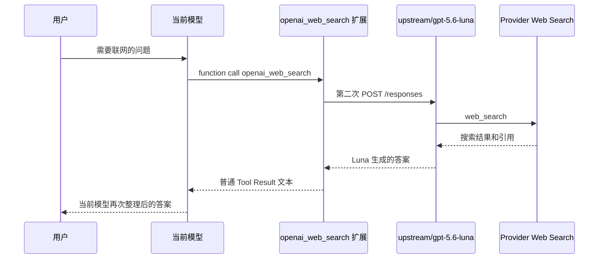
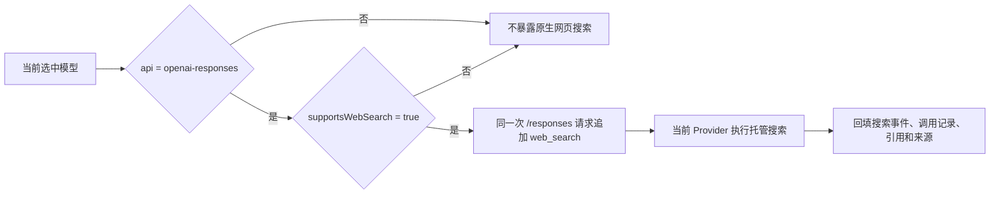
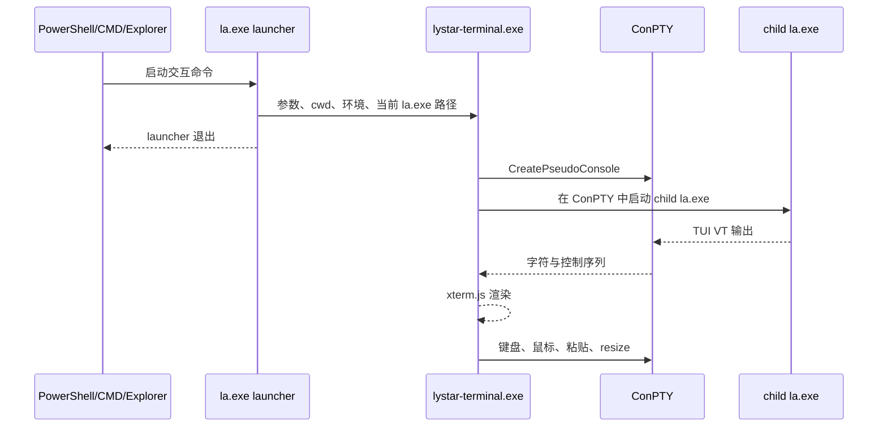

# Responses 原生 Web Search、Windows Bash 与独立终端窗口实施方案

> 实施状态（2026-08-09）：源码、测试、文档、用户级旧搜索扩展停用和 Linux 验证已完成；Windows 原生宿主编译、ConPTY/WebView2 GUI smoke、截图、图标和 PowerShell 5.1 离线安装等待提交后的 `windows-2025` CI 实际执行。

> 状态：待实施，仅包含方案，不修改当前实现。
>
> 核对日期：2026-08-09。
>
> 代码基线：LYStar Agent `0.84.1-lystar.6`，提交 `bfeb0729a77df1933d043bd89d420ea910c6b381`；Pi 上游本地基线 `9dd90a49711d088b86fdd9b4aea575913a8328a8`。
>
> 官方协议依据：[OpenAI Web search guide](https://developers.openai.com/api/docs/guides/tools-web-search)、[Responses API reference](https://platform.openai.com/docs/api-reference/responses)。仓库当前使用 OpenAI Node SDK `6.26.0`，以下字段和事件同时对照了该版本的 `responses.d.ts`。

## 1. 结论

LYStar 当前同时存在两条网页搜索链路：

1. 仓库内 `packages/ai` 已实现 Responses 原生托管 `web_search`。启用 `compat.supportsWebSearch` 后，当前选中的 `openai-responses` 模型会在自己的 `/responses` 请求中收到 `{ "type": "web_search" }`。
2. 用户级扩展 `/home/yean/.pi/agent/extensions/openai-web-search.ts` 注册了函数工具 `openai_web_search`。任何模型调用该工具时，扩展都会固定使用 `upstream/gpt-5.6-luna` 再发起一次 `/responses` 请求。

第二条链路造成了当前问题。它把“由当前模型调用 Provider 原生搜索”改成“当前模型调用函数工具，再由 Luna 生成一份搜索答案”，模型、计费、上下文、流事件和引用归属都发生了变化。

实施后只保留第一条链路：

- 只有 `api: "openai-responses"` 且明确声明 `compat.supportsWebSearch: true` 的模型获得原生 `web_search`。
- 请求始终使用当前选中的 Provider、模型、凭据和 base URL。
- 不设置 `searchModel`，不使用 `gpt-5.6-luna` 代搜，也不对其他协议做隐藏降级。
- `openai_web_search` 用户级扩展退出默认环境。
- 官方 `web_search_call`、搜索状态、`url_citation` 和完整 sources 按结构化数据保存和展示。
- Windows 继续使用现有托管 MinGit，并把 Bash 路径和环境统一到共享 Shell 运行时，父进程是 PowerShell、CMD、IDE 终端或独立窗口都不影响执行。
- Windows 交互模式默认由 LYStar 自带终端窗口承载；一次性 CLI、管道、JSON 和 RPC 仍在调用终端返回结果。
- Windows `la.exe` 和终端窗口使用用户提供的 LYStar Logo；macOS、Linux 的启动和终端行为保持现状。

## 2. 已验证现状

### 2.1 仓库内原生 Web Search

提交 `c1f023a7d` 增加了以下能力：

| 位置 | 当前行为 |
|---|---|
| `packages/ai/src/types.ts` | `OpenAIResponsesCompat` 增加 `supportsWebSearch?: boolean` |
| `packages/coding-agent/src/core/model-config.ts` | `models.json` schema 接受 `supportsWebSearch` |
| `packages/ai/src/api/openai-responses.ts` | 能力开启时向当前请求追加 `{ type: "web_search" }`，并请求 `web_search_call.action.sources` |
| `packages/ai/src/api/openai-responses-web-search.ts` | 从完成的 output item 收集 URL，最后追加一个普通 `Sources:` 文本块 |
| `packages/ai/src/api/openai-responses-shared.ts` | 在 Responses 流处理中调用 source collector |
| `packages/ai/test/openai-responses-web-search.test.ts` | 覆盖工具注入和去重来源文本 |

测试里的 `gpt-5.6-luna` 只是 fixture 模型 ID。仓库内这条链路没有固定切换 Luna，运行时仍使用传入 `streamOpenAIResponses()` 的当前模型。

### 2.2 用户级 `openai_web_search`

实际注册位置为：

```text
/home/yean/.pi/agent/extensions/openai-web-search.ts
```

关键行为如下：

```ts
const searchModel = ctx.modelRegistry.find("upstream", "gpt-5.6-luna");

await fetch(`${baseUrl}/responses`, {
  body: JSON.stringify({
    model: "gpt-5.6-luna",
    reasoning: { effort: "low" },
    tools: [{ type: "web_search", search_context_size: "medium" }],
    include: ["web_search_call.action.sources"],
    input: params.query,
    max_output_tokens: 3000,
  }),
});
```

这条链路的真实时序是：



已确认的问题：

- 所有模型都能看到这个函数工具，协议能力边界失效。
- 固定依赖 `upstream/gpt-5.6-luna` 和该 Provider 的认证配置。
- 一次用户请求至少经过两个模型回合。
- Luna 的 usage 没有进入主模型 usage，成本和延迟不可准确归属。
- 官方搜索事件被扩展压成一次普通 Tool Result，TUI 看不到 `searching` 等状态。
- 引用先被 Luna 整理成 Markdown，再由当前模型二次生成，无法保证引用范围和最终句子一致。
- 工具名和标签写成 “OpenAI Web Search”，实际请求发往自定义 `upstream` base URL，容易误判服务主体。

### 2.3 Windows 托管 MinGit

Windows 缺少 Bash 的基础能力已经完成，相关提交为 `67e5af8f1` 和 `ec39c76c0`。

当前实现包括：

- 固定 MinGit `2.55.0.3` 和 SHA-256。
- 优先从 npmmirror 下载，失败后访问 Git for Windows Release。
- staging 解压、Bash/Git 自检、目录替换和失败恢复。
- 进程内 Promise 去重和跨进程锁。
- 托管目录 `~/.pi/agent/bin/mingit/`，多个 LYStar 版本共用。
- `la --ensure-windows-bash` 显式初始化入口。
- 官方安装器在切换 `current` 版本前执行初始化，失败时不切换版本。
- 首次交互启动和内建 Bash Tool 会自动补齐环境。
- `PI_OFFLINE=1` 禁止隐式联网。
- Windows CI 已覆盖并发初始化、托管 Git 优先、中文文件名和常用 Bash 命令。

因此，Windows 工作重点是让现有 MinGit 真正覆盖所有 Shell 入口，再增加独立终端窗口和发行验证。当前仍有四个缺口：

- `packages/coding-agent` 的 Bash Tool 已按需调用 `ensureShellConfig()`，但 `resolve-config-value.ts` 仍使用同步 `getShellConfig()`，首次运行时无法主动准备 MinGit。
- `packages/agent/src/harness/env/nodejs.ts` 维护了另一套 Windows Bash 查找逻辑，没有读取 LYStar 托管目录。
- Package 命令和部分 Git 调用发生在 Interactive TUI 初始化之前，不能依赖 `InteractiveMode.init()` 修改进程 PATH。
- TUI 直接复用 PowerShell 或旧 Console Host 的窗口、字体和输入能力，图形字符、中文输入、快捷键和链接体验取决于父终端。

无需引入 WSL、Cygwin、MSYS2 或系统级 Git。修复应集中在共享 Shell 运行时和 Windows 专用终端宿主。

## 3. 与 OpenAI 官方 Responses Web Search 的差异

| 项目 | OpenAI 官方协议 | 仓库当前原生实现 | 用户级 `openai_web_search` |
|---|---|---|---|
| 模型 | 当前 Responses 模型 | 符合 | 固定切到 Luna |
| 请求次数 | 一个 Responses 请求，搜索由托管工具执行 | 符合 | 额外发起一个模型请求 |
| 工具声明 | `tools: [{ type: "web_search" }]` | 符合 | 在第二个请求中声明 |
| 完整来源 | `include: ["web_search_call.action.sources"]` | 已请求 | 已请求，但压成 Markdown |
| 搜索调用 | 输出 `web_search_call` | 读取后丢弃 | 在扩展内部丢弃 |
| Action | `search`、`open_page`、`find_in_page` | 只提取 URL | 只提取 URL |
| 流事件 | `in_progress`、`searching`、`completed` | 未暴露 | 非流式请求，全部丢失 |
| 行内引用 | `output_text.annotations[].url_citation`，含 URL、标题和字符范围 | 只收集 URL/标题，字符范围丢失 | 只生成末尾来源列表 |
| Session 回放 | 手工维护上下文时应保留相关 output item | `store: false`，但未保存 `web_search_call`，重放时 annotations 固定为空 | 只保存普通 Tool Result |
| 搜索参数 | 支持 `search_context_size`、`user_location`、`filters.allowed_domains` | 未提供请求级配置 | 固定 `medium`，其余不支持 |
| 能力失败 | Provider 返回明确错误 | 整个请求失败，诊断未区分能力声明错误 | 依赖 Luna 和 upstream 配置，错误归属混杂 |
| 计费与追踪 | 归属当前 response | 归属当前 response | 主模型和 Luna 分裂 |

当前原生实现已经走对请求入口，缺口集中在协议数据保存、流事件、引用展示和 stateless replay。用户级扩展属于另一种“模型辅助研究”能力，不应继续作为原生搜索入口。

## 4. 目标架构

### 4.1 请求链路



关键约束：

- Provider 和模型只能来自当前 `Model` 对象。
- 认证只能来自当前请求已有的 Provider 解析结果。
- 代码中不得查找或硬编码另一个模型。
- 原生搜索不注册为 Pi client tool，不产生 Tool Result，也不把主循环停在 `toolUse`。
- 其他协议没有自动替代能力。用户切到不支持原生搜索的模型后，LYStar 应明确显示该模型无此能力。

### 4.2 能力声明

继续使用现有字段，避免无收益的配置迁移：

```json
{
  "api": "openai-responses",
  "compat": {
    "supportsWebSearch": true
  }
}
```

字段语义调整为：

> 当前 Provider/模型原生接受 Responses `web_search` 托管工具，并返回兼容的 `web_search_call` 与引用数据。

约束如下：

- 默认值始终为 `false`。
- 仅 `openai-responses` adapter 读取该字段。
- 自定义 Provider 必须经过真实请求验证后显式开启。
- 同一 Provider 只有部分模型支持时，在模型级配置中分别声明，不能在 Provider 级一并打开。
- 不根据模型名、`baseUrl` 或 `provider` 字符串猜测能力。
- 不兼容当前 GA `web_search` 的 Provider 保持关闭；本次不增加 `web_search_preview` 降级。

### 4.3 请求级搜索参数

在 `OpenAIResponsesStreamOptions` 增加可选参数，默认仍只发送 `{ type: "web_search" }`：

```ts
interface ResponsesWebSearchOptions {
  searchContextSize?: "low" | "medium" | "high";
  allowedDomains?: string[];
  userLocation?: {
    type?: "approximate";
    city?: string;
    region?: string;
    country?: string;
    timezone?: string;
  };
}

interface OpenAIResponsesStreamOptions {
  webSearch?: false | ResponsesWebSearchOptions;
}
```

合并规则：

- `supportsWebSearch !== true` 时忽略 `webSearch`，并在调用方显式要求时返回能力错误。
- `webSearch === false` 时本次请求不暴露搜索。
- 未传 `webSearch` 且模型支持时，保留现有自动暴露行为。
- `allowedDomains` 去空、去重并限制数量；只传域名，不接受带协议的 URL。
- `userLocation` 只接受近似位置，不读取系统精确定位。
- `search_context_size` 没有业务要求时不发送，使用 Provider 默认值。

官方文档还描述了 live web access 控制。仓库当前 OpenAI Node SDK `6.26.0` 的 `WebSearchTool` 类型尚未包含该字段，本次先不通过类型断言强塞；升级 SDK 并完成 Provider 兼容验证后再加入。

## 5. 官方协议映射

### 5.1 请求

`buildParams()` 在普通函数工具完成转换后追加托管搜索：

```json
{
  "model": "当前模型 ID",
  "tools": [
    { "type": "function", "name": "..." },
    {
      "type": "web_search",
      "search_context_size": "medium",
      "filters": { "allowed_domains": ["example.com"] },
      "user_location": {
        "type": "approximate",
        "country": "US",
        "timezone": "America/New_York"
      }
    }
  ],
  "include": [
    "reasoning.encrypted_content",
    "web_search_call.action.sources"
  ],
  "store": false
}
```

实现要求：

- 合并 `tools` 和 `include` 时去重，不覆盖现有 function/custom tools。
- `samplingParams` 仍可用于 Provider 私有字段，但不能无提示删除框架声明的原生搜索和 sources include；如果允许覆盖，必须把该行为写入 API 契约并补测试。
- payload 测试必须断言 `model` 等于当前模型 ID，且请求过程中没有查询其他模型。

### 5.2 搜索调用记录

新增结构化内容类型，保存官方 output item：

```ts
interface WebSearchCallContent {
  type: "webSearchCall";
  id: string;
  status: "in_progress" | "searching" | "completed" | "failed";
  action:
    | { type: "search"; query?: string; queries?: string[]; sources?: WebSearchSource[] }
    | { type: "open_page"; url?: string }
    | { type: "find_in_page"; url: string; pattern: string };
}
```

`AssistantMessage.content` 增加该类型。它是 Provider 托管调用记录，不参与 Agent 的 client tool 执行逻辑。

保存它有三个用途：

- Session 能准确记录模型何时搜索、打开页面和页内查找。
- `store: false` 的同模型后续请求可以按官方 output item 回放。
- TUI、JSON/RPC 和导出可以展示真实搜索状态与来源。

同 Provider、同 API、同模型回放时，`convertResponsesMessages()` 将其还原为 `web_search_call`。跨模型或跨 Provider 时丢弃调用记录，只保留答案文本和用于展示的引用，避免复用 Provider 私有 ID。

### 5.3 流事件

`AssistantMessageEvent` 增加三类事件：

```ts
| { type: "websearch_start"; contentIndex: number; partial: AssistantMessage }
| { type: "websearch_update"; contentIndex: number; call: WebSearchCallContent; partial: AssistantMessage }
| { type: "websearch_end"; contentIndex: number; call: WebSearchCallContent; partial: AssistantMessage }
```

映射关系：

| Responses 事件 | LYStar 事件/动作 |
|---|---|
| `response.output_item.added` 且 item 为 `web_search_call` | 创建内容块，发送 `websearch_start` |
| `response.web_search_call.in_progress` | 更新为 `in_progress` |
| `response.web_search_call.searching` | 更新为 `searching` |
| `response.web_search_call.completed` | 更新为 `completed` |
| `response.output_item.done` | 用完整 action 和 sources 回填，发送 `websearch_end` |
| terminal response output | 对缺失的 done 数据做最终回填 |

Agent Core proxy、JSON mode 和 RPC 必须同步支持这些事件，不能把它们转换成 `toolcall_*`。

### 5.4 引用

为 `TextContent` 增加结构化 annotation：

```ts
interface UrlCitation {
  type: "url_citation";
  startIndex: number;
  endIndex: number;
  title: string;
  url: string;
}

interface TextContent {
  type: "text";
  text: string;
  textSignature?: string;
  annotations?: UrlCitation[];
}
```

处理规则：

- 从 `ResponseOutputText.annotations` 保留 `start_index`、`end_index`、标题和 URL。
- 校验字符范围；非法范围不影响正文，只记录 provider diagnostic。
- URL 只接受 `http` 和 `https`。
- 同 URL 的多个引用保留各自范围；来源列表展示时再去重。
- `action.sources` 表示搜索调用访问过的完整来源，`url_citation` 表示答案实际引用，两者不能混成同一个集合。
- 同模型 stateless replay 时把 annotations 原样写回 `ResponseOutputMessage`；当前固定写 `annotations: []` 的逻辑需要修改。

展示层根据 annotations 在正文后生成可点击的编号来源列表。该列表只负责 TUI、print 和 HTML export，不再作为额外 `TextContent` 写入模型答案，避免污染 Session 上下文。

当前 `createWebSearchCollector()` 可以改造成 Responses Web Search 协议转换器；删除“把 Sources 追加成普通文本事件”的职责。

## 6. 非官方 Provider 兼容策略

`openai-responses` 表示协议 adapter，不代表请求一定直达 OpenAI。LYStar 允许兼容 Provider 使用原生搜索，但必须遵守以下规则：

1. Provider 明确接受 `tools[].type = "web_search"`。
2. Provider 返回兼容的 `web_search_call`、`output_text.annotations` 和 terminal response。
3. Provider 自己完成搜索，LYStar 不替它调用其他模型或搜索服务。
4. 完整 sources 不支持时可以缺省，但引用数据必须按 Provider 实际返回处理，不能伪造。
5. Provider 拒绝工具时，返回清晰诊断：当前模型声明了原生 Web Search，但端点不支持该协议。
6. 不自动重试到 Luna，不静默移除搜索后重答，也不切换 Provider。

兼容级别按测试结果记录：

| 级别 | 条件 | 行为 |
|---|---|---|
| 完整 | 工具、流事件、调用记录、annotations、sources 全部兼容 | 开启 `supportsWebSearch` |
| 基础 | 工具和最终引用兼容，缺少部分状态事件或完整 sources | 可开启，文档标注缺失项，terminal output 必须可回填 |
| 不兼容 | 拒绝工具、返回非 Responses 结构、需要另一个模型代搜 | 保持关闭 |

能力探测只用于开发和 Provider 接入测试，不在用户请求中自动发送试探流量。

## 7. 工具命名与现有配置迁移

### 7.1 用户级扩展

实施时停用：

```text
~/.pi/agent/extensions/openai-web-search.ts
```

处理原则：

- 不在 LYStar 代码中自动删除用户文件。
- 当前机器实施时由维护者显式备份后移出 Extension 加载目录。
- 文档和默认配置不再注册 `openai_web_search`。
- 若未来保留“让另一模型代查资料”的能力，名称必须明确表达模型代理性质，例如 `research_via_model`，并要求用户主动配置目标模型。该能力不属于本次范围。

### 7.2 `models.json`

当前配置：

```json
{
  "providers": {
    "upstream": {
      "api": "openai-responses",
      "compat": {
        "supportsWebSearch": true
      }
    }
  }
}
```

迁移规则：

- 已验证 upstream 下所有模型都支持同一原生协议时可以保留 Provider 级声明。
- 只有部分模型支持时，把字段移到对应模型的 `compat`。
- 未经验证的 Provider 删除该字段或设为 `false`。
- 不增加 `searchModel`、`fallbackModel`、`searchProvider` 等配置。

### 7.3 对外名称

| 场景 | 名称 |
|---|---|
| Responses payload | `web_search` |
| 配置能力 | `supportsWebSearch` |
| TUI 状态 | `正在搜索网页`、`已搜索网页` |
| Session 内容类型 | `webSearchCall` |
| 禁止继续使用 | `openai_web_search` 作为全模型函数工具 |

TUI 不写“OpenAI Web Search”，因为兼容 Provider 也可能实现同一 Responses 协议。

## 8. Windows Bash、独立终端窗口与 Logo

### 8.1 平台边界

Windows 实施目标：

1. 无论用户从 PowerShell、CMD、Windows Terminal、IDE 终端、开始菜单还是资源管理器启动，LYStar 内部需要 Bash 时都使用同一个托管 MinGit。
2. Windows 的 Interactive TUI 默认在 LYStar 自己的窗口中运行，不再受父终端字体和控制台能力限制。
3. `la.exe`、独立窗口、任务栏和快捷方式使用同一 LYStar Logo。
4. macOS 和 Linux 不进入新启动分支，Shell 解析、TUI 和发行产物保持现状。

可行性判断：

| 需求 | 结论 | 主要代价 |
|---|---|---|
| 父终端无关的 Bash | 可直接实施 | 收敛现有 Shell/Git 入口，不需要新 Shell 子系统 |
| 替换 Windows Logo | 可直接实施 | 生成多尺寸 ICO，并把 Windows binary 改到 Windows runner 编译 |
| LYStar 自有交互窗口 | 技术上可行 | 新增 ConPTY + WebView2 terminal host，是三项中工作量和验证量最大的一项 |
| 仅改变 Windows | 可直接控制 | 所有新入口使用 `process.platform === "win32"` 和 Windows-only release job |

已验证的外部能力是 ConPTY、WebView2 分发和 Bun `--windows-icon`；基于现有源码作出的工程判断是：独立 host 可以复用现有字符 TUI，不需要重写 Agent 界面，但必须补齐输入、字体、窗口生命周期和发行测试。

“每次运行 `la` 都开窗口”只适用于会进入 TUI 的交互命令。`la --version`、`la --help`、`la --print`、管道输入、`--mode json`、`--mode rpc`、安装、更新和认证输出必须继续在当前终端工作，否则会破坏脚本、CI 和编辑器集成。

### 8.2 统一 Windows Shell 运行时

把当前分散的“找 Bash”“补 PATH”“找 Git”统一成一个异步事实源：

```ts
interface ShellRuntime {
  shell: string;
  args: string[];
  commandTransport?: "argv" | "stdin";
  env: NodeJS.ProcessEnv;
}

async function resolveShellRuntime(options?: {
  customShellPath?: string;
  requireManagedWindowsBash?: boolean;
}): Promise<ShellRuntime>;
```

Windows 默认返回：

```text
shell = ~/.pi/agent/bin/mingit/usr/bin/bash.exe
args  = ["--noprofile", "--norc", "-c"]
env.PATH 前缀 = mingit/cmd;mingit/mingw64/bin;mingit/usr/bin
```

执行原则：

- Shell 使用绝对路径，不从 PowerShell 的 PATH 猜测 `bash.exe`。
- 每次 spawn 显式传入托管 MinGit 环境，不依赖某次启动曾经修改过全局 `process.env`。
- `git.exe`、`bash.exe`、`sh.exe` 和 MinGit 内部命令来自同一个托管根目录。
- 用户明确配置 `shellPath` 时继续优先使用，并为它构造独立环境。
- 托管 MinGit 不存在时由该异步入口安装或修复；调用方不再各写一套 fallback。
- Windows Agent 执行模式需要 Bash 且安装失败时给出明确错误，不能继续运行到第一次 Tool Call 才返回“找不到 shell”。
- Unix 继续使用现有 `/bin/bash -> PATH bash -> sh` 顺序。

需要接入的入口：

- 内建 Bash Tool 和 `createLocalBashOperations()`。
- `!command` 配置值执行；当前同步路径需要在 Model/认证配置解析前完成 Windows Shell bootstrap，或改为使用已准备好的 runtime。
- Package Manager 的 `git:` 安装、更新和 Git 命令。
- Git branch、交互式 Git 操作和 Extension 暴露的本地 Shell。
- `packages/agent` Node harness。通用 harness 不直接依赖 LYStar 目录，由 Coding Agent 创建环境时注入 `shellPath` 和 `shellEnv`。

### 8.3 Windows 启动分流

新增统一判断 `shouldLaunchWindowsTerminalHost(args, stdio)`，在创建 TUI 之前执行：

| 调用 | Windows 默认行为 |
|---|---|
| `la` | 打开 LYStar 独立窗口 |
| `la --continue`、`la --resume`、带模型或会话参数的交互启动 | 打开 LYStar 独立窗口，并原样传递参数和 cwd |
| `la config` 等会创建 TUI 的命令 | 打开 LYStar 独立窗口 |
| 从资源管理器或开始菜单启动 | 直接打开 LYStar 独立窗口 |
| `la --version`、`la --help`、`la list` | 在当前终端输出 |
| `la --print`、stdin/stdout 被重定向 | 在当前终端输出 |
| `--mode json`、`--mode rpc` | 在当前终端运行 |
| `install`、`remove`、`update`、非交互 auth 命令 | 在当前终端运行 |
| `la --attached` | 显式在当前终端运行 TUI，用于 SSH、调试和终端集成 |

启动防循环使用内部环境变量，例如 `LYSTAR_TERMINAL_HOST=1`。独立窗口中的 child `la.exe` 看到该标记后直接进入现有主流程。

### 8.4 独立终端宿主

新增 Windows 专用 `lystar-terminal.exe`，职责保持单一：



宿主采用以下组合：

- Windows ConPTY：托管现有字符模式 `la.exe`，保持 TUI 主程序和 Unix 平台逻辑一致。
- Win32 + WebView2：提供真正属于 LYStar 的桌面窗口。
- xterm.js：解析 VT 序列并渲染 truecolor、CJK、emoji、IME、鼠标和链接。
- 本地静态资源：HTML、CSS、JavaScript 和字体随发行包提供，运行时不访问网页。

微软对 ConPTY 的定义就是“由外部 host 替代默认 console host 的交互显示部分”，宿主必须分别持续处理输入和输出管道，避免阻塞和死锁。实现按官方流程使用 `CreatePseudoConsole`、`PROC_THREAD_ATTRIBUTE_PSEUDOCONSOLE`、`ResizePseudoConsole` 和 `ClosePseudoConsole`。

终端实现边界：

- 采用成熟 xterm.js 处理 VT、Unicode、IME 和选择复制；仓库当前只有测试使用的 `@xterm/headless`，实施时需要新增并锁定浏览器端 `@xterm/xterm`。
- 不引入 `node-pty`；ConPTY 生命周期和管道由 native host 直接管理，避免 Bun 单文件打包再加载一层原生 addon。

不采用以下方案：

- `CREATE_NEW_CONSOLE` 或 `AllocConsole`：只会得到另一个 Console Host，字体和图形字符限制仍在。
- 直接调用 `wt.exe`：依赖用户安装和配置 Windows Terminal，窗口也不归 LYStar 管理。
- 手写完整终端解析器：重复实现 VT、Unicode、IME 和选择复制没有收益。

### 8.5 窗口和文字显示

产品与核心任务：高频使用 Agent、查看长输出、执行工具和输入多行任务。

视觉方向：安静、全窗口的终端工作台，继续使用现有 LYStar TUI；设计识别只放在窗口图标、标题和统一字体，不增加浏览器式导航、卡片或装饰背景。

窗口要求：

- 内容全屏铺满，不在 TUI 外再套应用壳。
- 默认尺寸按字符网格确定，例如 `120 x 36`，最小 `80 x 24`。
- 正确处理 Windows DPI 缩放、窗口 resize 和全屏。
- 记住上次窗口大小和位置，超出当前屏幕时回到主屏可见区域。
- xterm title change 同步到 Win32 标题栏，默认标题为 `LYStar Agent`。
- 支持中文 IME 候选框、Ctrl/Shift/Alt 组合键、Bracketed Paste、SGR Mouse、OSC 8 链接、选择和复制。
- 关闭窗口时先向 child 发送正常退出信号；仍有任务执行时显示简短确认，超时后再结束进程树。

字体不依赖 PowerShell 或系统终端设置。发行包内放置经过许可证核对的本地等宽字体，至少覆盖：

```text
中文、ASCII、Box Drawing、✓、✗、✎、⌕、≡、▶、◆、常用数学和箭头字符
```

字体通过 `@font-face` 加载，只在 LYStar 窗口内生效，不安装到系统。xterm.js 的 glyph width 必须和项目 `string-width` 计算一致；CI 使用真实截图和光标位置断言验证中英文、宽字符、组合字符和现有 TUI 图标。

### 8.6 WebView2 交付边界

WebView2 Runtime 是独立终端窗口的系统依赖。Windows 11 包含 Evergreen Runtime，多数 Windows 10 机器也已有，但安装器仍需检测。

处理方式：

- 在线安装：检测不到 Runtime 时，以当前用户身份静默运行 Microsoft Evergreen Bootstrapper，不要求管理员权限。
- 离线安装：允许安装器接收 WebView2 Evergreen Standalone Installer 本地路径。
- Runtime 安装失败：一次性 CLI 仍可使用；交互启动返回清晰错误并提示 `la --attached` 临时进入当前终端。
- 不随 LYStar 固定打包超过 250 MB 的 Fixed Version Runtime。
- WebView2 禁止导航到外部页面，禁用生产环境 DevTools、下载和新窗口；外部链接交给默认浏览器。

### 8.7 Windows Logo

用户提供的源文件：

```text
/tmp/cmux-drop-e1f74d23-1530-439a-b570-364979a46f2f.png
```

已确认它是 `1254 x 1254`、8-bit RGB PNG，黑色背景，中心为白色 LY 图形和蓝色星形。

实施时复制为仓库正式资产，并生成多尺寸 ICO：

```text
packages/coding-agent/assets/lystar-windows-icon.png
packages/coding-agent/assets/lystar-windows-icon.ico
```

ICO 至少包含 `16、20、24、32、40、48、64、128、256` 像素版本。小尺寸需要逐级检查，不能只让系统从 256 像素临时缩放，避免环形细线和蓝色星形糊成一块。

Bun 支持 `--windows-icon=<ico>`，但当前官方实现要求构建进程本身运行在 Windows。现有 Release workflow 在 Ubuntu 交叉编译全部平台，因此 Windows 产物需要移到 `windows-latest` 构建：

- `la.exe` 编译时传 `--windows-icon`。
- `lystar-terminal.exe` 的 Win32 resource 和运行时窗口图标使用同一 ICO。
- 安装器、开始菜单快捷方式、任务栏和文件资源管理器显示同一图标。
- Windows CI 提取 exe 关联图标并生成截图，检查 16、32 和 256 像素结果。

### 8.8 保留现有 MinGit 交付设计

以下设计已经可用，实施时保持：

- 当前用户目录安装，无管理员权限。
- 固定版本、固定文件名、固定 SHA-256。
- 镜像失败后回退官方来源。
- staging 自检通过后再替换正式目录。
- 托管目录跨 LYStar 版本共享。
- 显式 `shellPath` 始终优先。
- 系统 Git Bash、PATH Bash 仅作兼容回退。
- 安装失败不切换 LYStar `current` 版本。

正式安装顺序：

```text
下载 LYStar 候选版本
  -> 校验 LYStar release SHA-256
  -> 检测或安装 WebView2 Runtime
  -> 运行候选 la.exe --version
  -> 运行候选 la.exe --ensure-windows-bash
  -> 校验托管 Bash 和托管 Git
  -> 验证 lystar-terminal.exe 可启动
  -> 写入版本目录
  -> 切换 current
```

已有有效 MinGit 时只做快速自检，不重复下载。

### 8.9 MinGit 离线、并发和诊断

新机器离线入口保持为：

```powershell
la --ensure-windows-bash --archive .\MinGit-2.55.0.3-64-bit.zip
```

实现要求：

- 本地 archive 继续使用代码内固定 SHA-256。
- `PI_OFFLINE=1` 允许读取本地 archive，禁止网络请求。
- `install.ps1` 增加 `-MinGitArchive <path>`；独立窗口离线安装另接收 WebView2 Runtime installer。
- 锁文件记录 PID、开始时间和 MinGit 版本；回收前确认持锁进程已经退出。
- 下载和解压期间更新锁 mtime，获锁后再次检查正式目录。
- 正式目录替换保留 `.previous`，新目录最终自检通过后再删除备份。

错误信息至少区分下载失败、checksum 不匹配、解压失败、Bash 启动失败、Git 路径错误、锁超时、离线缺少 archive 和 WebView2 Runtime 缺失。

### 8.10 发行验证

Windows CI 必须使用本次提交生成的实际产物：

- 在 `windows-latest` 构建带图标的 `la.exe` 和 `lystar-terminal.exe`。
- 清空系统 Git/Bash 相关 PATH，验证 PowerShell、CMD 和独立窗口三种入口。
- 通过 `la.exe --ensure-windows-bash` 初始化，再由 Bash Tool 执行命令。
- 启动独立窗口，使用 UI Automation 或截图验证 Logo、字体、中文、图形字符、输入、resize 和退出。
- 一次性 CLI 断言不会打开新窗口，并保持 stdout、stderr 和退出码。
- 安装器端到端测试使用本次构建的本地 archive 和 manifest。
- Ubuntu release job 构建 macOS/Linux 产物，下载 Windows job 产物后统一生成 manifest、checksum、attestation 和 Release。

技术依据：

- [Microsoft ConPTY session](https://learn.microsoft.com/en-us/windows/console/creating-a-pseudoconsole-session)
- [Microsoft WebView2 distribution](https://learn.microsoft.com/en-us/microsoft-edge/webview2/concepts/distribution)
- [xterm.js](https://github.com/xtermjs/xterm.js)
- [Bun Windows executable metadata](https://github.com/oven-sh/bun/blob/main/docs/bundler/executables.mdx)

## 9. 文件级实施范围

### 9.1 Web Search

| 文件 | 改动 |
|---|---|
| `packages/ai/src/types.ts` | 增加 `UrlCitation`、`WebSearchCallContent`、对应 stream event；扩展 `TextContent` 和 `AssistantMessage.content` |
| `packages/ai/src/api/openai-responses.ts` | 构造原生 Web Search tool 和请求级参数；保证当前模型直连和 include 合并 |
| `packages/ai/src/api/openai-responses-web-search.ts` | 改为 output item、状态、sources 和 annotations 的协议转换器，删除普通 `Sources:` 文本注入 |
| `packages/ai/src/api/openai-responses-shared.ts` | 创建和更新 Web Search 内容块，回填 terminal output，保留引用 |
| `packages/ai/src/api/transform-messages.ts` | 跨模型转换时保留正文并丢弃 Provider 私有搜索调用 |
| `packages/ai/src/api/openai-responses-shared.ts` 的 `convertResponsesMessages()` | 同模型 stateless replay 还原 `web_search_call` 和 annotations |
| `packages/coding-agent/src/core/model-config.ts` | 保持 `supportsWebSearch` schema，补充字段说明和请求参数入口需要的 schema（若暴露到设置） |
| `packages/agent/src/agent-loop.ts`、`packages/agent/src/proxy.ts` | 透传新的 Web Search stream event |
| `packages/coding-agent/src/modes/interactive/components/assistant-message.ts` | 展示搜索状态、行内引用对应的可点击来源列表 |
| `packages/coding-agent/src/modes/print-mode.ts` | 输出引用列表 |
| `packages/coding-agent/src/core/export-html/` | 导出引用和搜索调用记录 |
| `packages/ai/test/openai-responses-web-search.test.ts` | 扩展 payload、事件、引用、sources、回放和错误测试 |

不在仓库中新增一个替代 `openai_web_search` Extension。

### 9.2 Windows

| 文件 | 改动 |
|---|---|
| `packages/coding-agent/src/utils/shell.ts` | 提供唯一的异步 `ShellRuntime`，返回绝对 Bash 路径、参数和显式环境 |
| `packages/coding-agent/src/utils/tools-manager.ts` | 支持本地 MinGit archive、增强锁所有权判断、导出托管 MinGit 环境 |
| `packages/coding-agent/src/core/tools/bash.ts` | 所有 Bash spawn 使用统一 runtime，不依赖父 PowerShell PATH |
| `packages/coding-agent/src/core/resolve-config-value.ts` | 在 Windows Shell bootstrap 后执行 `!command`，删除同步重复查找逻辑 |
| `packages/coding-agent/src/core/package-manager.ts`、Git 调用入口 | 使用托管 Git 绝对路径或同一 MinGit 环境 |
| `packages/agent/src/harness/env/nodejs.ts` | 接受 Coding Agent 注入的 `shellPath`/`shellEnv`，不维护 LYStar 私有查找规则 |
| `packages/coding-agent/src/main.ts` | 解析交互/一次性命令，Windows 交互模式启动独立 host；支持 `--attached` 和 MinGit archive |
| `packages/coding-agent/package.json`、lockfile | 新增并锁定浏览器端 `@xterm/xterm` 及实际使用的 addon；不加入 `node-pty` |
| `packages/coding-agent/src/windows-terminal-host/` | 新增 Win32、WebView2、ConPTY host 和本地 xterm.js 页面 |
| `packages/coding-agent/assets/lystar-windows-icon.png`、`.ico` | 保存用户提供的 Logo 和多尺寸 Windows icon |
| `scripts/build-binaries.sh`、新增 Windows build 脚本 | Unix 产物留在 Ubuntu；Windows job 编译带 icon 的 `la.exe` 和 terminal host |
| `scripts/install.ps1` | 检测 WebView2、准备 MinGit、安装 host、创建品牌快捷方式，全部成功后再切换版本 |
| `scripts/test-windows-managed-bash.mjs` | 增加 PowerShell/CMD、离线 archive、损坏安装和锁回收测试 |
| 新增 Windows terminal host 测试 | 覆盖参数分流、ConPTY、Unicode、IME、键盘、resize、窗口关闭和图标 |
| `.github/workflows/ci.yml`、`.github/workflows/release.yml` | Windows 原生构建、UI smoke、产物上传及统一发布 |
| `docs/getting-started/installation.md` | 说明独立窗口、在线/离线 WebView2 和 MinGit 准备方式 |
| `docs/troubleshooting/windows.md` | 增加 `--attached`、窗口启动、字体、WebView2 和 Bash 错误恢复 |
| `docs/development/release.md` | 记录 Windows icon、字体、WebView2 和 MinGit 固定资产更新流程 |

## 10. 实施顺序

### 10.1 先消除二次模型调用

- 备份并停用用户级 `openai-web-search.ts`。
- 保留 `supportsWebSearch` 原生入口。
- 增加 payload 回归：当前模型 ID 必须出现在唯一的业务 `/responses` 请求中。
- 增加防回归搜索，源码和默认资源不得出现 `find("upstream", "gpt-5.6-luna")` 或等价搜索模型逻辑。

完成这一项后，行为已经满足“只由当前 Responses 模型原生搜索”。后续工作补协议完整性。

### 10.2 补齐 Responses 协议数据

- 引入 Web Search 调用内容块和事件。
- 保存 action、sources 和 annotations。
- 完成 terminal backfill 和同模型 stateless replay。
- 调整 TUI、print、JSON/RPC 和 HTML export。

### 10.3 固化 Provider 兼容和配置

- 对每个准备开启的 Provider 执行协议 fixture 和真实 smoke。
- Provider 级能力只用于全模型一致的端点。
- 文档记录完整、基础或不兼容级别。
- 明确能力错误，禁止自动降级。

### 10.4 完成 Windows Shell 和独立窗口

- 先把 Bash、Git、`!command` 和 Agent harness 接到统一 Shell runtime。
- 增加本地 MinGit archive 和锁加固。
- 把用户 Logo 制作为多尺寸 ICO，并把 Windows 构建移到 Windows runner。
- 实现 `la.exe -> lystar-terminal.exe -> ConPTY child la.exe` 启动链路。
- 接入 xterm.js、本地字体、WebView2 检测和离线安装输入。
- 使用本次构建产物验证 PowerShell、CMD、独立窗口、一次性 CLI 和安装更新。

## 11. 测试矩阵

### 11.1 Web Search 单元与协议测试

| 场景 | 断言 |
|---|---|
| 能力关闭 | payload 无 `web_search`，无 sources include |
| 能力开启 | payload 有且只有一个 `web_search`，保留原有函数工具 |
| 当前模型 | payload `model` 等于当前模型，未查找或请求 Luna |
| 请求参数 | context size、域名和近似位置按规则映射 |
| search action | 保存 query、queries 和 sources |
| open page | 保存 URL |
| find in page | 保存 URL 和 pattern |
| 流状态 | start、searching、end 顺序正确 |
| terminal backfill | Provider 缺少部分 done event 时仍能从 terminal output 补齐 |
| 行内引用 | 保存字符范围、标题和 URL |
| 完整来源 | action.sources 与 annotations 分开保存和去重展示 |
| 非法引用 | 不破坏正文，产生 diagnostic |
| 同模型续聊 | input 重放 `web_search_call` 和 annotations |
| 跨模型续聊 | 丢弃调用 ID，保留纯文本答案 |
| Provider 不支持 | 返回能力声明错误，不切换模型、不静默重答 |
| 使用普通 client tools | 搜索调用不触发 `toolUse`，函数工具仍按原流程执行 |

### 11.2 集成测试

使用可控假 Provider 记录所有 HTTP 请求：

1. 当前模型设为 `upstream/gpt-5.6-sol`。
2. 提问需要当前信息的问题。
3. 断言业务侧只发起一次 `/responses` 请求。
4. 断言请求模型为 `gpt-5.6-sol`，工具包含 `web_search`。
5. 断言没有任何 `gpt-5.6-luna` 请求。
6. 返回模拟搜索流，检查 TUI/JSON 事件、Session JSONL 和下一轮重放。

真实 Provider smoke 只验证协议和引用，不把易变化的网页答案写成固定快照。

### 11.3 Windows 测试

| 场景 | 预期 |
|---|---|
| PowerShell 启动交互 `la` | TUI 出现在 LYStar 独立窗口，PowerShell 不承载界面 |
| CMD、IDE 终端、开始菜单和资源管理器启动 | 使用同一独立窗口和同一 cwd/参数规则 |
| `la --attached` | TUI 留在当前终端，便于调试和 SSH |
| `la --version`、`--help`、`--print`、JSON/RPC | 不打开窗口，stdout/stderr 和退出码正确 |
| 无系统 Git/Bash 的 Windows x64 | 托管 MinGit 完成初始化，Bash Tool、Git Package 和 `!command` 可用 |
| 父 PowerShell PATH 不含 Bash/Git | 内部命令仍使用托管绝对路径和环境 |
| Agent harness 和 Extension Bash | 与内建 Bash Tool 使用同一 runtime |
| npmmirror 失败 | 回退官方 Release，checksum 仍一致 |
| SHA 不匹配或 zip 损坏 | 清理 staging，保留旧 LYStar 和旧 MinGit |
| 两个进程同时初始化 | 只安装一次，两个进程得到同一路径 |
| 持锁进程仍存活 | 不误删锁 |
| `PI_OFFLINE=1` 且传本地 MinGit archive | 校验并安装成功 |
| WebView2 已存在 | 不重复安装 Runtime |
| WebView2 缺失且在线 | 当前用户静默安装后打开窗口 |
| WebView2 缺失且离线 | 本地 installer 成功；缺少 installer 时提示 `--attached` |
| 中文、Box Drawing 和项目图形字符 | 字形完整、宽度和光标位置正确 |
| 中文 IME、粘贴和组合键 | 输入完整，不丢修饰键，不重复提交 |
| 窗口 resize、DPI、全屏 | ConPTY 尺寸和 TUI 布局同步 |
| 关闭运行中窗口 | 先正常结束并保存 Session，再按超时结束进程树 |
| `la.exe`、host、任务栏和快捷方式 | 使用用户提供的 LYStar Logo |
| Windows PowerShell 5.1 | 安装脚本解析和执行通过 |
| standalone 产物 | Bash、窗口、Logo 和一次性 CLI 全部由本次构建验证 |

## 12. 验收标准

### 12.1 Web Search

必须同时满足：

- `openai_web_search` 不再出现在默认工具列表。
- 任意一次原生搜索都使用当前选中的 `openai-responses` 模型。
- 搜索回合没有额外的 Luna 模型请求。
- 不支持 Responses 原生搜索的模型不会获得隐藏替代能力。
- TUI 能看到搜索中和已完成状态。
- 最终答案的引用可点击，Session 中保留结构化字符范围和 URL。
- `action.sources` 可回查，且不会冒充答案实际引用。
- `store: false` 的同模型第二轮请求包含需要的搜索调用和 annotation 上下文。
- Provider 能力配置错误时有明确诊断，无静默降级。
- `packages/ai` 全量测试、Agent proxy/RPC 测试和 Coding Agent 相关测试通过。

### 12.2 Windows

必须同时满足：

- Windows x64 用户无需预装 Git、Bash、Node.js、npm 或 Windows Terminal。
- PowerShell、CMD、IDE 终端、开始菜单和资源管理器启动交互 `la` 时都进入 LYStar 独立窗口。
- 一次性 CLI、管道、JSON 和 RPC 不打开窗口，自动化兼容性不变。
- 内建 Bash、Extension Bash、Agent harness、`!command` 和 Git Package 都使用同一托管 Shell runtime。
- 父终端 PATH、字体和图形能力不影响 Bash 可用性与 TUI 显示。
- 独立窗口支持 truecolor、中文 IME、项目现有图形字符、链接、鼠标、粘贴和 resize。
- `la.exe`、terminal host、任务栏和快捷方式使用给定 LYStar Logo。
- WebView2 和 MinGit 的在线、离线、校验、并发和失败恢复路径都可执行。
- 任一候选依赖失败时不切换新的 LYStar 版本。
- Windows CI 使用本次提交生成的 standalone 产物完成 Shell、窗口和 Logo 验证。
- macOS、Linux 行为和产物结构无回归。

## 13. 回退方案

### 13.1 Web Search

- 把对应模型的 `compat.supportsWebSearch` 设为 `false`，即可停止注入托管工具。
- 新增的 Session 字段保持可选，旧版本读取时应忽略未知内容；实施前需用真实旧版本验证这一点。若旧版本无法兼容，升级时增加 Session 降级导出说明。
- 引用展示异常时可以暂时只显示正文和结构化数据，不恢复 Luna 代搜扩展。
- Provider 兼容失败只关闭该 Provider/模型的能力，不影响其他 Responses 请求。

### 13.2 Windows

- 独立窗口宿主异常时可以临时使用 `la --attached`，不改变 Session 和模型配置。
- terminal host、xterm.js 或字体回退不得移除统一 Shell runtime；Bash 修复可以独立保留。
- WebView2 安装失败时保留一次性 CLI，并提示用户使用 attached 模式。
- 托管 MinGit 更新失败时恢复 `.previous`。
- LYStar 安装器继续保留 `current` / `previous` 应用版本切换。
- 图标问题只回退资源文件，不回退 Windows 原生构建和 Shell 修复。
- 不删除用户已有的系统 Git、WSL、Cygwin 或自定义 `shellPath`。

## 14. 明确不做

本次不实施：

- 为 Anthropic、OpenAI Completions 或其他协议调用 Luna 代搜。
- 集成第三方通用搜索 API。
- 根据提示词自动切换模型或 Provider。
- 把网页全文写入 Session。
- 在仓库中提交 MinGit 或 WebView2 Runtime 二进制。
- 依赖用户安装或配置 Windows Terminal、WSL、Cygwin、MSYS2。
- 让 `--version`、`--print`、JSON/RPC 等一次性命令强制打开窗口。
- 使用 `CREATE_NEW_CONSOLE` 假装已经解决字体和 Unicode 问题。
- 安装系统级 Git、系统字体或修改用户 PowerShell 配置。
- 为未经验证的 Provider 自动开启 `supportsWebSearch`。

## 15. 实施完成后的最小证据

交付记录至少附上：

```text
1. 捕获的 Responses payload：当前模型 ID、web_search tool、sources include。
2. HTTP 请求计数：没有 gpt-5.6-luna 二次请求。
3. 一段完整流事件：in_progress -> searching -> completed -> cited output。
4. Session 第二轮重放 payload：包含 web_search_call 和 annotations。
5. PowerShell、CMD 和开始菜单启动交互 `la` 后出现同一个 LYStar 独立窗口。
6. 一次性 CLI 没有开窗，stdout、stderr 和退出码保持正确。
7. 清空系统 Git/Bash PATH 后，内建 Bash、Extension、Agent harness、`!command` 和 Git Package 全部使用托管 MinGit。
8. 独立窗口中的中文、图形字符、IME、鼠标、链接、resize 和 Session 退出通过真实截图与交互验证。
9. `la.exe`、terminal host、任务栏和快捷方式显示给定 Logo。
10. 在线失败不切换版本，MinGit/WebView2 离线输入成功，并发初始化成功。
```

这些证据齐全后，才能把“Responses 原生 Web Search”“Windows 自带可用 Bash”和“LYStar 独立终端窗口”写入正式发布说明。
