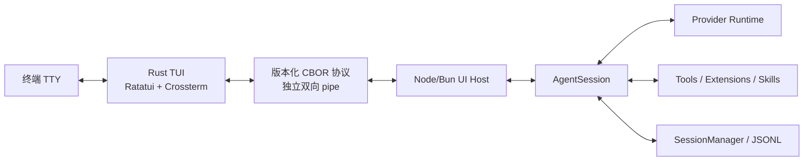
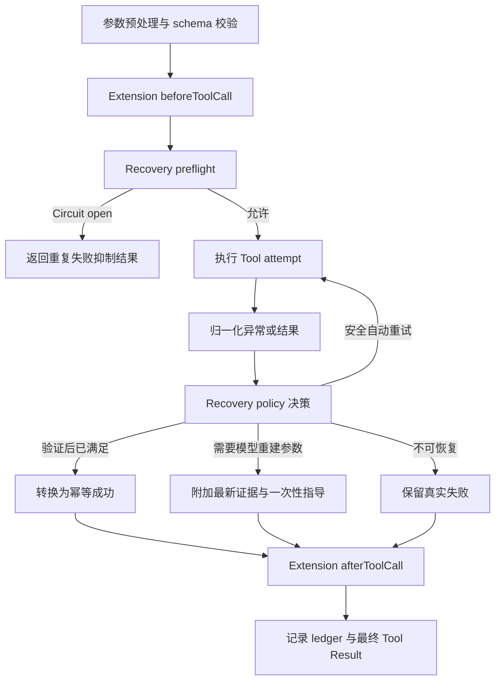
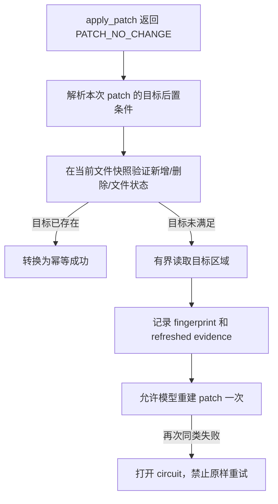
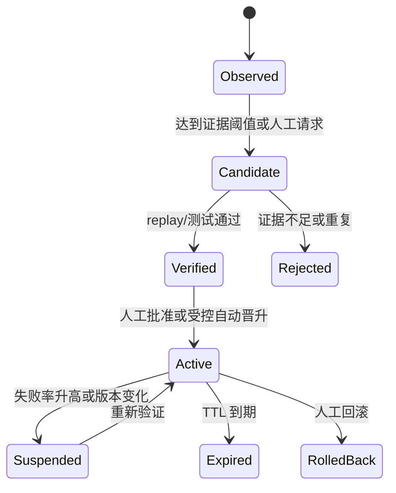
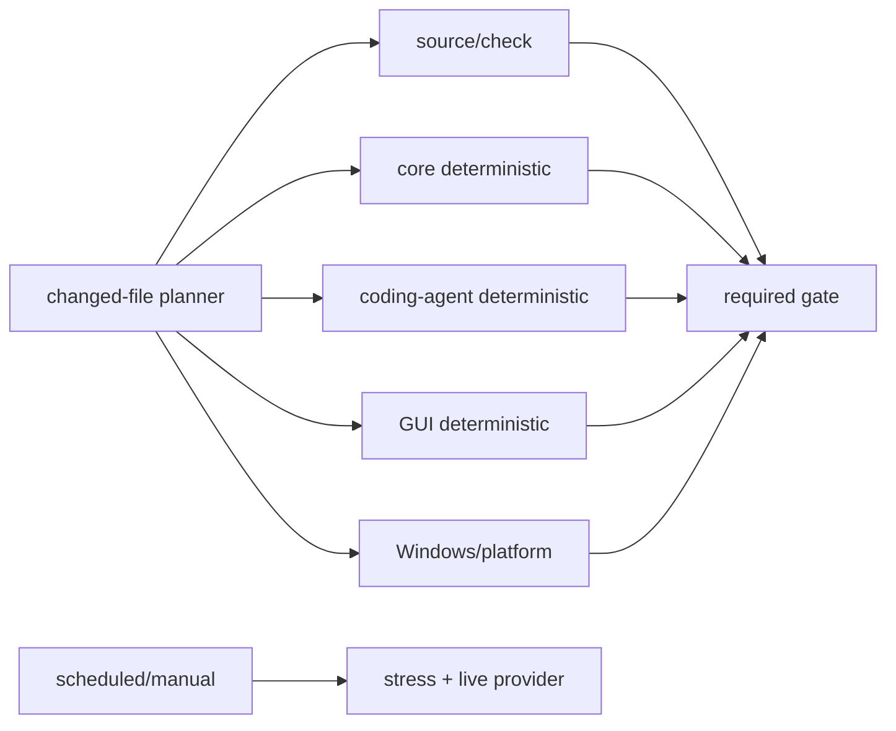

# LYStar Code 系统级演进实施方案

> 状态：本地实施收口完成；远端与跨平台证据待 push 后补齐
>
> 实施基线：2026 年 8 月 15 日，`merge/pi-v0.84.2`，最终本地代码基线 `ca6805055`
>
> 当前 LYStar：`0.84.2-lystar.1`
>
> 当前 Pi 基线：`v0.84.2`，commit `914cf1472e715297caa30db4b9535d534a9eb718`
>
> 发行仓库：`lystar-team/lystar-code`

## 0. 实施结果与状态

本方案的 M0-M8 已完成代码实现和本地验收；Rust 自有可见 TUI 的整体迁移继续是强制目标。远端 Actions、受保护环境审批、真实 Provider、跨 OS 实机、Tag、Release、签名与 attestation 均未执行。本节只记录本轮可复查事实，不替代后文的预算、回滚和退出 gate。

| 里程碑 | 提交范围 | 本地状态 | 远端或外部状态 |
| --- | --- | --- | --- |
| M0 基线冻结 | `479fabdd1..744c5ea06` | 基线、版本和本地验证入口固定 | Actions 历史与 10/20 次观察样本待 push 后采集 |
| M1 Pi 最新 Tag 合并 | `744c5ea06`、`59c43a40c`、`101e31cb7`、`48bdf260a` | Pi `v0.84.2` 合并、LYStar 适配和本地 gate 完成 | 本地 Bash 仅产出 Darwin/Linux 四个 Unix 中间包；五平台发布链的 Windows x64 由 Windows runner 构建。当前只在 Linux x64 解包 smoke，其他 OS 未实机；未打 Tag、未建 Release |
| M2 CI/测试/发布治理 | `118f046c0`、`f360ece78`、`c893b34cf`、`31612a5bd`、`0b224bf9f`、`cd53f9d69`、`58da785cf`、`7670dfff9`、`ca6805055` | deterministic/live/platform/stress 分层、planner、summary、预算诊断、单次发布契约和 required deterministic 零 skip 归属已实现 | planner 仍缺 10/20 次 observe；受保护 environment 审批、远端 history artifact、最近成功 live/stress/benchmark、五平台真实 runner、签名与 attestation 均待 push 后验证 |
| M3 Tool observe | `2cefffb18`、`e48ca870f`、`8bdc7955e` | taxonomy、fingerprint、Session ledger、observe 事件和诊断已实现 | 真实运行样本与分类统计待远端或后续受控环境采集 |
| M4 Tool assist/auto | `a67d555dc`、`8823fd697`、`f4973cf47`、`da32a176b`、`9f831f24e`、`6ed4ab5f9` | attempt budget、circuit、后置条件验证、内置 Tool 恢复和模式隔离已实现 | 不运行 live Provider；真实外部副作用恢复待单独受控验证 |
| M5 错题本 | `d08eb269d`、`e113b158a`、`c216b80d`、`bf5149fc4`、`7bb2a1c27` | candidate、验证、审批、回滚、TTL、审计和 `lc doctor` 已实现 | 真实跨会话 history artifact 与受控审批记录待远端或后续环境验证 |
| M6 Rust 协议 Spike | `34d6864a5`、`7f350ffa6`、`4598dba20`、`7b9670a94`、`e3d6960aa` | schema 生成、双向 golden、headless bridge、PTY guard、B0 smoke 完成 | 保留旧 B0 Stop 数据作为历史基线；Yean 于 2026-08-15 调整判定，绝对预算通过即可进入 B1，相对 CPU/写量仅阻止 M10 默认切换 |

运行模式已落地为 `off`、`observe`、`assist`、`auto`，默认 `assist`；`lc doctor` 和 GUI Host 诊断同步显示当前模式、circuit 与 lesson 状态。`auto` 仍只允许 policy 白名单内的安全恢复动作。

M7 已完成本地 Linux 只读 Transcript 验收；M8 已完成 Linux x64 Composer、运行中状态、Host response-drop/reacquire E2E、正式组件基准和 80x8 多行 PTY 验收。GUI 所有 write 幂等 foundation 已完成：旧写命令与 B3 快速写共用 operation journal 和 scope 串行队列。B3 Settings foundation 现已统一 TypeScript descriptor catalog，`/settings` 与 GUI Host `list_settings`/`set_setting` 共用设置元数据和读写校验；此项仍不表示 Rust B3 UI 已完成。M9-M11 仍待实施。2026-08-15 前的 B0 Stop 数据继续作为历史性能基线保留；Yean 于 2026-08-15 明确调整判定：协议生成、终端恢复、headless bridge、80x8 兼容性和绝对预算通过即为 Development Go，可进入 B1；相对 CPU 和终端写量门槛仅为 M10 默认切换的 Release Go。

## 1. 结论先行

本方案建议按下面的顺序实施，禁止多个大型改造同时进入主干：

1. 先把 LYStar 从 Pi `v0.84.1` 合并到实施当日最新正式 Tag。按 2026 年 8 月 15 日的事实源，目标是 `v0.84.2`。
2. Pi 合并稳定后，先治理测试、CI 和发布流水线：删除或重写不能证明真实故障的测试，把 live provider、平台和压力测试移到正确频率，消除重复安装、重复构建和同一 commit 的重复五平台打包。
3. CI 基线稳定后，在 Agent Tool 执行主链建立统一失败分类、恢复策略、重复失败熔断和 Session 内恢复账本，先覆盖 `apply_patch`、`edit`、`read`、`write`、`grep`、`find`、`ls`。
4. Tool 恢复链稳定后，再增加跨会话“错题本”。跨会话经验先生成候选，经证据、验证、作用域和版本检查后晋升，不能直接修改基础系统提示。
5. Rust 自有可见 TUI 必须整体迁到 `Ratatui + Crossterm`。Node/Bun 继续负责 Agent、Provider、Session、Tool 和 Extension 运行时，Rust 只负责终端输入、布局、渲染和交互。
6. B0 必须先通过协议、终端恢复、headless bridge、80x8 兼容性和绝对预算。相对 CPU 与写量数据继续采集，但只约束 M10 默认切换，不能停止 B1-B9。
7. Pi Extension API 允许第三方扩展直接创建 TypeScript `Component`、自定义页眉、页脚和编辑器。要保持 Pi 契约兼容，必须保留一个无终端所有权的 TypeScript Tier 3 headless bridge；除非未来 Pi 正式废弃这类 API，否则不能承诺删除所有 TypeScript TUI 运行时代码。

推荐交付顺序：

```text
Pi v0.84.2 合并
  -> 测试分层、CI 去重、单次发布流水线
  -> Tool 失败分类与 observe 模式
  -> apply_patch 等内置 Tool 自动纠偏
  -> 错题本候选、审查、晋升、回滚
  -> Rust 协议与性能 Spike
  -> Rust 只读 transcript
  -> Rust 输入、Tool、Overlay 和会话操作
  -> Extension 兼容桥
  -> 灰度默认切换
  -> 满足删除门槛后移除旧全屏 InteractiveMode
```

## 2. 已核实事实

### 2.1 Pi 升级事实

截至 2026 年 8 月 15 日：

| 项目 | 已核实结果 |
| --- | --- |
| LYStar 产品版本 | `0.84.1-lystar.13` |
| LYStar 当前 Pi 基线 | `v0.84.1` |
| Pi 最新正式 Tag | `v0.84.2` |
| Pi `v0.84.2` 发布时间 | 2026 年 8 月 14 日 |
| Pi `v0.84.2` commit | `914cf1472e715297caa30db4b9535d534a9eb718` |
| `v0.84.1..v0.84.2` 上游提交数 | 137 |
| `v0.84.1..v0.84.2` 上游变更规模 | 202 个文件，`+10051/-4750` |
| 从当前 LYStar HEAD 合并的冲突数 | 24 个 |

`v0.84.2` 主要带来：

- 全屏 transcript 搜索。
- 可配置默认内置 Tool。
- 可配置全屏退出输出。
- 实验性严格 JSON Schema Tool 采样。
- 单次运行主题选择。
- 全屏渲染分配量优化。
- Extension Tool fallback 展开行为修复。
- RPC/JSON 流式 usage 修复。
- OpenAI Responses、Provider、鼠标、Overlay、SSH 键盘、剪贴板和 Session 相关修复。

### 2.2 合并预演的 24 个冲突

已经使用不修改工作区的 `git merge-tree --write-tree HEAD v0.84.2` 做过预演。冲突如下：

| 领域 | 冲突文件 | 处理责任 |
| --- | --- | --- |
| 仓库治理 | `.github/APPROVED_CONTRIBUTORS` | 核对 LYStar 删除原因与上游用途，不机械恢复 |
| Agent | `packages/agent/src/proxy.ts` | 上游协议和重试行为优先，保留 LYStar 必需差量 |
| AI | `packages/ai/src/api/openai-responses-shared.ts` | 上游 Provider 语义优先 |
| AI | `packages/ai/src/api/openai-responses.ts` | 上游流式、namespace、deferred tool 修复优先 |
| 文档 | `packages/coding-agent/README.md` | 保留 LYStar 产品名、命令、仓库和中文说明，吸收上游功能 |
| 示例 | `packages/coding-agent/examples/extensions/subagent/index.ts` | 上游示例行为优先，LYStar 中文和本地增强单独复核 |
| 产品配置 | `packages/coding-agent/package.json` | 版本跟随 Pi，`piConfig` 保持 LYStar 事实源 |
| CLI | `packages/coding-agent/src/cli/args.ts` | 合入上游参数，保持 `lc`、`lystar` 和现有参数兼容 |
| CLI | `packages/coding-agent/src/cli/auth-command.ts` | 合入上游认证修复，保留中文输出和 LYStar 命令 |
| 信任 | `packages/coding-agent/src/core/project-trust.ts` | 上游信任语义优先，保留 LYStar 中文和 GUI 契约 |
| Session | `packages/coding-agent/src/core/session-manager.ts` | 上游 Session 正确性优先，严禁破坏旧 JSONL |
| Tool | `packages/coding-agent/src/core/tools/edit.ts` | 合入上游工具契约，同时保留 LYStar 已实现的展示和诊断 |
| Tool | `packages/coding-agent/src/core/tools/write.ts` | 合入上游路径与严格采样能力，保留 LYStar UI 契约 |
| TUI | `packages/coding-agent/src/modes/interactive/components/tool-execution.ts` | 手工组合上游 fallback 修复与 LYStar 卡片体系 |
| TUI | `packages/coding-agent/src/modes/interactive/interactive-mode.ts` | 手工组合，不允许整文件选 ours/theirs |
| Theme | `packages/coding-agent/src/modes/interactive/theme/theme-schema.json` | 合入搜索颜色等上游 schema，保留 LYStar 主题兼容 |
| Theme | `packages/coding-agent/src/modes/interactive/theme/theme.ts` | 同步 schema 与运行时映射 |
| Package | `packages/coding-agent/src/package-manager-cli.ts` | 上游安装行为优先，保留 LYStar 命令和仓库来源 |
| 测试 | `packages/coding-agent/test/interactive-mode-status.test.ts` | 按最终行为重建断言 |
| 测试 | `packages/coding-agent/test/interactive-tui.test.ts` | 合并上游搜索、鼠标修复和 LYStar 全屏行为 |
| 测试 | `packages/coding-agent/test/settings-selector.test.ts` | 覆盖新增设置和中文显示值 |
| 测试 | `packages/coding-agent/test/tool-execution-component.test.ts` | 覆盖上游 fallback 与 LYStar Tool 卡片 |
| TUI Core | `packages/tui/src/tui-alt-screen.ts` | 上游渲染优化优先，重新叠加 LYStar 终端行为 |
| TUI Core | `packages/tui/src/tui.ts` | 上游输入、鼠标、渲染正确性优先，保留 LYStar 必需差量 |

### 2.3 当前 TUI 事实

当前 TypeScript TUI 不是未经优化的简单实现：

- `packages/tui/src/tui.ts` 约 1489 行，负责差量渲染、输入、焦点、Overlay、鼠标和终端状态。
- `packages/tui/src/terminal.ts` 约 540 行，负责进程终端、Kitty 键盘协议、能力查询、鼠标和清理。
- `packages/coding-agent/src/modes/interactive/lystar-tui.ts` 已有 60 FPS 合帧、输入优先、stdout backpressure 和终端 repair。
- `packages/coding-agent/src/modes/interactive/components/lystar-workspace.ts` 已实现固定底部 Composer、状态区和小高度裁切优先级。
- Pi `v0.84.2` 还新增了 full-width 行直接绘制，专门减少全屏重组分配。

因此，Rust 只能作为待验证的工程方向，不能把“语言更快”当作验收证据。Node Agent runtime 仍会存在，进程总内存甚至可能在迁移初期上升。

### 2.4 当前 GUI/RPC 边界

仓库已经有可复用的跨进程基础：

- `packages/gui-protocol` 使用 TypeBox 定义严格消息结构。
- 传输使用长度前缀 CBOR frame，最大 frame 为 16 MiB。
- 协议已经包含版本握手、capabilities、Session 快照、transcript 分页和增量、operation journal、write lease、UI request 和 content reference。
- `packages/gui-host` 已把 Node Agent runtime 与前端解耦。
- 当前 GUI runtime adapter 已支持 `select`、`confirm`、`input`、`secret`、`editor`、`notify`、字符串 Widget、状态和标题。

当前边界仍缺少完整 TUI Extension 兼容：

- 不支持任意 `ctx.ui.custom()` TypeScript Component。
- 不支持组件式 Widget、Header、Footer 和自定义 Editor。
- `setWorkingIndicator()` 当前为空实现。
- theme 查询和切换由 GUI 管理，不能直接复用为 TUI 完整契约。
- 扩展替换 Session 的部分命令在 GUI backend 中被拒绝。

Rust TUI 应扩展这条边界，不另建第三套 RPC。

### 2.5 当前 Tool 失败链

`packages/agent/src/agent-loop.ts` 当前会：

1. 找 Tool。
2. 预处理和校验参数。
3. 执行 `beforeToolCall`。
4. 调用 `tool.execute()`。
5. 把异常转成普通错误 Tool Result。
6. 执行 `afterToolCall`。
7. 发出 `tool_execution_end` 和 Tool Result Message。

当前缺口：

- 失败只有文本和 `isError`，没有统一错误 code、类别、重试安全性和稳定 fingerprint。
- `apply_patch` 有专门提示，但它只是单点文案，不是统一恢复机制。
- Agent 可以用相同参数重复调用同一个已知失败 Tool。
- 没有 Session 内 attempt budget 和 circuit breaker。
- 没有把成功恢复沉淀成受治理经验的机制。
- 没有跨 Tool 的副作用分类，无法安全决定是否自动重试。

### 2.6 Prime Agent 可借鉴的部分

用户所说的 Prime Code/Prime Agent 对应公开项目 `PrimeIntellect-ai/prime-agent`。截至 2026 年 8 月 15 日，其最新 Release 是 `v0.7.2`，发布于 2026 年 8 月 11 日。

适合 LYStar 借鉴的原则：

- 基础系统提示不可变，可修订内容放在独立补充状态中。
- Refinement 先计划、后应用，避免模型调用期间直接改状态。
- 修改应小、可审查、有证据、有版本、有历史、可回滚。
- 默认使用 Session 局部作用域，跨会话状态需要更严格条件。
- `/refine` 在当前 turn 结束后运行，不在执行中修改自身规则。
- 应用前重新读取状态并比较 planning baseline，拒绝覆盖并发修改。

LYStar 不照搬以下部分：

- 不引入 Python REPL 作为 Tool 主入口。
- 不引入 Prime daemon、RLM 和整套 Prompt/Memory/Skill/Subagent 持久层。
- 不允许模型自由修改基础提示或生产代码。
- 不把一次偶发错误直接写成全局经验。

## 3. 总目标和非目标

### 3.1 总目标

- 让 LYStar 基于最新稳定 Pi 能力继续维护，减少长期上游冲突债务。
- 建立按真实故障价值分层的测试和发布 gate，缩短等待时间，同时降低重复 runner、网络下载和构建成本。
- 建立可测、可回滚的 Rust TUI 路径，降低输入、滚动、流式渲染和长 Session 的 UI 开销。
- 让 Tool 失败从“错误文本交给模型自己猜”升级为“结构化分类、有限恢复、重复抑制、经验治理”。
- 保持 Pi 的 Session、Provider、Tool、Extension、Skill、Package、Theme、Prompt Template、MCP 和 CLI 核心契约。

### 3.2 非目标

- 不把 Agent、Provider、Session 和 Tool 运行时整体移植到 Rust。
- 不重写 Session JSONL 格式。
- 不增加 `LA_*` 环境变量或第二套配置目录。
- 不把所有 Tool 错误都自动重试。
- 不让“错题本”绕过用户权限、项目约束或 Tool 安全检查。
- 不在 Rust TUI 性能未达标时删除当前 TypeScript TUI。
- 不为迁移期保留永久双轨业务逻辑。兼容桥只承接 Pi Extension 的动态 TypeScript UI 契约。
- 不以 benchmark 单点数字替代真实 PTY、长会话和跨平台验收。
- 不以覆盖率、测试数量或全绿截图作为保留测试的理由，也不为提速删除数据安全、协议兼容、发布完整性和历史故障回归。

## 4. 全局实施原则

### 4.1 一个事实源

- 产品版本和仓库继续读取 `packages/coding-agent/package.json` 的 `piConfig`。
- Agent/Session/Tool 状态继续由 Node runtime 负责。
- Rust 只保存可丢弃的 UI 状态，不直接写 Session 文件。
- 跨语言协议只有一个 schema 事实源，Rust 类型由 schema 生成，禁止手写一套长期漂移的镜像类型。
- Tool 安全恢复策略来自代码中的 policy registry；学习到的经验只能缩小匹配和补充指导，不能创造新的写权限。

### 4.2 先观测，再自动化

所有自动恢复先经过四种运行模式：

| 模式 | 行为 |
| --- | --- |
| `off` | 保持当前行为 |
| `observe` | 分类、fingerprint、记录指标，不改变执行结果 |
| `assist` | 阻止原样重复，向模型提供恢复建议，不自动重试 |
| `auto` | 只执行白名单中的安全恢复动作 |

### 4.3 失败不能被伪装成成功

- 只有确定验证了目标后置条件，错误才能转成幂等成功。
- “没有抛异常”不等于恢复成功。
- Recovery 必须记录原错误、执行动作和验证结果。
- 不允许为了通过测试放宽文件写入、Session、权限或发布 gate。

### 4.4 每阶段可独立回滚

- Pi 合并、CI/测试治理、Tool 恢复、错题本、Rust TUI 分开提交和发布。
- 每个阶段都有独立开关和退出条件。
- Rust TUI 默认切换前，TypeScript TUI 必须继续可用。
- 错题本状态损坏时，Agent 应退回无经验的默认策略，不能阻止启动。

### 4.5 测试必须证明真实故障

- 每个保留的测试必须能说明：它保护什么生产行为、删除哪条生产逻辑会失败、由哪一层 gate 执行。
- 同一不变量只保留必要层级：纯逻辑在单元层穷举，进程或平台层只保留能证明接线正确的代表用例。
- 默认 CI 中永远 skip 的测试不算验证通过；它必须迁入真实会执行的定时、手动或平台 job，否则删除。
- 测试体积不是删除依据。大型测试若保护 Session、文件原子性、权限、协议、发布或真实历史回归，应保留并优化执行频率。
- 删除测试前用最小定向 mutation 或等价故障注入证明剩余测试仍能捕获该故障，不新增 mutation testing 框架。

## 5. 工作流 A：合并 Pi 最新正式 Tag

### 5.1 目标版本冻结规则

本文确认的目标是 `v0.84.2`。真正开始实施时必须再次执行：

```bash
git fetch upstream --tags --prune
git tag --sort=-version:refname | head
git show --no-patch --decorate <目标-tag>
```

规则：

- 若实施当日没有更新正式 Tag，继续使用 `v0.84.2`。
- 若出现更新正式 Tag，先更新本文的事实基线、changelog、diff 和 merge-tree，再决定新目标。
- 合并开始后不在中途追逐新的 Tag。先完成当前目标，再单独做下一次上游合并。

### 5.2 合并准备

1. 等待当前 GUI 工作区改动完成或由其所有者提交，不能带着无关脏改动开始上游 merge。
2. 确认 `origin/main`、CI、当前 LYStar Tag 和 ancestry bridge。
3. 保存当前全量 gate 结果和 TUI PTY 快照，形成可比较基线。
4. 创建 `merge/pi-v0.84.2` 分支。
5. 记录上游 commit、Release Notes、文件统计和冲突清单。

### 5.3 冲突处理顺序

按依赖从底层到界面处理：

1. `packages/agent` 和 `packages/ai`。
2. Coding Agent 的 Session、信任、认证、工具和 Package 管理。
3. CLI 参数和产品配置。
4. TUI Core。
5. Interactive Mode、Theme 和 Tool 卡片。
6. 测试。
7. README、changelog、版本和兼容矩阵。

每个冲突都要记录三件事：

- 上游 `v0.84.2` 改了什么。
- LYStar 在该文件保留什么契约。
- 最终选择为什么不会丢失任一方必要行为。

禁止：

- 对 `interactive-mode.ts`、`tui.ts` 等大文件整文件选择 ours/theirs。
- 用测试改写掩盖真实行为差异。
- 只解决编译错误，不回查用户行为。
- 只修改版本展示，不修改 `piConfig` 事实源。

### 5.4 LYStar 必须保留的契约

| 契约 | 合并后要求 |
| --- | --- |
| 产品命令 | `lc`、`lystar` 保持可用 |
| 产品身份 | `LYStar Code`、`octyean/lystar-agent` 保持 |
| 配置目录 | `~/.pi/agent` 和项目 `.pi` 保持 |
| 环境变量 | `PI_*` 保持，不增加 `LA_*` |
| Session | 旧 JSONL 可读取、恢复、分支、压缩和导出 |
| Provider | LYStar 现有 Provider、模型数据和 OpenRouter attribution 保持 |
| Extension | Pi Extension API、Tool renderer、UI context 和事件保持 |
| TUI | 全屏、inline fallback、鼠标、resize、IME、中文宽字符、Kitty 键盘协议保持 |
| UI 布局 | Composer 和快捷栏固定底部，状态和 Widget 只能使用剩余高度 |
| 更新 | 只访问 LYStar Release，不回退 Pi/npm 更新源 |
| 发布 | 五平台包、SHA、manifest、安装器和 attestation 保持 |

### 5.5 `v0.84.2` 功能映射

合并后需要明确映射到 LYStar：

| 上游能力 | LYStar 处理 |
| --- | --- |
| 全屏 transcript 搜索 | 合入现有 LYStar workspace，不破坏固定底部区和中文宽字符 |
| `defaultTools` | 存储值原样，设置标题和枚举显示中文 |
| 全屏退出输出 | 保留 `auto/always/never` 等已有终端模式语义，新增设置中文 |
| `--use-theme` | CLI 参数原样，主题名称不翻译 |
| 严格 JSON Schema Tool | 保持 `PI_EXPERIMENTAL=1` gate，纳入 Tool 恢复测试 |
| full-width 渲染优化 | 作为 TypeScript 基线的一部分，Rust 必须与优化后的版本比较 |
| Extension fallback 修复 | 与 LYStar 自定义 Tool 卡片组合，不能退回通用黑盒展示 |

### 5.6 版本和提交

合并完成后：

- workspace package 版本跟随 Pi `0.84.2`。
- `packages/coding-agent/package.json` 的 `piConfig.productVersion` 设为 `0.84.2-lystar.1`。
- `releaseRepository` 继续为 `octyean/lystar-agent`。
- README、计划文档和兼容矩阵记录 Pi tag 和 commit。
- 上游 merge commit 与 LYStar 适配提交分开。

建议提交：

```text
chore(upstream): 合并 Pi v0.84.2
fix(tui): 适配 Pi v0.84.2 全屏交互
fix(agent): 补齐 Pi v0.84.2 中文与兼容
```

### 5.7 验收

自动 gate：

```bash
npm run check
npm run build:offline
npm --workspace @earendil-works/pi-tui test
npm --workspace @earendil-works/pi-ai test
npm --workspace @earendil-works/pi-coding-agent test -- --maxWorkers=4
npm --workspace @earendil-works/pi-agent-core test
bash scripts/test-install-sh.sh
git diff --check
```

真实 PTY 至少覆盖：

- `80x24`、`80x8`、`120x36`。
- 启动期间 managed tool 下载状态。
- transcript 搜索、鼠标选区、链接、Overlay 滚轮。
- SSH 下拆分 `Alt+Enter`。
- 中文、Indic grapheme、长模型名和窄终端。
- Kitty/iTerm2 图片、长 Tool Diff、流式 Thinking。
- 退出时 transcript/resume hint 两种模式。
- `/settings`、`defaultTools`、`--use-theme`。

发布前再按现有五平台流程完成包、SHA、manifest、安装器和公开 Release 验证。

## 6. 工作流 B：Rust TUI 架构决策

### 6.1 ADR：选择 `Ratatui + Crossterm`

| 候选 | 优点 | 主要问题 | 决策 |
| --- | --- | --- | --- |
| Ratatui | 成熟、生态大、低层控制强、Widget 和测试资料多、MIT | 需要自己组织应用状态和复杂组件 | 采用 |
| Crossterm 单独使用 | 终端控制直接、跨平台 | 会重新手写布局、Buffer、Widget 和 diff renderer | 只作为 Ratatui backend |
| iocraft `0.8.4` | React/SwiftUI 风格，Flexbox，组件写法接近当前 TS 心智 | 生态较小，宏和 Hook 模型增加框架绑定，复杂终端能力验证不足 | 不作为主框架，可保留 Spike 对照 |
| tui-realm `4.1.0` | 基于 Ratatui，提供 Elm/React 状态和事件模型 | 会在 Ratatui 上再叠一层状态框架，与现有 Agent/协议状态边界重复 | 不采用 |
| Cursive core `0.4.6` | 成熟、易上手、传统 View 体系 | 对 LYStar 高密度自定义 transcript、图片、OSC 8 和精细绘制控制不够直接 | 不采用 |

Ratatui 当前核实的最新正式版本为 `0.30.2`，发布于 2026 年 6 月 19 日。实际实施时固定精确 crate 版本，并核对与 Crossterm 的兼容矩阵和许可证。不要在本文中把 Crossterm 的 GitHub Release 页面当成 crates.io 最新版本事实源，版本选择在 Spike 时以 crate metadata 和 lockfile 为准。

### 6.2 目标进程边界



责任边界：

| 组件 | 唯一责任 |
| --- | --- |
| Rust TUI | TTY、输入解析、布局、可视区域、样式、鼠标、Overlay、终端恢复 |
| Node UI Host | 协议适配、Session 操作、Extension 生命周期、Tool 执行、模型和设置 |
| AgentSession | 对话、队列、compaction、分支、Provider、Tool 状态 |
| GUI Protocol | 跨进程命令、事件、快照、分页、UI 请求和兼容协商 |

上游可合并边界固定为 Rust crates、LYStar adapter 和 composition root：在这些位置接入 Rust TUI、协议和 sidecar。不得重写 Pi 的 Agent、Session、Provider、Tool 或 Extension 核心；Tier 3 继续由 Node headless bridge 承接 TypeScript Component。

Rust TUI 不得：

- 直接打开或修改 Session JSONL。
- 直接执行 Tool。
- 直接读取 `auth.json`、`settings.json` 或 Provider 凭据。
- 自己复制一套 Session 状态机。
- 根据 transcript 文本猜测 Tool 状态。

### 6.3 启动方式

推荐保持现有 `lc` Node/Bun CLI 为主进程：

1. Node 解析 CLI 参数和最小配置。
2. Node 尽早启动 Rust TUI 子进程，让它接管 TTY 并显示启动状态。
3. Node 与 Rust 使用继承的独立双向 pipe 传输 CBOR frame，协议输出绝不写入 TTY stdout。
4. Node 在当前进程中创建 Agent runtime 和 UI Host，不再额外启动第二个 Node core。
5. Rust 完成 handshake 后获取 Session 快照和 transcript 首屏。
6. Rust 退出后 Node 完成 Session、Extension、日志和 updater 清理。

这样发布包只新增一个 Rust sidecar，不把普通 CLI、JSON、RPC、Package 管理和更新器一起重写。

### 6.4 协议事实源

复用 `packages/gui-protocol`，不新建 `rust-tui-protocol` 私有协议。

建议目录：

```text
packages/gui-protocol/
  src/schemas.ts                 # 协议唯一手写事实源
  generated/gui-protocol.schema.json
  scripts/generate-schema.mjs

crates/lystar-protocol/
  src/generated.rs              # 从 schema 生成，禁止手改
  src/framing.rs
  tests/golden_vectors.rs

crates/lystar-tui/
  src/main.rs
  src/app.rs
  src/transport.rs
  src/terminal.rs
  src/views/
  src/widgets/
```

生成链要求：

1. TypeBox schema 导出标准 JSON Schema。
2. Rust `serde` wire types 从 JSON Schema 生成。
3. CI 执行生成后检查工作区无 diff。
4. TypeScript 编码的 golden frame 必须能被 Rust 解码。
5. Rust 编码的 golden frame 必须能被 TypeScript 解码。
6. 未知字段、未知 union variant、超长 frame、截断 frame 和错误版本必须有确定行为。

若 TypeBox 到 Rust 的生成工具不能正确表达递归 `JsonValue`、discriminated union 或 optional/null 差异，协议 Spike 判定失败。此时先调整 schema 表达或选择可生成的中立 IDL，不能退回长期手写双份类型。

### 6.5 协议扩展清单

当前 GUI Protocol 可以直接复用：

- hello/version/capabilities。
- Session list/create/acquire/release/delete/rename。
- transcript paging、revision 和 committed delta。
- operation journal、abort 和 write access。
- model、thinking、skills、project instructions、git、update、资源读取。
- standard UI request。

Rust TUI 正式可用前需补齐：

- steer、follow-up 和 queued message 管理。
- compaction、branch/fork/tree navigation、reload。
- Tool 启用状态和 `defaultTools`。
- settings 的读取、修改和显示值。
- theme 列表、单次主题和运行时切换。
- 服务端 `search_transcript`、搜索 cursor、revision 和标记导航状态，Rust 不为搜索一次性加载完整 Session。
- copy/clipboard 结果和失败。
- widgets、working indicator、hidden thinking label。
- Extension 自定义 UI 兼容协议。
- 退出输出策略和 resume hint。
- resize、focus、terminal capability 和 frontend diagnostics。

每项通过 capability 协商启用。Rust 不能假定 Node host 支持所有新命令。

## 7. Rust TUI 渲染模型

### 7.1 应用状态

Rust 只保存 UI 投影：

```rust
struct AppState {
    session: SessionSnapshot,
    transcript: TranscriptWindow,
    composer: ComposerState,
    overlays: OverlayStack,
    viewport: ViewportState,
    terminal: TerminalCapabilities,
    connection: ConnectionState,
}
```

`SessionSnapshot` 和 transcript revision 由 Node 提供。断线重连后，Rust 丢弃不可信增量并重新读取快照和当前窗口。

### 7.2 Transcript 虚拟化

- 首次只取满足首屏的最近一页，默认协议上限仍为 200 项。
- 向上滚动接近页首时预取上一页。
- 缓存按 `entryId + width + themeRevision + expansionState` 建立。
- Session revision 改变时只失效受影响项。
- 大 Tool 输出继续使用 `content_ref` 分块读取，不把完整日志塞进 frame。
- 100,000 条记录的 Session 不允许一次性构建全部渲染行。

### 7.3 帧调度

- 空闲时不定时重绘。
- 输入事件优先于流式合帧。
- 流式更新最多 60 FPS，但默认按变化驱动。
- 同一事件循环内的多个 transcript delta 合并为一次布局。
- 只向终端写变化 cell/row。
- stdout/backpressure 必须进入状态机，不能无限积压待写 frame。

### 7.4 文本和终端能力

采用成熟 crate 处理：

- Markdown AST。
- Unicode grapheme 和 display width。
- ANSI/SGR 解析。
- 语法高亮。

现有 LYStar 行为必须用 fixture 固化：

- 中文宽字符。
- Indic conjunct grapheme。
- OSC 8 文件和网页链接。
- 流式未闭合 Markdown。
- LaTeX 和 Mermaid 的最终可见结果。
- Kitty/iTerm2 图片位置、清理和 resize。
- Windows Terminal、ConPTY、Git Bash、MSYS、Cygwin、WSL。
- tmux、Zellij、GNU Screen 和 SSH 高延迟输入。

Markdown transformer 仍在 Node Extension runtime 执行。Node 发送变换后的 Markdown，Rust 负责最终解析和显示，避免把 TypeScript Extension 逻辑移植两遍。

## 8. Rust TUI 性能基线和预算

### 8.1 必须先测的基线

基线对象是合并 `v0.84.2` 后的 TypeScript TUI，而不是当前 `v0.84.1-lystar.13`。

固定场景：

| 场景 | 输入 |
| --- | --- |
| 冷启动 | 空 Session、150 条 Session、10,000 个 Tool 调用轮次 |
| 编辑器 | 连续输入 300 字符、中文 IME、5,000 字符 paste；同一 Session 始终保留 10,000 个 Tool 调用轮次 |
| 流式 | 20、60、120 次 Tool Result streaming 更新，含长输出、diff、error、image 和 `content_ref` 摘要 |
| 滚动 | 10,000 个 Tool 调用轮次，连续 PageUp/滚轮/拖动 scrollbar |
| Tool | 每轮至少一个 `toolCall` 和一个 `toolResult`；workload hash 覆盖 id/name/args/result/status/diff/error 和最终 viewport |
| 图片 | Tool Result 图片摘要和 `content_ref`，滚动、resize、展开/收起 |
| Overlay | settings、model、session、search、Extension custom UI |
| 终端 | 性能固定 `80x24`、`120x36`、`200x60`；`80x8` 只验证布局不崩、Composer 底部和退出恢复 |

采集指标：

- 冷启动到首个可交互 frame 的 p50/p95。
- key event 到终端 write 的 p50/p95/p99。
- frame 计算时间 p50/p95/p99/max。
- 每 frame 分配量和 GC 停顿。
- 每 frame 终端写入字节数。
- 空闲 CPU、流式 CPU、滚动 CPU。
- UI 进程 RSS 和 Node+Rust 总 RSS。
- transcript 初始页和上一页加载耗时。
- resize 到稳定 frame 的耗时。
- 丢帧、合帧、backpressure 和协议队列深度。

### 8.2 候选切换预算

下面是 M10 默认灰度和发布的硬门槛。Development Go 只要求协议生成、终端恢复、headless bridge、80x8 兼容性和绝对预算；M0 基线完成后可以依据测试机能力调整一次，之后冻结：

| 指标 | 候选门槛 |
| --- | --- |
| 空闲重绘 | 无状态变化时 0 frame/s |
| 空闲 CPU | Linux 基准机 p95 `< 1%` 单核 |
| 输入回显 | p95 `<= 16 ms`，p99 `<= 33 ms` |
| frame 计算 | p95 `<= 8 ms`，p99 `<= 16 ms` |
| 流式 chunk 到可见更新 | p95 `<= 33 ms` |
| transcript 搜索交互 | 10,000 条记录下 p95 `<= 50 ms` |
| resize | p95 `<= 50 ms` |
| 首屏 transcript | 200 项 p95 `<= 100 ms`，不含 Node 冷启动 |
| Rust UI RSS | Linux x64 稳态 `<= 40 MiB` |
| 组合 RSS | 迁移期不得高于 TS 基线 10% 以上 |
| 终端写量 | 静态 frame 为 0；动态场景低于 TS `v0.84.2` 基线 |
| 卡顿 | 超过 50 ms 的 UI frame 少于 1%，且无连续 3 帧超标 |

同时满足相对目标仅作为 M10 默认切换的 Release Go：

- 输入/滚动 p95 延迟至少比 TS `v0.84.2` 降低 30%，或已经达到绝对预算。
- frame CPU 时间至少降低 40%。
- UI 分配量至少降低 60%。
- 长 transcript 下内存随“可见窗口 + 页缓存”增长，不随完整 Session 线性展开。

若 Rust 只达到相同表现，仍可因崩溃隔离、终端恢复和维护性继续迁移并进入 B1-B9；但不能以“性能重构完成”名义默认切换。

## 9. Rust TUI 分阶段迁移

### 9.1 B0：协议和性能 Spike

交付物：

- `Ratatui + Crossterm` 最小全屏程序。
- 继承 pipe 上的 GUI Protocol handshake。
- TypeScript/Rust 双向 golden frame。
- 同一 Session 的 10,000 个 Tool 调用轮次虚拟列表原型；每轮至少含 `toolCall`、`toolResult`，混入长输出、diff、error、image/content_ref 摘要和 streaming 更新。
- 性能 records 固定 `80x24`、`120x36`、`200x60`；`80x8` 独立验证布局、Composer 底部和退出恢复。
- 中文、OSC 8、鼠标、resize、Windows ConPTY 的最小验证。
- TypeScript `Component` headless 兼容桥原型。
- 与 TS `v0.84.2` 的基准报告。

退出条件：

- 协议类型可以单源生成。
- 终端异常退出能恢复 raw mode、alternate screen、cursor 和 mouse。
- Extension 兼容桥证明可接收异步 invalidate、输入和 resize。
- `80x8` 布局不崩、Composer 固定底部且退出恢复；该尺寸不参与性能 records。
- Rust 满足输入、流式、resize、RSS 等绝对预算。以上全部满足即为 Development Go，可进入 B1。相对 CPU、frame/write 和分配目标保留给 M10 Release Go。

失败处理：

- 若跨语言 schema 无法稳定生成，先修协议，不继续堆 UI。
- 若 Rust 相对性能不优于 TS，保留数据作为历史基线，继续 B1-B9；仅阻止 M10 默认切换。
- 若 Extension 任意 Component 无法安全桥接，先补 Tier 3 headless bridge；在桥接完成前保持 TypeScript 兼容路径，但不停止 Rust 自有可见 TUI 迁移。

### 9.2 B1：Rust Shell 和只读 Transcript

范围：

- 全屏进入和退出。
- Session 快照和 transcript 首屏/分页。
- user、assistant、thinking、toolResult、custom message 的只读显示。
- Markdown、代码块、通用 Tool 卡片和 Diff。
- 滚动、scrollbar、搜索、OSC 8 链接、resize。
- 断线和协议错误界面。

不包含：

- Composer 提交。
- Tool 运行。
- Extension 自定义组件交互。
- Session 切换和设置修改。

退出条件：

- 同一 Session 的 Rust/TS transcript golden 结果在语义上等价。
- 历史 Session、长 Session、内容引用和流式追加无错序。
- Rust 不直接读取 Session 文件。

### 9.3 B2：Composer 和运行中状态

范围：

- 多行编辑器、IME、paste、undo/redo、历史。
- prompt、steer、follow-up、abort。
- 流式 assistant/thinking。
- Tool start/update/end。
- working 状态、队列、token、model、thinking、cwd、git footer。
- `Ctrl+O`、全局 keybindings 和帮助。

退出条件：

- 输入延迟达标。
- 运行中与结束后 transcript 一致。
- 同一个 toolCall 只产生一个最终结果，重连不重复提交。
- 极小高度下 Composer 和快捷栏始终可见。

### 9.4 B3：完整内置工作台

范围：

- settings、model、thinking、session、tree、changes、skills、trust。
- login/auth、project instruction、package 和 update 界面。
- Subagent workbench 和独立 Session View。
- 图片、Mermaid、LaTeX、剪贴板。
- transcript search、marked message 和分支导航。
- inline fallback 和退出输出。

退出条件：

- 内置交互功能矩阵与 TS TUI 对齐。
- 所有内置文案使用 LYStar locale。
- 五平台自动测试和可用平台实机验证完成。

### 9.5 B4：Extension 兼容

Extension UI 分四级：

| 级别 | 能力 | Rust 处理 |
| --- | --- | --- |
| Tier 0 | 无自定义 UI，只返回 Tool content/details | Rust 通用 renderer |
| Tier 1 | `select/confirm/input/editor/notify`、字符串 Widget、状态 | 原生协议和 Rust 组件 |
| Tier 2 | 新增声明式 UI schema | Rust 原生渲染，推荐新扩展使用 |
| Tier 3 | 任意 TypeScript `Component`、自定义 Tool renderer、Header、Footer、Editor | Node headless compatibility bridge |

Tier 3 兼容桥：

1. Node 创建原 Extension Component。
2. 使用无终端所有权的 Headless TUI facade 按 width/height 渲染。
3. Node 返回带样式的行、cursor、hit region 和期望尺寸。
4. Rust 把结果合成到主 Buffer。
5. Rust 把键盘、鼠标和 resize 发回 Node。
6. Component 调用 `requestRender()` 时，Node 发送 invalidate 事件。
7. Component dispose、Overlay close 和异常都有明确生命周期。

兼容桥不得直接写终端。所有 cursor、alternate screen、mouse 和清理动作只能由 Rust 处理。

### 9.6 B5：灰度和默认切换

迁移期使用临时环境变量：

```text
PI_TUI_FRONTEND=typescript|rust|auto
```

建议策略：

- 开发期默认 `typescript`。
- 内部验证期默认 `auto`，只对白名单环境启用 Rust。
- 正式灰度期默认 `rust`，保留 `typescript` 回退。
- 删除旧 InteractiveMode 前至少跨两个 LYStar 正式版本保持回退。

自动 fallback 规则：

- Rust handshake 前失败：可以自动回退 TS。
- Rust 已获取 Session write lease 但尚未提交操作：释放 lease 后回退。
- Rust 已开始 turn：不得创建新 Session 或重复 prompt，只能重连同一 Session，或退出并提示 `lc -r` 恢复。

### 9.7 B6：旧 TUI 删除门槛

全部满足后才能删除旧全屏 InteractiveMode：

1. Rust 默认前端至少经过两个稳定正式版本。
2. 五平台发布包和安装器通过。
3. 关键性能预算全部通过。
4. 内置功能矩阵 100% 通过。
5. Pi 官方 Extension 示例和 LYStar 内置 Extension 兼容测试通过。
6. Tier 3 兼容桥通过异步渲染、输入、Overlay、Header、Footer、Widget 和自定义 Editor 测试。
7. 没有未解决的 Session 重复提交、终端无法恢复或数据丢失问题。
8. TypeScript fallback 使用率低于预设阈值，且剩余问题有处理结论。

即使满足以上条件，`packages/tui` 中为第三方任意 TypeScript Component 服务的 headless compatibility runtime 仍可能保留。删除它需要 Pi Extension API 正式迁移到声明式 UI 或发生明确的主版本破坏性变更。

## 10. Rust 构建、打包和发布

目标 Rust triples：

```text
aarch64-apple-darwin
x86_64-apple-darwin
aarch64-unknown-linux-gnu
x86_64-unknown-linux-gnu
x86_64-pc-windows-msvc
```

发布包结构保持现有外层命名，只在包内增加 sidecar：

```text
lystar-agent/
  lc / lc.exe
  lystar / lystar.exe
  lystar-tui / lystar-tui.exe
  LICENSE
  THIRD_PARTY_LICENSES.md
  ...
```

构建要求：

- Rust 版本固定在仓库 toolchain 文件。
- Cargo 依赖固定精确版本，提交 `Cargo.lock`。
- macOS、Linux、Windows 使用对应 runner 构建，避免未经验证的交叉编译产物。
- Linux 在明确的旧 glibc 基线环境构建，不能只在最新 runner 验证。
- `scripts/build-binaries.sh` 只负责组装已经构建和验证的 Rust sidecar。
- manifest 继续记录整个发布 archive 的 SHA-256，包内 sidecar 另有内部校验清单。
- `THIRD_PARTY_LICENSES.md` 增加 Rust crate 许可证。
- `lc --version`、更新器、安装器和 `current/previous` 指针行为不变。

Rust gate：

```text
cargo fmt --check
cargo clippy --all-targets --all-features -- -D warnings
cargo test --workspace
跨语言 protocol golden tests
PTY snapshot/golden tests
五平台 sidecar 启动 smoke
```

## 11. 工作流 C：统一 Tool 自动纠偏

### 11.1 架构位置

统一入口放在 `packages/agent/src/agent-loop.ts` 的 Tool 执行链，但核心包不认识 `apply_patch` 等具体 Tool。

分层：

```text
packages/agent
  ToolRecoveryController 接口
  通用 attempt budget、call signature、circuit breaker
  统一 ToolExecutionError
  agent-loop 集成

packages/coding-agent
  内置 Tool side-effect registry
  failure adapter registry
  recovery policy registry
  Session recovery ledger
  lessons store 和 turn-end refiner

extensions/apply-patch
  结构化错误 code
  patch 后置条件验证
  有界上下文刷新
```

### 11.2 Tool 执行顺序



逻辑 Tool Call 只发出一次最终 `tool_execution_end`。内部恢复 attempt 使用单独的 recovery event 和 ledger，避免 Session 中出现多个互相冲突的最终结果。

Extension hook 契约：

- `beforeToolCall` 对逻辑 Tool Call 只执行一次，避免自动 attempt 重复触发授权、确认或 Extension 副作用。
- `afterToolCall` 只接收恢复后的最终结果并执行一次。
- 如果 `afterToolCall` 抛错或把结果改成错误，记录为 `POST_HOOK_FAILURE`，但不自动重新执行已经完成的 Tool。
- 内部 attempt 的开始、结束和退避只通过 recovery event 暴露，不伪装成新的模型 Tool Call。

### 11.3 标准失败模型

```ts
type ToolFailureCategory =
  | "arguments"
  | "precondition"
  | "stale_state"
  | "resource"
  | "transient"
  | "permission"
  | "cancelled"
  | "execution"
  | "unknown";

type ToolSideEffect =
  | "read_only"
  | "idempotent_write"
  | "conditional_write"
  | "non_idempotent_write"
  | "external_side_effect"
  | "unknown";

interface ToolFailure {
  schema: 1;
  toolName: string;
  toolVersion?: string;
  code: string;
  category: ToolFailureCategory;
  sideEffect: ToolSideEffect;
  retryable: boolean;
  fingerprint: string;
  callSignature: string;
  targetHash?: string;
  evidence: Record<string, string | number | boolean>;
  occurredAt: string;
}
```

第一批稳定 code：

```text
ARGUMENTS_SCHEMA_INVALID
TOOL_UNAVAILABLE
TARGET_NOT_FOUND
MATCH_NOT_FOUND
MATCH_AMBIGUOUS
NO_CHANGE
STALE_CONTEXT
WRITE_CONFLICT
PERMISSION_DENIED
RATE_LIMITED
TIMEOUT
TRANSPORT_ERROR
PROCESS_EXIT_NONZERO
POST_HOOK_FAILURE
CANCELLED
RESOURCE_EXHAUSTED
UNCLASSIFIED
```

### 11.4 结构化异常

新增通用异常类型：

```ts
class ToolExecutionError extends Error {
  code: string;
  category: ToolFailureCategory;
  retryable: boolean;
  details?: Record<string, unknown>;
}
```

兼容规则：

- 内置 Tool 逐步改为抛 `ToolExecutionError`。
- 第三方 Tool 继续可以抛普通 `Error`。
- 普通 `Error` 由 adapter 根据 Tool 名、错误类型和结果内容分类。
- 无法可靠分类时使用 `UNCLASSIFIED`，默认不自动重试。
- Tool 的用户可见原始错误保留，结构化字段用于策略，不替换诊断正文。

### 11.5 Fingerprint 和重复调用抑制

使用两个 hash：

```text
callSignature = SHA-256(toolName + canonicalJson(validatedArgs))
failureFingerprint = SHA-256(
  toolName + toolVersion + code + normalizedTarget + normalizedConstraint
)
```

要求：

- canonical JSON 按 key 排序。
- fingerprint 不直接包含 secret、完整文件内容、绝对路径、token、cookie、URL query。
- 路径只在 Session 内保留缩短形式；跨会话只保存 scope hash/target hash。
- 时间戳、随机 ID、PID、临时目录、行号等不稳定字段不进入 fingerprint，除非 adapter 明确声明其有语义。

Circuit breaker：

- 同一 Session 中，完全相同 `callSignature + failureFingerprint` 第二次出现时进入警告。
- 达到该 policy 的 attempt budget 后，不再执行原样调用，返回“已阻止重复失败”结果。
- 模型必须改变参数、刷新状态、切换工具或请求用户决定。
- 新参数只有在 `callSignature` 确实变化时才算新 attempt。

### 11.6 副作用和自动恢复白名单

| Tool/失败 | 副作用 | 自动动作 | 默认预算 |
| --- | --- | --- | --- |
| `read/grep/find/ls` transient | read-only | 指数退避后原样重试 | 2 次 |
| `read` target missing | read-only | 刷新父目录一次，返回新证据 | 1 次 |
| `apply_patch` no-change | conditional write | 验证后置条件 | 1 次验证 |
| `apply_patch` match missing/ambiguous | conditional write | 有界重读，要求模型重建 patch | 1 次重建机会 |
| `edit` match missing/ambiguous | conditional write | 有界重读，要求模型重建 oldText | 1 次重建机会 |
| `write` stale/conflict | conditional write | 重读目标，禁止原样覆盖 | 1 次刷新 |
| `bash` non-zero | unknown/non-idempotent | 不自动重跑，只提供错误分类 | 0 次 |
| `bash` timeout | unknown/non-idempotent | 先确认进程状态，不原样重跑 | 0 次 |
| Provider/网络 Tool rate limit | 视 Tool 声明 | 只读且明确安全时退避重试 | 最多 2 次 |
| permission/cancelled | 任意 | 停止 | 0 次 |
| 第三方未知 Tool | unknown | observe/assist，不自动执行 | 0 次 |

禁止通过命令字符串启发式把任意 Bash 判断成“只读”。Bash 默认不可自动重试。

### 11.7 Recovery action

```ts
type RecoveryAction =
  | { type: "accept_as_success"; verification: string }
  | { type: "retry_same_args"; delayMs: number }
  | { type: "refresh_context"; adapter: string }
  | { type: "ask_model_to_rebuild"; guidance: string }
  | { type: "suggest_alternative_tool"; toolName: string }
  | { type: "require_user"; reason: string }
  | { type: "stop"; reason: string };
```

只有代码内注册的 policy 可以返回 `retry_same_args` 或 `accept_as_success`。跨会话 lesson 默认只能提供 `guidance`，不能自行升级为写操作。

## 12. `apply_patch` 专项恢复设计

### 12.1 保持现有正确能力

当前 `apply_patch` 已有：

- 结构化 patch parser。
- add/update/delete。
- fuzzy matching。
- 多文件预检。
- 文件 mutation queue。
- 写入失败回滚。
- 结构化 diff details 和 TUI renderer。

统一恢复不能绕过这些能力，也不能另写第二套 patch executor。

### 12.2 错误 code

`apply_patch` adapter 至少输出：

```text
PATCH_PARSE_ERROR
PATCH_TARGET_NOT_FOUND
PATCH_MATCH_NOT_FOUND
PATCH_MATCH_AMBIGUOUS
PATCH_NO_CHANGE
PATCH_WRITE_CONFLICT
PATCH_WRITE_FAILED
PATCH_ROLLBACK_FAILED
```

`PATCH_ROLLBACK_FAILED` 属于高严重度，立即停止自动恢复并把已触碰文件、回滚状态和人工检查要求直接显示。

### 12.3 `NO_CHANGE` 流程



转换为幂等成功的条件：

- add file：目标文件存在且内容 hash 与期望一致。
- delete file：目标文件已经不存在。
- update hunk：新增目标块存在，待删除旧块不存在，且上下文能唯一归属。
- 多文件 patch：每个 operation 都满足后置条件。

任何 operation 无法验证时，整体不能伪装成功。

成功结果示例：

```text
补丁目标状态已经存在，无需再次写入。
已验证 2 个文件，原失败：PATCH_NO_CHANGE。
```

### 12.4 `MATCH_NOT_FOUND` 和 `MATCH_AMBIGUOUS`

恢复动作：

1. 使用 parser 保留的文件、hunk、`@@` header 和上下文 hash 定位目标。
2. 读取命中点附近的有界行区间，默认不超过 200 行。
3. `MATCH_AMBIGUOUS` 返回候选行范围，不自动选第一个。
4. 把最新片段作为一次性 recovery evidence 交给模型。
5. 只允许一次新 patch。
6. 若相同 fingerprint 再次出现，打开 circuit。

不做：

- 不扩大 fuzzy match 到可能误改的程度。
- 不使用编辑距离自动选择“最像”的代码块。
- 不在多个候选中选第一个。
- 不把失败 patch 直接改写后静默执行。

### 12.5 并发和幂等性

- 验证和重读必须进入现有文件 mutation queue 的同一责任边界。
- 自动恢复前重新校验文件 snapshot/hash，防止用户或另一个 Tool 已修改文件。
- recovery attempt 不得跨过 Extension trust 或 sandbox 边界。
- Session abort 立即取消恢复，不留下后台重试。

## 13. Session Recovery Ledger

### 13.1 记录结构

```ts
interface RecoveryLedgerEntry {
  schema: 1;
  id: string;
  sessionId: string;
  turnId: string;
  toolCallId: string;
  toolName: string;
  callSignature: string;
  failureFingerprint: string;
  failureCode: string;
  attempt: number;
  action: RecoveryAction["type"];
  outcome: "recovered" | "failed" | "needs_model" | "blocked" | "cancelled";
  durationMs: number;
  createdAt: string;
}
```

### 13.2 存储

- 内存 Map 负责当前进程的快速 budget 和 circuit 判断。
- `~/.pi/agent/tool-recovery/sessions/<session-path-hash>.jsonl` 追加 Session ledger，用于恢复和审计；文件名不暴露原始路径。
- 每行独立 JSON，尾部损坏时跳过最后一条，不阻止 Session 启动。
- 日志不进入模型上下文，只有相关摘要按需注入。
- Session 删除时同步删除对应 ledger；启动时可按 TTL 清理已经没有 Session 的孤立 ledger。

Ledger 不改变 Session JSONL 消息格式，也不影响 Pi 读取原 Session。

## 14. 跨会话“错题本”

### 14.1 定位

错题本不是错误日志堆积，也不是让模型无限扩写系统提示。它是经过治理的 Tool 恢复 lesson store，只保存未来确实可复用的窄规则。

### 14.2 Lesson 状态机



### 14.3 Lesson 结构

```ts
interface ToolRecoveryLesson {
  schema: 1;
  id: string;
  status: "candidate" | "verified" | "active" | "suspended" | "expired";
  scope: "project" | "global";
  scopeHash?: string;
  matcher: {
    toolName: string;
    failureCode: string;
    fingerprintPrefix?: string;
    toolVersionRange?: string;
  };
  guidance: string;
  allowedAction: "guidance" | "safe_refresh";
  evidence: {
    occurrences: number;
    sessions: number;
    recovered: number;
    failed: number;
  };
  version: number;
  expiresAt: string;
  createdAt: string;
  updatedAt: string;
  rollbackOf?: string;
}
```

### 14.4 存储方式

复用仓库已有 `proper-lockfile`，不为这项能力增加数据库依赖：

```text
~/.pi/agent/tool-recovery/
  lessons.json                 # 当前快照，原子替换
  history.jsonl                # create/update/approve/disable/rollback 历史
  lock                         # 跨进程锁
```

写入要求：

- 锁内重新读取最新 snapshot。
- 检查 lesson version，拒绝覆盖并发修改。
- 写临时文件、fsync、同文件系统 rename。
- 历史记录 before/after 和操作来源。
- 损坏 snapshot 时退回空状态并保留损坏文件供诊断，不能静默覆盖唯一副本。

### 14.5 候选生成

优先使用确定性规则：

- 已知 failure code 和成功 recovery action 直接形成结构化候选。
- 相同 Tool、code 和作用域去重合并证据。
- 不需要模型总结的内容不调用模型。

只有无法用确定性字段表达的恢复经验，才在 turn 结束后调用 refiner。Refiner 输入只包含：

- 脱敏 failure 摘要。
- 已执行 recovery action。
- 验证结果。
- 当前同类 lesson 摘要。
- 用户明确纠正。

Refiner 只能提出 lesson create/update/disable proposal，不能直接执行 Tool、修改源码、修改基础系统提示或提升权限。

### 14.6 晋升规则

默认人工批准。受控自动晋升只允许 `guidance` lesson，并同时满足：

- 至少 3 次同类 observation。
- 来自至少 2 个不同 Session。
- 至少 3 次成功恢复且没有已知错误恢复。
- deterministic replay 通过。
- matcher 不包含 secret 或原始内容。
- 作用域明确。
- Tool 版本仍在 lesson 的有效范围。
- guidance 不要求执行写操作或绕过确认。

`safe_refresh` 必须人工批准。自动重试和幂等成功策略永远由代码 policy 控制，不能仅凭 lesson 晋升。

### 14.7 注入策略

在模型即将处理相关 Tool 失败时检索：

1. 精确 project + tool + code。
2. project + tool category。
3. global + tool + code。

限制：

- 最多 3 条 lesson。
- 总长度默认不超过 500 tokens。
- 只注入 matcher 命中的经验。
- 不在每个 turn 全量注入错题本。
- 已过期、暂停、版本不匹配的 lesson 不注入。

### 14.8 审查和回滚

第一版提供 CLI，不等 Rust TUI：

```text
lc lessons list [--status candidate|active]
lc lessons show <id>
lc lessons approve <id>
lc lessons disable <id>
lc lessons rollback <history-id>
lc lessons prune
```

Rust TUI 完成后再提供对应 Overlay。CLI 和 TUI 都调用同一个 service，不复制存储逻辑。

## 15. 隐私和安全边界

禁止跨会话保存：

- API key、OAuth token、cookie、Authorization header。
- 完整 Tool args。
- 完整 Tool output。
- 文件正文、patch 正文、用户 prompt、Thinking。
- 未脱敏绝对路径、用户名、主目录、临时目录。
- 远程 URL query、数据库连接串、SSH 信息。

允许保存：

- Tool 名和稳定错误 code。
- hash 后的 project/target/call/failure 标识。
- 枚举化 recovery action。
- 计数、时间、版本、TTL。
- 经审查的短 guidance。

自动恢复安全规则：

- 未知 Tool 默认 `unknown` side effect。
- 非幂等写和外部副作用不自动重试。
- permission、trust、sandbox、用户确认不能由 lesson 绕过。
- `bash`、数据库写、git push、部署、消息发送等不因 timeout 自动再执行。
- Agent abort、进程退出和 Session lease 丢失立即停止恢复。

## 16. 可观测性

### 16.1 Tool 指标

```text
tool_failure_total{tool,code}
tool_recovery_attempt_total{tool,action}
tool_recovery_success_total{tool,action}
tool_repeat_blocked_total{tool,code}
tool_unsafe_retry_blocked_total{tool}
tool_recovery_duration_ms
lesson_match_total{lesson}
lesson_recovery_success_total{lesson}
lesson_suspended_total{lesson}
```

默认只写本地 diagnostics，不新增网络遥测。

### 16.2 Rust TUI 指标

```text
tui_frame_duration_ms
tui_input_to_write_ms
tui_frame_bytes
tui_frame_coalesced_total
tui_protocol_queue_depth
tui_transcript_cache_items
tui_transcript_page_ms
tui_backpressure_ms
tui_terminal_repair_total
tui_legacy_bridge_frame_ms
```

`lc doctor` / diagnostics 中显示：

- 当前 frontend。
- Rust/Node 版本和 protocol version。
- 最近连接错误。
- 最近一次终端 repair。
- Recovery 模式、活跃 circuit 数和 lesson 数。
- 不显示凭据和原始 Tool 内容。

## 17. 测试矩阵

### 17.1 Pi 合并

- 24 个冲突逐项行为测试。
- `v0.84.2` 新功能回归。
- 旧 Session fixture。
- Extension、Skill、Package、Theme、Prompt Template、MCP 加载。
- `PI_OFFLINE=1` 网络边界。
- `lc -c`、`lc -r`、install/remove/list/config/update。
- 五平台发行和安装器。

### 17.2 Tool Recovery

| 测试 | 要求 |
| --- | --- |
| deterministic fault injection | Fake Tool 按固定序列抛错，无真实 sleep |
| 分类 | 每个稳定 code 映射正确，未知错误不误判可重试 |
| fingerprint | 动态时间/PID 不改变 fingerprint，目标变化会改变 |
| 重复抑制 | 同参数同失败达到预算后不再执行 |
| 幂等成功 | 只有后置条件全部通过才转换成功 |
| 非幂等 Tool | `bash`/external side effect 不自动重跑 |
| 并行 Tool | 每个 toolCall budget 独立，Session circuit 线程安全 |
| abort | 恢复和 backoff 可取消，无后台 attempt |
| Extension hook | before/after hook 的逻辑调用次数有明确契约 |
| ledger | truncated tail、重复 ID、并发 append 可恢复 |
| lessons | candidate/approve/disable/rollback/TTL/version 完整 |
| 隐私 | snapshot/history 不包含测试 secret 和绝对路径 |
| prompt budget | 最多 3 条、500 tokens，相关性排序稳定 |

### 17.3 `apply_patch`

- `NO_CHANGE` 且目标已存在，转换幂等成功；每个 hunk 的 post-image 必须按原顺序、唯一且不重叠地完整匹配，不能把 context 与新增行拆开搜索。
- `NO_CHANGE` 但目标未满足，不能成功；验证结束到返回结果之间 snapshot 再变化时拒绝成功。
- `MATCH_NOT_FOUND` 自动读取正确文件和最多 200 行有界区域；`MATCH_AMBIGUOUS` 返回候选，不自动选第一个。
- fingerprint 只由 Tool、稳定 code、target hash 和显式稳定约束构成；candidate 行号、mtime、snapshot、绝对路径和 evidence 变化不改变 fingerprint。
- 一次重建后，同一 fingerprint 即使 `callSignature` 改变也熔断；熔断状态在本 Session 内永久关闭。
- 多文件 patch 只有全部后置条件满足才成功；mutation queue 中存在用户或并发 Tool 修改时拒绝 stale write。
- 写入失败分别验证完全回滚和逐文件回滚失败；报告必须如实列出每个文件状态，禁止先声称“已回滚”。
- BOM、CRLF、中文路径、Windows drive/分隔符解析。
- 历史 Session ToolResult 使用持久化 `details.files` 重放 diff；删除当前工作区目标后仍可渲染，且 renderer 不读取工作区文件。
- 真实 `AgentSession` 覆盖 edit 的 `MATCH_NOT_FOUND`/`MATCH_AMBIGUOUS` evidence、一次 rebuild、跨参数熔断；read 的 `TARGET_NOT_FOUND` 只刷新父目录且 path 不变，权限错误不刷新。
- `before`、`after`、`tool_execution_end` 和最终 ToolResult 对每次恢复决议均恰好一次；post-hook 失败只能记录 `POST_HOOK_FAILURE`，不得重跑 Tool。

### 17.4 Rust 协议

- TS encode -> Rust decode。
- Rust encode -> TS decode。
- 每个 command/event golden fixture。
- 协议版本不匹配和 capability 缺失。
- frame 分片、合并、截断、超长和随机无效输入。
- transcript revision 跳跃后强制 refresh。
- write lease 丢失、host 重启、Rust 重连。
- content ref 分块、取消和过期。

### 17.5 Rust TUI

- 组件 golden render：40/80/120/200 列。
- PTY snapshot：Linux/macOS/Windows。
- `80x8` 固定底部。
- 中文、Indic、emoji、组合字符和长单词不越界。
- 鼠标点击、拖动、选择、OSC 8 链接。
- Kitty/iTerm2 图片不覆盖 Composer。
- transcript 搜索、手动滚动和 resize 不跳回。
- Extension legacy bridge 的异步 invalidate、输入、Overlay 和 dispose。
- panic、SIGINT、SIGTERM、child crash 后终端恢复。
- 长 Session 性能、流式 benchmark、内存和输出字节预算。

## 18. 测试、CI 与发布效率治理

### 18.1 判断原则

本工作流不以“删掉多少测试”为目标。目标是让每一分钟 CI 都产生可说明的证据，并把高成本验证放到真正需要它的频率和平台。

必须同时优化两个指标：

- **等待时间**：从 push/PR 到 required gate 完成的墙钟时间。
- **总成本**：所有 job 的累计 runner-min、重复安装、网络下载、构建和 artifact 传输。

判断规则：

1. 测试必须指向真实生产故障、关键契约、数据安全、平台兼容或已发生回归。
2. 同一逻辑在单元、集成、进程和平台层重复穷举时，只在最低成本层保留完整矩阵，高层保留代表性接线测试。
3. 默认 CI 中全部 skip 的文件不属于“测试通过”，它们只增加测试数量和虚假安全感。
4. 测试慢不等于测试无用。Session、锁、原子写、进程退出、终端恢复和发布包验证可以降频或按路径触发，不能直接删除。
5. CI 提速不能依赖降低断言、吞掉失败、增加 retry、扩大 timeout 或用 mock 替代必须由真实进程和平台证明的行为。

### 18.2 2026 年 8 月 15 日基线

GitHub Actions 已核实数据：

| 流水线 | Run | 墙钟 | 累计 runner 时间 | 主要关键路径 |
| --- | --- | ---: | ---: | --- |
| 主 CI | `31861390257` | 3 分 28 秒 | 10.1 runner-min | Windows installer 203 秒；Coding Agent 分片 121/96 秒 |
| CLI Release | `31571986253` | 3 分 50 秒 | 4.7 runner-min | Windows build 190 秒；Unix build 63 秒 |
| GUI 正式发布 | `31859444631` | 14 分 31 秒 | 43.2 runner-min | macOS x64 615 秒；Windows 572 秒；Linux x64 450 秒 |
| 同 commit GUI 全量预检 | `31856665307` | 18 分 25 秒 | 48.0 runner-min | macOS x64 899 秒；Windows 671 秒 |

GUI 预检和正式发布针对同一个 commit `0d805f26f762ab8ebe02e58462e7702d8caff1f7` 各跑了一次完整矩阵，两次墙钟相加为 32 分 56 秒，累计约 91.2 runner-min。当前工作区已经删除 `gui-preflight/**` 分支触发并增加 Rust cache，但这些改动尚未有新的成功 run，不能把预期收益写成事实；`workflow_dispatch` 后再打 Tag 仍可能重复执行完整矩阵。

主 CI 当前存在以下重复：

- 7 个 job 分别执行 `npm ci`。
- 5 个 job 分别执行 `npm run build:offline`。
- 两个 Coding Agent 分片分别安装 `fd`/`rg`、安装依赖和构建全仓。
- TUI 测试本身只运行 8 秒，但为 `fd` 集成用例执行 apt 安装用了 12 秒。
- Windows job 每次下载 MinGit，最近一次该步骤用了 49 秒。

核心测试文件规模：

| 范围 | 测试文件 | 测试代码行数 |
| --- | ---: | ---: |
| `packages/tui` | 37 | 16,161 |
| `packages/ai` | 130 | 32,889 |
| `packages/agent` | 20 | 8,431 |
| `packages/coding-agent` | 244 | 53,282 |
| GUI Protocol/Host/GUI | 13 | 2,716 |
| 根 `scripts/*.test.mjs` | 5 | 303 |

本机按当前工作区执行默认入口得到：

| 套件 | 墙钟 | 通过 | 跳过 | 结论 |
| --- | ---: | ---: | ---: | --- |
| AI | 19.5 秒 | 878 | 825 | 25 个文件 0 项执行、全部 skip |
| Coding Agent | 96.8 秒 | 2,117 | 49 | 6 个文件 46 项全部 skip，另有 3 项条件 skip |

测试数量不能直接说明质量。AI 默认结果中接近一半用例没有执行，Coding Agent 的 Windows 专项测试已由 Windows platform job 执行；Agent Core 的 Windows-only 文件必须由同一 job 的 `PI_TEST_SUITE=platform` 单独收集，不能留在 Linux default suite。

825 个 AI skip 不是当前墙钟的首要瓶颈：最近 CI 的 AI 测试步骤为 30 秒。拆分它们首先解决的是“没有执行却被计入测试矩阵”的证据问题；主要提速仍来自 Windows 资产缓存、取消重复 build、减少重复 job setup，以及避免同一 SHA 重跑 Rust/Tauri 五平台矩阵。

### 18.3 根因

#### 18.3.1 默认 gate 混合了不同证据层

当前默认 `vitest --run` 同时收集：

- 无网络的确定性单元和契约测试。
- 需要 API key/OAuth 的 live provider 测试。
- 只适用于特定 OS 的平台测试。
- 超大文件、真实图片重编码和完整进程启动等高成本测试。

结果是：默认 CI 看起来拥有大量测试，实际许多项长期 skip；真正昂贵的测试又与普通逻辑测试同频运行。

#### 18.3.2 流水线按 job 重复准备环境

GitHub hosted runner 之间不能共享工作目录。把测试拆成更多 job 会重复 checkout、Node setup、`npm ci`、系统包安装和构建。当前分片缩短了单个 Coding Agent job，却没有缩短被 Windows job 控制的整体关键路径，反而增加累计 runner 时间。

#### 18.3.3 测试层级存在重复穷举

典型例子是 Tool 图片处理：

- `tool-result-images.test.ts` 用 `2400x4800` PNG 完整测试 `normalizeToolResultImages()`。
- `agent-session-tool-result-images.test.ts` 再创建同尺寸 PNG，通过 Session Harness 重复验证缩放和关闭自动缩放。
- 两个文件本机合计约 7.3 秒，主要成本是两次生成和重编码 1152 万像素图片。

纯图片算法应在单元层完整覆盖；Session 层只需要一个更小但刚超过阈值的代表 fixture，证明设置和调用链接通。

#### 18.3.4 存在弱断言和无执行归属的测试

`packages/ai/test/empty.test.ts` 当前允许 Provider 返回成功或错误，两条路径都能通过，只要求错误时存在 `errorMessage`。这不能证明“Provider 正确处理空消息”，属于需要重写或删除的低价值断言。

根 `scripts/*.test.mjs` 只由 `npm run test:scripts` 执行，但主 CI 和 Release 都没有运行该入口。以 `gui-release-signing.test.mjs` 为例，它包含对损坏 workflow 的负向验证，当前 `npm run check` 只运行正向 checker；测试文件存在不等于 gate 已覆盖它。

#### 18.3.5 发布流水线重复构建同一 commit

CLI Release 已经等待相同 SHA 的 main CI，没有重新跑全部测试，这一设计应保留。GUI 历史流程则允许“全平台预检一次、打 Tag 后再全平台发布一次”。Rust/Tauri 五平台构建是当前最高成本环节，同 commit 重复矩阵是优先级最高的浪费。

### 18.4 测试分层

| 层级 | 证明内容 | 默认频率 | 例子 |
| --- | --- | --- | --- |
| G0 静态契约 | 格式、类型、依赖锁、schema、生成物无漂移 | 每个相关 PR/push | Biome、tsgo、shrinkwrap、protocol schema |
| G1 确定性逻辑 | 纯逻辑、解析、状态机、错误分类 | 每个相关 PR/push | Tool fingerprint、Provider payload、TUI layout 纯函数 |
| G2 进程/组件集成 | 真实子进程、文件、Session、RPC 接线 | 受影响 PR；代码 main | CLI stdout、writer lock、GUI Host framed protocol |
| G3 平台/安装 | OS shell、终端、安装器、签名、打包 | 受影响 main；发布 | Windows MinGit、PTY、DMG/NSIS/AppImage |
| G4 压力/性能 | 超大 Session、长流式、benchmark、资源预算 | 定时；相关发布候选 | `MAX_STRING_LENGTH` sparse Session、长 transcript |
| G5 Live Provider | 真实外部 API、OAuth、供应商兼容 | 定时或手动 | stream、abort、cache、token usage |

要求：

- G0/G1 required suite 的 skip 数必须为 0。
- G2/G3 只能因明确平台矩阵而 skip，且必须在对应平台 job 中实际执行。
- G4/G5 不计入普通 PR 的“通过测试数”，单独报告最近成功时间和实际覆盖 Provider/平台。
- 网络和真实凭据测试不能通过无凭据 skip 冒充已验证。

### 18.5 当前测试处置清单

| 当前对象 | 处置 | 原因和保留证据 |
| --- | --- | --- |
| `packages/ai/test/empty.test.ts` | 重写后删除当前矩阵 | 当前断言允许成功或错误都通过；改为协议层确定性空消息序列化测试，加少量 live sentinel |
| 以 `stream`、`abort`、`tokens`、`total-tokens`、`unicode-surrogate`、`image-tool-result`、`tool-call-without-result`、`context-overflow` 为主的 25 个 AI live 文件 | 从默认 suite 移到 `test:live`，再按协议族合并 | 825 项在默认 CI 中全部 skip；共享 OpenAI-compatible transport 的转售 Provider 不需要在每次提交重复同一矩阵 |
| 每个 Provider 的 live smoke | 按独有协议、鉴权、header、endpoint 或事件格式保留 | Anthropic、OpenAI Responses、OpenAI Completions、Google、Mistral、Bedrock 等独有路径仍需真实验证 |
| Coding Agent 的 `rpc.test.ts`、旧 AgentSession compaction/branching/tree-navigation/extension live 文件 | 迁到凭据 E2E job，能被 Faux Provider 覆盖的部分改为确定性 contract | 当前 44 个凭据用例在默认 CI 中全部 skip |
| `bash-close-hang-windows.test.ts` | 已加入 Windows job | 2 项 Windows 历史回归由 Windows platform job 执行 |
| Tool 图片单元 + Session 图片集成 | 单元层保留完整算法；Session 层保留一个小型越界 fixture | 保留真实 Photon 路径，删除重复大图计算，不用 mock 代替图片库 |
| `opens session files larger than Node's max string length` | 保留，移入 G4 stress；Session loader 变更和发布候选触发 | 单项约 5.9 秒且依赖超大 sparse 文件，保护真实大 Session 回归，不适合普通局部 PR |
| `session-id-readonly.test.ts`、`stdout-cleanliness.test.ts` | 保留 G2，按 CLI/Session/Package 路径触发 | 两文件约 26 秒，但证明真实进程 stdout/stderr、Session 保留和 trust 边界，不能改成自洽 mock |
| `lazy-module-load.test.ts` | 保留 G2 | 约 3.1 秒，真实证明导入根入口不会加载所有 Provider SDK，直接影响启动性能和可选依赖 |
| `package-manager.test.ts`、`model-registry.test.ts` | 暂不因文件大而删除 | 前者未进入慢文件前列，后者约 1.1 秒；先看独有故障价值，不按行数判断 |
| `scripts/*.test.mjs` | 有独有负向故障的接入 G1；没有独有 mutation 的删除 | 先解决“测试存在但 CI 不运行”，不能继续把本机手工运行当 required gate |

AI live matrix 不应简单从 825 项全部保留或全部删除。目标结构是：

1. 每种底层协议实现拥有确定性 request/stream/error fixture。
2. 每个具备独有行为的 Provider 拥有 1 个最小 live smoke。
3. 共享同一协议且只有 base URL/model catalog 不同的 Provider，只保留 metadata/endpoint 映射测试和定时抽样。
4. 只有曾发生供应商差异回归时，才增加该 Provider 的专项 live case，并记录故障来源。

### 18.6 删除或合并测试的证据流程

每批清理都执行：

1. 为候选测试写一句故障声明：删改哪条生产逻辑时它必须失败。
2. 查历史 issue、commit 和 `AGENT_VERIFICATION.md`，确认是否来自真实回归。
3. 对目标生产分支做一次临时定向 mutation，运行候选测试和可能重叠的测试。
4. 若候选测试没有失败，它本身无效，重写或删除。
5. 若多个测试都捕获同一 mutation，只保留最低成本的完整矩阵和最高层的一条接线验证。
6. 恢复 mutation，单独提交测试清理，记录删除数量、节省时间和保留证据。

禁止：

- 为了删除测试而新增测试专用生产接口。
- 用覆盖率下降或测试数量减少否决已经证明重复的测试清理。
- 删除后只跑剩余测试并以“全绿”证明没有损失；必须先有 mutation 或真实故障证据。

### 18.7 目标 CI 拓扑



`changed-file planner` 使用 Git diff 和仓库包依赖关系生成 gate，不引入第三方 changed-files action。规则 fail-open：未知目录、lockfile、根配置、workflow、构建脚本、公共 Agent/AI/TUI/Protocol 变更都触发全量相关 gate。

建议执行矩阵：

| 变更 | required gate |
| --- | --- |
| 纯 Markdown/方案文档 | 尾空格、链接、Markdown/文本规则，不安装全部依赖、不构建 |
| AI Provider 局部实现 | G0、AI G1、受影响 Coding Agent contract；不跑无关 GUI 五平台 |
| Agent/Session/Protocol 公共契约 | G0、全部下游 G1/G2 |
| TUI/Rust TUI | G0、TUI/Coding Agent、PTY；平台相关时加 G3 |
| 安装器/更新器/Release workflow | G0、脚本负向测试、Unix/Windows 安装和对应打包 |
| 产品版本或正式发布候选 | 全部 G0-G3；G4 按发行风险；等待 exact SHA main CI |

required gate 必须始终存在。可选 job skip 后，由最终 gate 检查所有被 planner 选中的 job 均为 success；planner 自身失败时执行全量，不允许静默跳过。

### 18.8 主 CI 具体优化

按收益和风险排序：

1. **先分离 skip-only suite**：为 AI 增加明确的 deterministic/live 配置；Coding Agent 凭据 E2E 和 Windows 测试迁到真实执行 job。
2. **取消测试 job 的重复全仓 build**：Vitest 已通过源码 alias 运行。必须先在干净 checkout 逐个删除 build step 验证；若某测试确实依赖 dist，只为该 job 构建需要的 workspace。
3. **合并低耗时 core job**：TUI、AI deterministic、Agent Core 可在一个 runner 顺序执行，共用一次 `npm ci` 和一次 `fd` 准备。当前关键路径由 Windows 控制，合并不会明显增加墙钟，却能减少 runner-min。
4. **重新评估 Coding Agent 分片**：无分片本机约 96.8 秒；两个 CI 分片测试各约 55/59 秒，但重复 setup。若单 job 仍低于 Windows 关键路径，使用一个 `--maxWorkers=4` job；只有套件增长突破预算时再恢复分片。
5. **缓存固定 MinGit 资产**：以版本和 SHA-256 为 key 缓存下载文件，命中后仍校验 SHA。缓存 miss 才联网，不能跳过摘要验证。
6. **减少 apt 重复**：复用仓库已有 managed `fd`/`rg` 资产或在合并后的单 job 只安装一次。不能通过 skip `fd` 测试省时。
7. **接入根脚本测试**：把有独有负向 mutation 的 `scripts/*.test.mjs` 加入 source gate，预计成本远低于重复 build。
8. **保留 npm download cache，不缓存 `node_modules`**：`setup-node` 已缓存 npm 包下载。跨 job 恢复 `node_modules` 容易受 Node、平台和 optional dependency 污染，除非实测收益稳定且有严格 key，否则不采用。

目标主 CI 只有四类 job：source/check、core deterministic、Coding Agent deterministic、按路径触发的平台/安装器。GUI 独立 deterministic job 只在 GUI/共享协议受影响时运行。

### 18.9 发布流水线具体优化

#### 18.9.1 CLI

保留当前 exact SHA CI 绑定和 Release 不重跑全部测试的设计。优化重点：

- Release 只负责版本核验、必要平台构建、包内容、SHA、manifest、attestation 和发布。
- Linux 构建的 JS dist 是否能作为跨 workflow artifact 供 Windows/Unix 共用，先做可重复性 Spike；无法证明字节和平台无关时继续各平台构建。
- Windows `npm ci` 曾出现 90 秒波动，需要记录 npm cache 命中和网络耗时，不能仅凭单次异常增加复杂缓存。

#### 18.9.2 GUI 和未来 Rust TUI

正式目标是一个 commit 只执行一次完整平台矩阵：

```text
exact SHA main CI success
  -> 一次性准备 Remote Host/共享资产
  -> 五平台并行构建
  -> 包内容、签名、架构、SHA、manifest 验证
  -> 受保护环境人工批准
  -> 最后创建 annotated tag
  -> attestation + Release
```

推荐把完整预检和正式发布合并为一个受保护的 `workflow_dispatch` 发布 run，Tag 在全部 artifact 验证后创建；失败发生在 Tag 前时不产生半成品发布。若继续保留 Tag 触发，则 routine 流程只能跑一次 Tag 矩阵，`workflow_dispatch` 默认只允许单平台 smoke，不能再把五平台 full preflight 当普通步骤。

采用前一种单次发布方案时，必须同步修改 `check-gui-release-signing.mjs` 和 `gui-release-signing.test.mjs`：当前 checker 明确要求 release job 只能在 `gui-v*` Tag 上运行。新契约应改为“只有受保护的 publish 输入和人工批准可以创建 Tag/Release”，并保留损坏 workflow 的负向测试。

Rust cache 规则：

- 当前工作区新增的 `actions/cache` 先记录命中、恢复/上传时间、压缩体积和 `cargo --timings`。
- 如果整个 `target/` cache 的传输成本接近编译收益，改为 registry/git cache 加 `sccache`；没有数据前不增加第二套 cache。
- cache key 包含 OS、arch、Rust 版本和 `Cargo.lock`；fallback cache 只用于依赖复用，最终产物必须由当前 commit 重建。
- 不缓存 DMG、NSIS、AppImage 或最终二进制来冒充当前 commit 构建。

五平台构建、macOS 签名/架构验证、Windows 安装器和公开 artifact 摘要不能为了提速删除。优化目标是只构建一次、提高 cache 命中和缩短串行前置链。

### 18.10 初始性能预算

M0 先收集最近 10 次成功 run 的冷/热 cache 数据。下表作为初始目标，只允许依据基线调整一次，随后冻结：

| 项目 | 热 cache p95 | 冷 cache 上限 | 累计 runner 目标 |
| --- | ---: | ---: | ---: |
| 纯文档 required gate | 60 秒 | 90 秒 | 2 runner-min |
| 普通代码 PR/main required gate | 3 分钟 | 5 分钟 | 8 runner-min |
| CLI Release（已通过 exact SHA CI） | 5 分钟 | 8 分钟 | 4.5 runner-min |
| GUI/未来 Rust TUI 五平台 Release | 12 分钟 | 20 分钟 | 35 runner-min |

硬约束：

- 同一 SHA 的完整五平台矩阵默认最多 1 次。
- G0/G1 required suite 的 skipped tests 必须为 0。
- CI planner 无法识别变更时走全量，不以漏测换速度。
- 任一性能优化不得降低 Release artifact、SHA、manifest、签名和 attestation 验证。
- 连续 3 次超过预算时生成诊断，不自动放宽预算。

### 18.11 可观测性

每个 GitHub Actions run 输出统一 summary：

```text
ci_wall_seconds
ci_runner_seconds_total
ci_setup_seconds_total
ci_build_seconds_total
ci_test_seconds_total
ci_cache_restore_seconds
ci_cache_hit{cache}
test_passed_total{suite}
test_skipped_total{suite,reason}
test_slowest_file_ms{suite,file}
release_full_matrix_count{sha}
release_artifact_bytes{platform}
```

实现要求：

- Vitest JSON/JUnit profile 只作为短期 artifact 和 summary 输入，不提交到仓库。
- 默认显示最慢 20 个测试文件，不为每个测试增加长期历史数据库。
- skip 必须标明 `credential`、`platform` 或显式原因；required deterministic 出现 skip 直接失败。
- retry 只用于 GitHub/网络基础设施步骤；确定性测试失败不能自动重跑后算绿。
- cache 损坏或 miss 时必须能完整冷构建，cache 不是正确性依赖。

### 18.12 灰度、回滚和退出条件

灰度顺序：

1. planner 先进入 observe，只计算“本应运行哪些 job”，实际仍跑原 gate，对比至少 10 次变更。
2. 分离 live/platform/stress suite，确认新 job 中确实执行，不再依赖 skip。
3. 删除重复 build 和合并 job，每次只改一个变量并比较墙钟、runner-min 和失败定位能力。
4. 测试删除或合并单独提交，每批带 mutation 证据和前后 profile。
5. GUI 单次发布流水线先做非发布 dry run，再替换正式 Tag 流程。

回滚：

- planner 误判时立即 fail-open 全量运行，修路径映射，不临时手工补 job。
- CI 优化回滚只回滚 workflow/测试配置提交，不回滚同期产品代码。
- 单次发布 workflow 在创建 Tag 前失败可直接修复重跑；Tag 已创建后遵循现有规则，不移动 Tag，发布新修订号。
- cache 相关问题通过禁用或修改 key 回到冷构建，不删除正确性 gate。

本工作流完成的退出条件：

- 20 次代表性 run 没有发现 planner 漏掉受影响 package 或平台。
- 主 CI 和发布达到冻结预算，或对未达项有明确、可复现的外部平台瓶颈证据。
- 默认 deterministic suite 不再包含长期全部 skip 的文件。
- 所有保留的 Windows、live provider 和 stress 测试都有真实执行入口和最近成功记录。
- 每个删除测试都有 mutation、历史回归或上层等价契约证据。
- 同一 SHA 不再重复执行 routine 五平台 full matrix。

## 19. 里程碑、依赖和退出条件

| 里程碑 | 依赖 | 交付物 | 实施状态 |
| --- | --- | --- | --- |
| M0 基线冻结 | 无 | 当前版本、测试、PTY、性能、Actions 墙钟和 runner 数据 | 代码和本地基线已冻结；远端历史样本待 push 后采集 |
| M1 Pi 最新 Tag 合并 | M0 | `v0.84.2` merge + LYStar 适配 | 代码和本地 gate 完成；Linux x64 smoke 已执行；无 Tag/Release，跨 OS 未实机 |
| M2 CI/测试/发布治理 | M1 | 分层 suite、planner、去重 CI、单次发布、指标 | 代码入口与预算诊断完成；10/20 observe、审批、远端 artifact、live/stress/benchmark、五平台签名和 attestation 待验证 |
| M3 Tool observe | M2 | taxonomy、fingerprint、ledger、metrics | 代码和确定性测试完成；真实 observation 统计待采集 |
| M4 Tool assist/auto | M3 | circuit、safe retry、apply_patch 恢复 | 代码和故障注入完成；默认 `assist`，外部副作用恢复未做 live 验证 |
| M5 错题本 | M4 | candidate、审查、TTL、回滚、CLI | 代码和确定性测试完成；真实 history/审批 artifact 待验证 |
| M6 Rust 协议 Spike | M5 | Ratatui 原型、生成协议、benchmark | B0 smoke、协议和 PTY guard 完成；旧相对性能 Stop 数据保留为历史基线，按 Yean 于 2026-08-15 的新判定已满足 Development Go |
| M7 Rust 只读 UI | M6 | transcript、滚动、搜索、Tool 显示 | Linux 本地验收完成：typed projection、严格分页/revision、搜索 cursor 失效、8 KiB progress preview、OSC 8、fd bridge E2E 与 RSS artifact 已覆盖；Windows named-pipe transport 留待 M10 |
| M8 Rust 交互 UI | M7 | Composer、运行中状态、内置 Overlay | Linux x64 本地验收完成：两连接 response-drop/reacquire 幂等、正式 `AppState`/`EditorState`/`TranscriptView` 基准、80x8 多行 PTY、状态 progress wire regression 均通过；M9 前不扩展 Extension Overlay |
| M9 Extension 兼容 | M8 | Tier 0-3、headless bridge | 重新开放，待实施 |
| M10 默认切换 | M9 | `auto/rust/typescript` 灰度 | 重新开放，待实施；必须满足 Release Go 的相对 CPU/写量门槛 |
| M11 删除旧全屏 UI | M10 | 删除重复 InteractiveMode | 重新开放，待实施 |

同一时间只允许一个 merge-critical 里程碑修改主链。M3 observe 和性能采集可以后台运行，但不能与 M1 冲突解决或 M8 大规模 UI 迁移混在同一提交中。

## 20. 预计文件边界

### 20.1 Pi 合并

以第 2.2 节冲突文件和 `v0.84.2` 新增测试为准，不扩大无关重构。

### 20.2 CI、测试和发布

建议新增一个事实源脚本：

```text
scripts/ci-plan.mjs
```

需要修改：

```text
.github/workflows/ci.yml
.github/workflows/release.yml
.github/workflows/gui-release.yml
package.json
packages/ai/package.json
packages/ai/vitest.config.ts
packages/coding-agent/package.json
packages/coding-agent/vitest.config.ts
scripts/check-gui-release-signing.mjs
scripts/gui-release-signing.test.mjs
对应的低价值、live、platform 和 stress 测试文件
```

`ci-plan.mjs` 只负责把 changed files 映射为已有 gate，未知路径必须全量。测试分层优先使用现有 Vitest include/exclude 和 package script，不为每种层级新建一套 runner 抽象。

### 20.3 Tool Recovery

建议新增：

```text
packages/agent/src/tool-recovery/types.ts
packages/agent/src/tool-recovery/controller.ts
packages/agent/src/tool-recovery/fingerprint.ts
packages/coding-agent/src/core/tool-recovery/registry.ts
packages/coding-agent/src/core/tool-recovery/policies.ts
packages/coding-agent/src/core/tool-recovery/ledger.ts
packages/coding-agent/src/core/tool-recovery/lessons-store.ts
packages/coding-agent/src/core/tool-recovery/refiner.ts
packages/coding-agent/src/cli/lessons-command.ts
```

需要修改：

```text
packages/agent/src/agent-loop.ts
packages/agent/src/types.ts
packages/coding-agent/src/core/agent-session.ts
packages/coding-agent/src/extensions/apply-patch/index.ts
packages/coding-agent/src/core/tools/edit.ts
packages/coding-agent/src/core/tools/read.ts
packages/coding-agent/src/core/tools/write.ts
packages/coding-agent/src/core/tools/grep.ts
packages/coding-agent/src/core/tools/find.ts
packages/coding-agent/src/core/tools/ls.ts
```

不建议把所有 Tool adapter 拆成一文件一个。先用一个 registry 文件承载短 adapter，只有某个 Tool 的验证逻辑明显复杂时再拆分。

### 20.4 Rust TUI

建议新增：

```text
rust-toolchain.toml
Cargo.toml
Cargo.lock
crates/lystar-protocol/
crates/lystar-tui/
packages/gui-protocol/scripts/generate-schema.mjs
```

需要修改：

```text
packages/gui-protocol/src/schemas.ts
packages/gui-host/src/runtime-adapter.ts
packages/gui-host/src/service.ts
packages/coding-agent/src/main.ts
packages/coding-agent/src/cli/args.ts
scripts/build-binaries.sh
scripts/generate-release-metadata.mjs
.github/workflows/ci.yml
.github/workflows/release.yml
THIRD_PARTY_LICENSES.md
```

目录只是责任边界建议。实施时应继续复用当前 GUI Host 和 Protocol，不为了目录整齐搬迁无关文件。

## 21. 风险清单

| 风险 | 严重度 | 处理 |
| --- | --- | --- |
| changed-file planner 漏掉下游影响 | 高 | 未知路径、公共包、lockfile 和 workflow 默认全量；observe 对比 10 次后才启用 |
| 为提速误删有效回归 | 高 | 每批删除前做定向 mutation，保留数据安全、协议、权限、安装和历史故障测试 |
| cache 恢复旧产物掩盖当前源码 | 高 | cache 只复用中间依赖，最终 artifact 必须由当前 SHA 重建和校验 |
| 单次发布在 Tag 后失败 | 高 | Tag 放到 artifact 全部验证和人工批准之后；已创建 Tag 不移动 |
| 上游继续快速演进，Rust 分支长期偏离 | 高 | 每个正式 Pi Tag 小步合并，不等 Rust 完工再同步 |
| 任意 TS Component 无法完整桥接 | 高 | B0 必做 Spike，旧 TS TUI 保留到兼容门槛满足 |
| Rust+Node 两进程总内存上升 | 中 | 同时测单进程和组合 RSS，不只看 Rust |
| 协议双事实源漂移 | 高 | schema 生成 Rust 类型，CI 检查无 diff 和双向 golden |
| 自动重试产生重复写入 | 高 | side-effect 默认 unknown，只有代码白名单可自动执行 |
| `NO_CHANGE` 误判成功 | 高 | 全部 operation 后置条件验证，任一不确定则失败 |
| lesson 污染系统行为 | 高 | 候选、验证、审查、TTL、版本和回滚；基础提示不可变 |
| lesson 泄漏敏感数据 | 高 | 只存枚举和 hash，隐私测试作为 gate |
| 恢复逻辑增加 Agent loop 复杂度 | 中 | Agent core 只保留通用 controller，Tool 逻辑在 adapter |
| 合并和 Rust 同时改 TUI 导致冲突不可控 | 高 | M1 完成并发布后才进入 Rust 主开发 |
| Windows/SSH/Multiplexer 行为回归 | 高 | PTY fixture、真实平台 smoke、fallback 保留两个版本 |

## 22. 最终验收标准

### 22.1 Pi 升级完成

- LYStar 基于实施时最新正式 Pi Tag。
- 24 个已知冲突有明确处理记录。
- `productVersion`、文档、兼容矩阵和 Release 一致。
- 全量测试、构建、PTY 和五平台发布 gate 通过。

### 22.2 CI、测试和发布治理完成

- required deterministic suite 不再包含长期全部 skip 的文件。
- live provider、Windows 专项、stress 和 benchmark 均有真实执行入口及最近成功记录。
- 被删除或合并的测试有 mutation 或上层等价契约证据，不按覆盖率和数量决策。
- changed-file planner 对未知或公共影响 fail-open，全量回退路径可用。
- 主 CI、CLI Release 和 GUI/Rust 五平台 Release 达到冻结性能预算。
- 同一 SHA 的 routine 完整五平台矩阵只执行一次。
- 发布仍验证包内容、SHA、manifest、签名、架构和 attestation。

### 22.3 Tool 自动纠偏完成

- 所有失败进入统一 taxonomy 或明确 `UNCLASSIFIED`。
- 同类原样重复调用会被 attempt budget 和 circuit breaker 阻止。
- `apply_patch NO_CHANGE` 能区分“已经完成”和“仍未完成”。
- 非幂等 Tool 不会自动盲重试。
- Session ledger 可审计，跨会话 lesson 可禁用和回滚。
- lesson 不包含 secret、原始大输出和敏感路径正文。
- Recovery 不改变 Session JSONL 基本格式和 Extension Tool 名。

### 22.4 Rust TUI 完成

- Rust 负责 LYStar 自有全屏终端输入、布局、渲染和交互。
- Node 继续负责 Agent runtime，协议边界清楚且版本化。
- 性能达到冻结预算，并优于合并 `v0.84.2` 后的 TypeScript 基线。
- 内置功能、长 Session、图片、搜索、鼠标、IME、中文和窄终端通过。
- 第三方 Extension UI 有明确 capability tier 和兼容路径。
- 终端在正常退出、panic、SIGINT、SIGTERM、child crash 后都能恢复。
- 默认切换后仍有经过验证的 TypeScript 回退，直到删除门槛满足。

## 23. 已决定的实施边界

以下五项已作为本轮实现约束：

1. **升级目标**：固定实施 Pi `v0.84.2` 与 LYStar `0.84.2-lystar.1`；后续 Pi Tag 另起升级任务。
2. **Rust 范围**：Node/Bun 继续负责 runtime；Rust 仅作为可验证的 TUI Spike，任意 TypeScript Component 的 headless bridge 保留兼容边界。
3. **实施顺序**：按 Pi 升级、CI/测试/发布、Tool 恢复、错题本、Rust Spike 依次实施；Rust 自有可见 TUI 强制继续迁移，M7-M8 已完成本地 Linux 验收，M9-M11 继续实施，M10 默认切换才受 Release Go 约束。
4. **错题本晋升**：默认人工批准；仅满足严格证据阈值的纯 guidance lesson 才可受控自动晋升。
5. **测试与发布 gate**：分层测试、未知影响全量、live/stress 独立、同一 SHA 一次完整五平台矩阵；required deterministic 的 skip 为 0。

## 24. 实施收口判断

本地可执行开发工作已按 M0-M8 收口：M8 的 Linux x64 Composer 具备 response-drop/reacquire operation journal E2E、真实组件编辑基准、80x8 多行 PTY、状态 progress wire regression、fd bridge 与终端恢复记录；Windows named-pipe transport 仍留给 M10。M9-M11 不在本轮范围。远端 CI/Release、受保护审批、真实 Provider、跨 OS 实机、签名和 attestation 不在本地验收范围内。

### 24.1 本仓库

- [`.github/workflows/ci.yml`](../.github/workflows/ci.yml)
- [`.github/workflows/release.yml`](../.github/workflows/release.yml)
- [`.github/workflows/gui-release.yml`](../.github/workflows/gui-release.yml)
- [`package.json`](../package.json)
- [`packages/ai/vitest.config.ts`](../packages/ai/vitest.config.ts)
- [`packages/coding-agent/vitest.config.ts`](../packages/coding-agent/vitest.config.ts)
- [`packages/coding-agent/test/tool-result-images.test.ts`](../packages/coding-agent/test/tool-result-images.test.ts)
- [`packages/coding-agent/test/suite/agent-session-tool-result-images.test.ts`](../packages/coding-agent/test/suite/agent-session-tool-result-images.test.ts)
- [`packages/coding-agent/test/session-manager/file-operations.test.ts`](../packages/coding-agent/test/session-manager/file-operations.test.ts)
- [`packages/coding-agent/package.json`](../packages/coding-agent/package.json)
- [`packages/coding-agent/src/config.ts`](../packages/coding-agent/src/config.ts)
- [`packages/coding-agent/src/modes/interactive/lystar-tui.ts`](../packages/coding-agent/src/modes/interactive/lystar-tui.ts)
- [`packages/coding-agent/src/modes/interactive/components/lystar-workspace.ts`](../packages/coding-agent/src/modes/interactive/components/lystar-workspace.ts)
- [`packages/tui/src/tui.ts`](../packages/tui/src/tui.ts)
- [`packages/tui/src/terminal.ts`](../packages/tui/src/terminal.ts)
- [`packages/gui-protocol/src/schemas.ts`](../packages/gui-protocol/src/schemas.ts)
- [`packages/gui-protocol/src/framing.ts`](../packages/gui-protocol/src/framing.ts)
- [`packages/gui-host/src/runtime-adapter.ts`](../packages/gui-host/src/runtime-adapter.ts)
- [`packages/agent/src/agent-loop.ts`](../packages/agent/src/agent-loop.ts)
- [`packages/agent/src/types.ts`](../packages/agent/src/types.ts)
- [`packages/coding-agent/src/extensions/apply-patch/index.ts`](../packages/coding-agent/src/extensions/apply-patch/index.ts)
- [`docs/apply-patch-thinking-card-reliability-plan.md`](../docs/apply-patch-thinking-card-reliability-plan.md)
- [`AGENT_VERIFICATION.md`](../AGENT_VERIFICATION.md)

### 24.2 外部原始资料

- [主 CI run `31861390257`](https://github.com/lystar-team/lystar-code/actions/runs/31861390257)
- [CLI Release run `31571986253`](https://github.com/lystar-team/lystar-code/actions/runs/31571986253)
- [GUI 正式发布 run `31859444631`](https://github.com/lystar-team/lystar-code/actions/runs/31859444631)
- [GUI 同 commit 全量预检 run `31856665307`](https://github.com/lystar-team/lystar-code/actions/runs/31856665307)
- [Pi `v0.84.2` Release](https://github.com/earendil-works/pi/releases/tag/v0.84.2)
- [Pi `v0.84.2` commit](https://github.com/earendil-works/pi/commit/914cf1472e715297caa30db4b9535d534a9eb718)
- [Ratatui](https://github.com/ratatui/ratatui)
- [Ratatui `0.30.2`](https://github.com/ratatui/ratatui/releases/tag/ratatui-v0.30.2)
- [Crossterm](https://github.com/crossterm-rs/crossterm)
- [iocraft](https://github.com/ccbrown/iocraft)
- [iocraft `0.8.4`](https://github.com/ccbrown/iocraft/releases/tag/iocraft-v0.8.4)
- [tui-realm](https://github.com/veeso/tui-realm)
- [tui-realm `4.1.0`](https://github.com/veeso/tui-realm/releases/tag/v4.1.0)
- [Cursive](https://github.com/gyscos/cursive)
- [Prime Agent](https://github.com/PrimeIntellect-ai/prime-agent)
- [Prime Agent `v0.7.2`](https://github.com/PrimeIntellect-ai/prime-agent/releases/tag/v0.7.2)
- [Continual Learning from Experience: A Technical Report on the Continual Harness](https://arxiv.org/abs/2605.09998)
